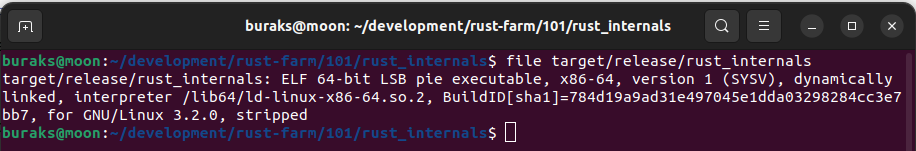
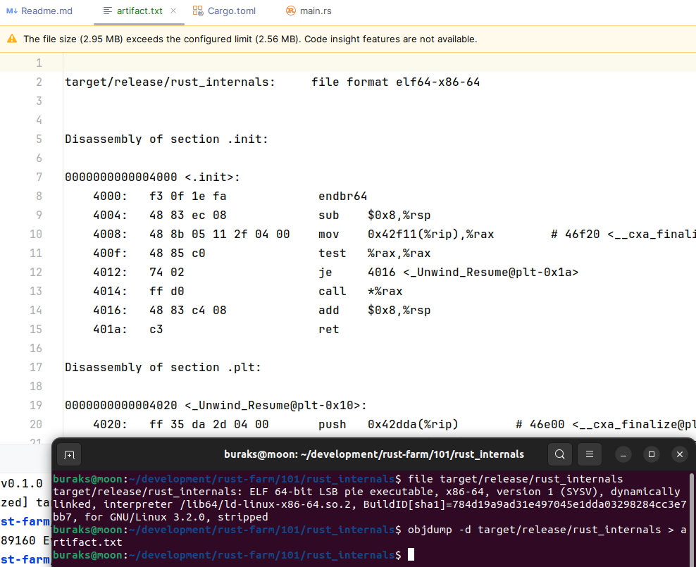
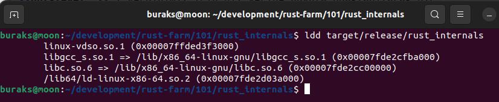
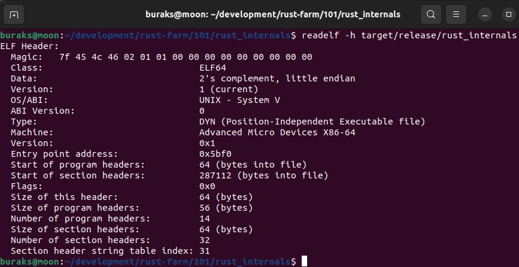
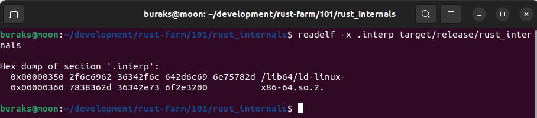

# Rust Internals

Normal varsayılan olarak bir rust projesini oluşturduğumuzda çalıştırılabilir binary'nin boyutu epeyce büyük olur. 

Sistem : Ubuntu 22.04
Uygulama : termianl projesi
İçerik :

```rust
fn main() {
    println!("Hello, world!");
}
```

İçinde sadece println makrosu kullanan bu uygulama için release aldığımızda oluşan binary'nin boyutu yaklaşık olarak 4 Mb civarındadır. Sistemde tam olarak 4_298_864 Kb.

```shell
# release almak için
cargo build -r

# dosya detayına bakmak için
ls -l target/release/rust_internals
```

## profile.release Ayarları

Toml dosyasında aşağıdaki ayarları yaptıktan sonra boyutta önemli bir azalma meydana gelir. Kendi sistemimde boyut 289_160 Kb kadar oldu.

```toml
[profile.release]
strip = true
opt-level = "z"
lto = true
panic = "abort"
```

- **strip :** Debug bilgileri gibi bazı gereksiz ayrıntıları dışarda bırakır.
- **opt-level :** z verdiğimiz için hız yerine boyuta odaklanılarak bir optimizasyon yapılmasını sağlar.
- **lto :** Link-Time Optimization anlamındadır. true verildiği için devreye giren bu mekanizma bellek kullanımını azaltıp, performansı artırmaya ve hatta boyut azaltmaya yarayacak bazı optimizasyonları çalıştırmak istediğimizi belirtir. Ne var ki bu derleme zamanını uzatabilir.
- **panic :** Varsayılan değeri unwind'dır. Çalışma zamanında bir panik oluştuğunda rust bununla ilgili detay ve ayrıntı toplar. Bu dosya boyutunu artıran da bir durumdur. Hatta bu senaryoda panik oluştuğunda rust bunu önce işlemeye çalışır sonra programı sonlandırır. abort'ta ise panik işlenmeye çalışılmak program hemen sonlandırılır. Dolayısla panik nedeniyle oluşan hata izleme(trace) bilgileri ve ayrıntılar tutulmaz. Performansı önemsediğimiz durumlarda abort ile kullanabiliriz.

## Çıktıyı İncelemek

Release olarak alınan dosyanın içeriği ve bazı bilgilerini görmek için kullanılabilecek araçlar.

```shell
# Oluşan binary executable hakkında bir takım bilgileri almak için
file target/release/rust_internals
```



ELF, Executable and Linkable Format anlamına gelir.

```shell
# Çıktının assembly kodlarını da görebiliriz elbette
# hatta bunu bir dosya içerisine alabiliriz de
objdump -d target/release/rust_internals > artifact.txt
```



```shell
# Bağımlılıkları(Dynamic Dependencies) incelemek için ldd aracını kullanabiliriz
ldd target/release/rust_internals
```



ELF bilgilerini okumak için readelf aracını da kullanabiliriz.

```shell
# ELF Header bilgilerini okumak için
readelf -h target/release/rust_internals
```



Bu dosyada örneğin Entry point adresi yer alır. Bu adresin objdump ile alınan çıktıdaki yerine bakarak program giriş noktasının assmebly kodlarına ulaşabiliriz. 

Aşağıdaki komutu kullanarak da Dynamic Linker'ın ELF içerisindeki yerini görebiliriz. Dynamic Linker, bellek yerleşimi, bağımlılıkların yüklenmesi vb işleri üstlenir(Memory Mapping, Dependency Loading, Relocations)

```shell
readelf -x .interp target/release/rust_internals
```




