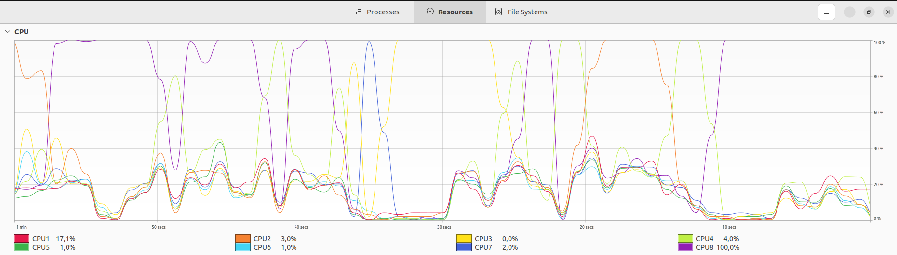

# Kötü Kod İyi Kod

Bu kütüphanede birkaç fonksiyon yer alıyor. Bad olarak işaretlenmiş fonksiyonlar sürdürülebilirlik _(Sustainability)_ açısından negatif etkide olanlar. Ayrıca kütüphanedeki fonksiyonlar için benchmark ölçümleri de var. Aslında Green Coding konsepti kapsamında neler yapılabileceğini araştırıyorum. Green Coding prensiplerini aşağıdaki gibi özetleyebiliriz.

- Efficiency (Verimlilik) : Enerji tüketimini daha iyi kod yazarak azaltmaya çalışmanın bir sonucudur. Bu genellikle algoritmaların zaman (Time) ve boyut (Space) karmaşıklığına göre optimize edilmesi anlamına gelir. Yani Big O mühim bir meseledir.
- Kaynak Tüketiminin Azaltılması (Reduciny Resource Consumption) : CPU ve bellek tüketimini minimum seviyeye çeken veri yapılarının ve algoritmaların kullanılmasını öğütler.
- Ölçeklenebilirlik (Scalability) : Enerji tüketimini doğrusal olarak artırmadan sistemleri doğru şekilde tasarlayabilme prensibidir.
- Tasarımda Sürdürülebilir Olmak (Sustainability in Design) : Yazılan kodun uzun vadede nasıl bir etkisi olacağını düşünme prensibidir. Günü kurtaran kod bile olsa bu kodun uzun vadede ektisinin ne olacağını düşünmek gerekir

## Fibonacci Değeri Hesaplaması

Fibonacci yapısında iki fonksiyon yer alıyor. Aslında bir programlama dilinde öz yinelemeli (Recursive) fonksiyonları öğrenirken sık kullanılan problemlerden birisidir Fibonacci hesaplaması. Ve genellikle calc_worst fonksiyonunda olduğu gibi hesaplanır. calc_worst'te her çağrı n-1 ve n-2 için birer çağrı daha yapar. Yani her seviyede fonksiyon çağrılarının sayısı iki katına çıkar. Dolayısıyla Big O değeri açısından bakarsak Time Complexity değeri O(2^n) olur. Her seviyede fonksiyon çağrılarının sayısı iki katına çıktığı için üssel bir büyüme söz konusudur. Dolayısıyla büyük bir sayı için fibonacci hesaplaması istendiğinde işlem uzun sürer. 51 değeri için bunu deneyebilirsiniz. Bu çok doğal olarak işlemcinin daha uzun süre hesaplama yapması, belleğin daha fazla kullanılması anlamına da gelir. Green Code prensipleri için pek de ideal değil. 

Şimdi yazılması biraz daha zor olan ikinci fonksiyona bakalım, calc_green. Bu fonksiyon fibonacci hesaplaması için Memoization tekniğini kullanır. Bu teknikte amaç önceden yapılmış hesaplamaların bir HashMap' te tutulması ve tekrar ihtiyaç duyulması halinde yeniden hesaplamaya gerek kalmadan kullanılabilmesidir. Dolayısıyla her sayı için hesaplama sadece bir kez yapılır diyebiliriz. Her sayı için tek bir hesaplama yapılması zaman karmaşıklığının O(n) olması anlamına gelir. Bu modelin kıymeti özellikle yüksek fibonacci sıra sayıları için anlamlıdır. 51 değerinin hesaplamasına birde bu fonksiyonla bakın derim ;)

## Coin Change Problemi

Para üstü hesaplayacağız ancak bunu minimum sayıda bozuk para kullanarak yapmak istiyoruz. Mesela 41 cents verilirse 1 Quarter + 1 Dime + 1 Nickel + 1 Penny yeterlidir. Bu en az bozukluk kullanarak 41 Cents üretilmesidir.

```text
1 Penny     = 1 Cent
1 Nickel    = 5 Cents
1 Dime      = 10 Cents
1 Quarter   = 25 Cents
```

Bu problem Coin Change olarak adlandırılıyor. İki senaryo olarak ele alınabilir. Bir senaryoda _(ki benim bu kütüphanede ele alacağımdır)_ belli bir miktarı oluşturmak için gerekli minimum bozuk para sayısı hesaplanmaya çalışılır. Diğer senaryoda ise bu miktarı oluşturmak için hangi bozukluklarının kullanılması gerektiği hesaplanır.    

## Test ve Benchmarks

Örnek fonksiyonlara ait testleri çalıştırmak ve benchmark çıktıları için aşağıdaki komutları kullanabiliriz.

```shell
cargo test
cargo bench

# Belli bir benchmark'ı çalıştırmak için
cargo bench --bench coin_change_benchmark
cargo bench --bench fibonacci_benchmark
```

## Sistem

Benchmark koşularını yaptığım makinenin özellikleri şöyle.

| Özellik | Değer                                   |
|---------|-----------------------------------------|
| OS      | Ubuntu 22.04                            |
| CPU     | Intel® Core™ i7-6700T CPU @ 2.80GHz × 8 |
| RAM     | 32 Gb                                   |

## Fibonacci Benchmark

İlk olarak Fibonacci benchmark ölçümlerini yorumlamaya çalışalım. Criterion küfesi ile elde ettiğim sonuçlar şöyle.

```text
Worst Case/Worst/36     time:   [58.093 ms 60.141 ms 63.221 ms]
Found 1 outliers among 10 measurements (10.00%)
  1 (10.00%) high mild
Worst Case/Worst/37     time:   [95.947 ms 98.038 ms 100.20 ms]
Worst Case/Worst/38     time:   [160.89 ms 171.29 ms 177.80 ms]
Worst Case/Worst/39     time:   [246.47 ms 253.76 ms 262.40 ms]
Found 1 outliers among 10 measurements (10.00%)
  1 (10.00%) low mild
Benchmarking Worst Case/Worst/40: Warming up for 3.0000 s
Warning: Unable to complete 10 samples in 20.0s. You may wish to increase target time to 23.6s or enable flat sampling.
Worst Case/Worst/40     time:   [414.04 ms 425.41 ms 443.02 ms]
Found 1 outliers among 10 measurements (10.00%)
  1 (10.00%) high mild

Green Case/Green/36     time:   [17.796 ns 18.378 ns 18.844 ns]
Found 1 outliers among 10 measurements (10.00%)
  1 (10.00%) high mild
Green Case/Green/37     time:   [17.580 ns 17.863 ns 18.181 ns]
Green Case/Green/38     time:   [17.780 ns 17.973 ns 18.232 ns]
Green Case/Green/39     time:   [17.451 ns 17.772 ns 18.349 ns]
Found 2 outliers among 10 measurements (20.00%)
  2 (20.00%) high mild
Green Case/Green/40     time:   [17.795 ns 18.611 ns 19.507 ns]
```

Pek tabii O(n^2) ile çalışan fonksiyon O(n) çalışana göre değerler arttıkça çok çok daha yavaş kalıyor diyebiliriz. Hatta 40 değeri için Worst Case bir uyarı mesajı da vermekte. Uyarı mesajı belirlenen sürede 10 örneğin **tamamlanamadığını** söylüyor. Green Case gruplamasındaki sonuçlara göre hesaplama sürelerinin milisaniye'den nanosaniyeler seviyesine düştüğünü görüyoruz. Memoization tekniğinin bir sonucu. Buna Dramatik Performans İyileşmesi diyelim. 36'dan 40'a kadar olan hesaplamalarda Green Case için hesaplama sürelerinin neredeyse aynı kaldığına da dikkat edelim.

## Coin Change Benchmark

Coin Change problemi için çalışma zamanı çıktıları aşağıdaki gibidir.

```text
Coin Change Worst Case/Worst/36
                        time:   [611.26 µs 627.59 µs 652.29 µs]
Found 1 outliers among 10 measurements (10.00%)
  1 (10.00%) high mild
Coin Change Worst Case/Worst/37
                        time:   [758.61 µs 780.84 µs 827.42 µs]
Found 1 outliers among 10 measurements (10.00%)
  1 (10.00%) high mild
Coin Change Worst Case/Worst/38
                        time:   [1.0093 ms 1.0188 ms 1.0471 ms]
Coin Change Worst Case/Worst/39
                        time:   [1.3730 ms 1.3779 ms 1.3838 ms]
Found 1 outliers among 10 measurements (10.00%)
  1 (10.00%) high mild
Coin Change Worst Case/Worst/40
                        time:   [1.8649 ms 1.9118 ms 2.0086 ms]
Found 2 outliers among 10 measurements (20.00%)
  2 (20.00%) high severe

Coin Change Green Case/Green/36
                        time:   [4.5870 ns 4.8340 ns 5.1681 ns]
Found 1 outliers among 10 measurements (10.00%)
  1 (10.00%) high severe
Coin Change Green Case/Green/37
                        time:   [4.5327 ns 4.6901 ns 4.9041 ns]
Coin Change Green Case/Green/38
                        time:   [4.3169 ns 4.4797 ns 4.7035 ns]
Found 2 outliers among 10 measurements (20.00%)
  1 (10.00%) high mild
  1 (10.00%) high severe
Coin Change Green Case/Green/39
                        time:   [4.3651 ns 4.4933 ns 4.7226 ns]
Found 1 outliers among 10 measurements (10.00%)
  1 (10.00%) high severe
Coin Change Green Case/Green/40
                        time:   [4.4541 ns 4.6296 ns 4.8259 ns]
Found 1 outliers among 10 measurements (10.00%)
  1 (10.00%) high mild
```

Özellikle worst case durumunda girdi boyutu(n) arttıkça milisaniye cinsinden ölçülen süreler ciddi biçimde artış göstermekte. Mesela 36 değeri için bu süre 611.26 mikro saniye iken, 40 değeri için bu süre 1.8649 mikrosaniyeye çıkmış. Tabii green case'de durum çok daha iyi. Green case senaryosunda aynen Fibonacci probleminde olduğu gibi Meomization tekniği kullanıldığından ölçülen süreler nanosaniye cinsinden neredeyse aynı kalmış durumda.Hatta ilerledikçe az miktar da olsa daha da iyileşiyor. Dolayısıyla stabil bir performans sergilendiğini söylemek mümkün.

Genel bir yorum olarak hem Fibonacci hem de Coin Change problemlerinde tekrar eden recursive işlerin küçük değerlerde çok düşük performans göstermediğini ancak girdi boyutunun arttığı durumlarda Memoization gibi teknikler kullanılmadığı takdirde dramatik olarak kötüleşen bir performans sergilediklerini ifade edebiliriz. Dolayısıyla problem içinde tekrar eden ve sonraki iterasyonlarda yeniden kullanılabilecek hesaplamalar varsa, Memoization tekniği performans sürelerinin dramatik biçimde iyileştirilmesine imkan sağlar diyebiliriz.

## Drama

Kendi sistemide dramatik performans kaybını görmek için Coin Change problemindeki değer aralığı ile biraz oynadım. Buna göre 1, 17, 41, 63 ve 72 cents olması halini ele aldım. Memoization uygulanmayan senaryoda nanosaniye ile başlayan ölçümleme, önce mikro saniyeye sonrasında mili saniyeye, sonrasında saniye seviyesine çıktı. Ancak son iki ölçümleme süreleri arasında belirgin bir süre farkı var. Güncel istatistik durumu aşağıdaki gibi gerçekleşti.

```text
Coin Change Worst Case/Worst/1
                        time:   [10.837 ns 11.282 ns 11.665 ns]
Found 1 outliers among 10 measurements (10.00%)
  1 (10.00%) high mild
Coin Change Worst Case/Worst/17
                        time:   [1.9924 µs 2.0595 µs 2.1584 µs]
Found 1 outliers among 10 measurements (10.00%)
  1 (10.00%) high mild
Coin Change Worst Case/Worst/41
                        time:   [3.0442 ms 3.1005 ms 3.1826 ms]
Found 1 outliers among 10 measurements (10.00%)
  1 (10.00%) high severe
Benchmarking Coin Change Worst Case/Worst/63: Warming up for 3.0000 s
Warning: Unable to complete 10 samples in 20.0s. You may wish to increase target time to 27.4s.
Coin Change Worst Case/Worst/63
                        time:   [2.6580 s 2.7268 s 2.8061 s]
Found 1 outliers among 10 measurements (10.00%)
  1 (10.00%) high mild
Benchmarking Coin Change Worst Case/Worst/72: Warming up for 3.0000 s
Warning: Unable to complete 10 samples in 20.0s. You may wish to increase target time to 432.2s.
Coin Change Worst Case/Worst/72
                        time:   [43.679 s 44.946 s 46.245 s]

Coin Change Green Case/Green/1
                        time:   [4.7950 ns 4.8900 ns 4.9771 ns]
Coin Change Green Case/Green/17
                        time:   [4.7075 ns 4.8722 ns 4.9892 ns]
Coin Change Green Case/Green/41
                        time:   [5.3489 ns 5.6212 ns 5.8755 ns]
Coin Change Green Case/Green/63
                        time:   [4.7910 ns 5.1268 ns 5.4764 ns]
Coin Change Green Case/Green/72
                        time:   [4.5325 ns 4.6094 ns 4.7159 ns]
```

Ancak memoization tekniğini kullandığımız durumda ölçümlemeler belli bir nanosaniye seviyesinde stabil kaldı. Yüksek performans tüketimi noktasında işlemci çekirdekleri de sıklıkla %100 peek time noktalarına ulaştı. İşte örnek bir görüntü.



## Concatenate Strings

Üçüncü vaka da pek çok programlama dili için baş belası olan metinsel veri türü String ele alınıyor. StringOps veri yapısının sunduğu fonksiyonlar ile aslında basit bir metinsel birleştirme operasyonu simüle ediliyor.

Worst senaryoda String içerikleri += operasyonu ile arka arkaya eklenmektedir. Burada döngü her kelime için bir kere çalıştığında O(n) türünden bir zaman karmaşıklığı olur diye düşünebiliriz ancak her adımda yeni bir String yaratılır ve bu işlem de belirtilen String'in uzunluğuna bağlı olacaktır. Bu nedenle Big O ölçümü için O(n^2) daha iyi bir tespit olabilir. Her adımda artan uzunlukta yeni String'ler üretilmesi bellek tüketimini de artırmaktadır yani Space Complexity değerinin de O(n^2) olarak yükseldiğini ifade edebiliriz.

Bu senaryodaki Green fonksiyonumuz ise öncelikle üretilecek toplam String boyutunu hesaplar ve buna göre tek bir String oluşturur ve kelimeler bu String'e eklenir. Toplam uzunluğun bulunması ve kelimelerin bu String'e eklenmesi O(n) birimlik zaman karmaşıklığına sebebiyet verir. Fonksiyonun üretmesi gereken String veri uzunluğu gelen vektöre içerisindeki elemanların uzunluğuna göre ilk seferde hesaplandığından bellek tüketimi de belli ve sabit kalacaktır.

```text
String Concatenate Worst Case/Worst Case
                        time:   [671.39 ns 684.79 ns 701.22 ns]
Found 1 outliers among 50 measurements (2.00%)
  1 (2.00%) high severe

String Concatenate Green Case/Green Case
                        time:   [595.27 ns 605.19 ns 615.02 ns]
Found 2 outliers among 50 measurements (4.00%)
  2 (4.00%) high mild
```

String birleştirme işi ile ilgili Criterion benchmark ölçümleri yukarıdaki gibidir. Aslında belirgin bir süre farkı görünmüyor diyebiliriz ancak bu senaryoda hızdan ziyade bellek tüketiminin fazlalığı öne çıkmaktadır.