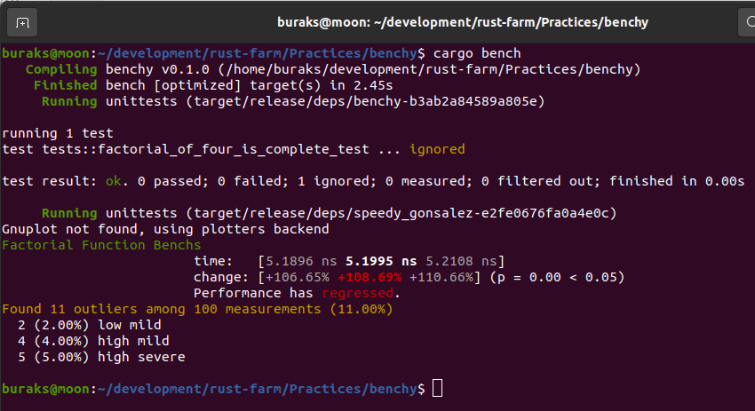
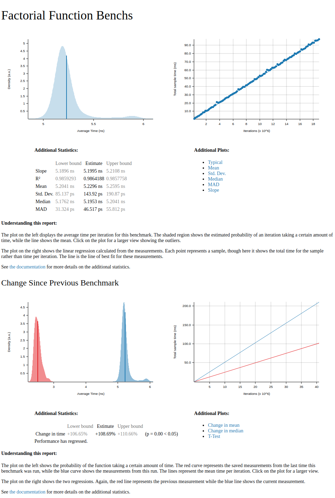

# Benchy : Basit Benchmark Ölçümleri

Fonksiyonelliklerin süre bazlı metriklerinin ölçümünde benchmark paketlerine sıklıkla başvurulur. Criterion, Rust tarafında kullanılan popüler benchmark paketlerinden birisi. Testleri yazarken sıklıkla başvurabileceğimiz bir paket.

Criterion için öncelikle toml dosyasında gerekli ilaveler yapılır. İlgili paket __dev_dependencies__ altında bildirilir. Nitekim sadece development safhasında kullanılması idealdir. Örnekte HTML tadında rapor çıktısı için bir feature'da eklenmiştir.

```toml
[dev-dependencies]
criterion={version="0.3.5",features=["html_reports"]}

[[bench]]
name="speedy_gonsalez"
# built-in benchmark'ları kapatmak için false değeri atandı
harness=false
```

Örneğin oluşturulması ve testleri.

```shell
cargo new benchy --lib
cd benchy
# benchmark testlerine ait kodların duracağı klasör
mkdir benches
# toml dosyasındaki bench sekmesinde belirtilenle aynı isimli bir dosya oluşturulur
touch benches/speedy_gonsalez.rs
cargo bench
```

İlk ölçümlemeden sonra faktöryel fonksiyonunda u128 veri türüne geçiş yapınca oluşan durum.



Tabii ölçümler örneğin çalıştığı sistemin özelliklerine göre değişiklik gösterecektir. Bu arada ilgili ölçümler için HTML raporunu da inceleyebiliriz.

target/criterion/report/index.html içeriği aşağıdakine benzer olacaktır.



