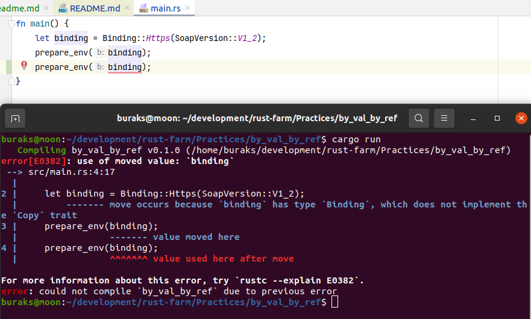
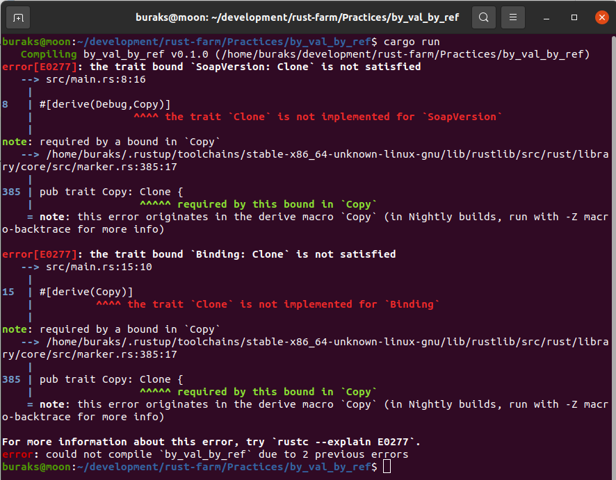
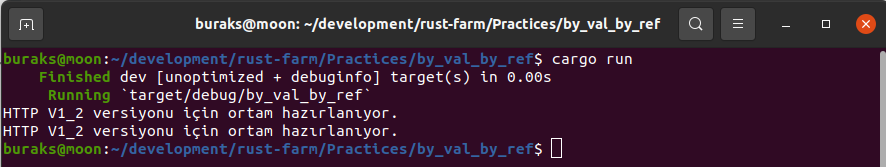
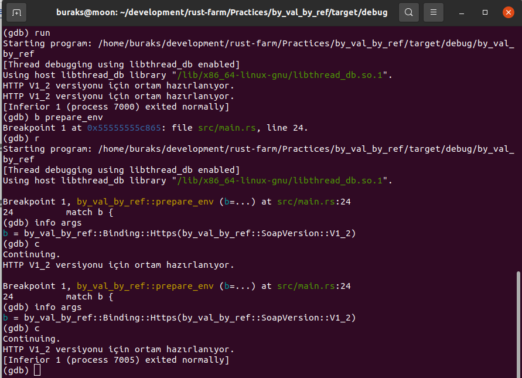
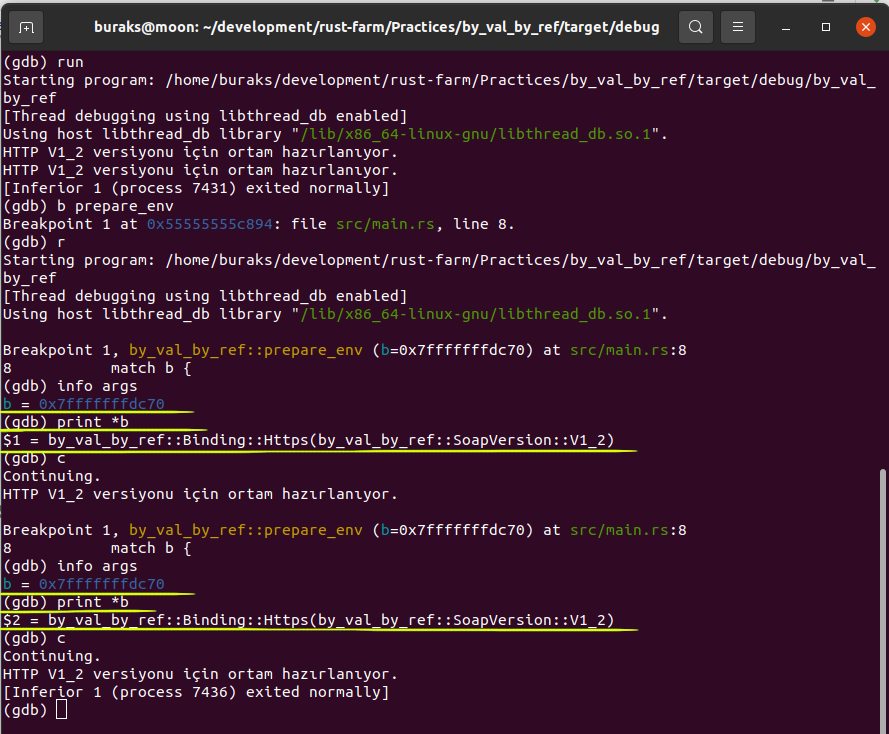

# Değişkenleri Kopyalarak veya Referans Olarak Taşımak

Bu pratikte içinde başka bir enum sabiti kullanan bir enum sabitinin bir fonksiyonda parametre olarak kullanılmasında oluşabilecek ___Value Moved Here___ sorununa bakıyoruz. Cümle biraz karışık oldu :D Öyleyse örnek üstünden ilerleyelim. Kod tarafında ilk olarak sorunsuz bir ortam tesis edeceğiz. Problemi oluşturacağız. Ardından iki farklı yolla duruma açıklık getireceğiz. 

```shell
# projeyi oluşturma aşaması
cargo new by_val_by_ref
cd by_val_by_ref
# çalıştırmak için
cargo run 
```

Program kodunun ilk versiyonu aşağıdaki gibi.

```rust
fn main() {
    let binding = Binding::Https(SoapVersion::V1_2);
    prepare_env(binding);
}

#[derive(Debug)]
enum SoapVersion {
    V1_1,
    V1_2,
}
enum Binding {
    Http(SoapVersion),
    Https(SoapVersion),
    Rest,
    Grpc,
}

fn prepare_env(b: Binding) {
    match b {
        Binding::Http(v) | Binding::Https(v) => {
            println!("HTTP {:?} versiyonu için ortam hazırlanıyor.", v)
        }
        Binding::Rest => println!("Servis REST protokolüne göre hazırlanıyor"),
        Binding::Grpc => println!("Servis GRPC protoklüne göre hazırlanıyor"),
    }
}
```

Bu program çalıştığında herhangi bir sıkıntı olmayacaktır. Oldukça sade ve anlaşılır zaten. Şimdi binding değişkeni için prepare_service fonksiyonunu bir kez daha çağıralım.


```rust
fn main() {
    let binding = Binding::Https(SoapVersion::V1_2);
    prepare_env(binding);
    prepare_env(binding);
}
```



**Bir değeri _(Value)_ bu örnekteki gibi bir scope'a taşıdıktan sonra sahipliğini _(Ownership)_ kaybederiz**

Yukarıdaki gibi bir kullanıp çok anlamlı değil gerçi ama Ownership'liğin korunması için iki yöntemimiz var. Binding ve SoapVersion enum sabitlerinin bit seviyesinde kopylanmasına izin vermek ki bu değerlerin kopyalanarak taşınması oluyor ya da referansı taşımak. İlki için Clone ve Copy trait'lerini implemente etmek yeterli.

```rust
#[allow(dead_code)]
#[derive(Debug, Clone, Copy)]
enum SoapVersion {
    V1_1,
    V1_2,
}

#[allow(dead_code)]
#[derive(Clone, Copy)]
enum Binding {
    Http(SoapVersion),
    Https(SoapVersion),
    Rest,
    Grpc,
}
```

Bu arada Copy ve Clone trait'lerini birlikte uygulamak gerekiyor. Sadece Copy trait'ini uygulamak yeterli değil.



Clone ve Copy trait'lerini uyguladığımız için binding değişkeni ilgili fonksiyona kopylanarak geçirilmiş oldu.



Pass by Value durumunu daha iyi anlamak için belkide gdb ile kodu debug etmek iyi olabilir.

```shell
cargo build
cd target/debug
gdb by_val_by_ref
run
list
b prepare_env
r
info args
c
info args
c
```



prepare_env fonksiyonuna bir breakpoint ekledik. İki kez üzerinden geçiyoruz. Her seferinde argümanlara baktık. Birebir kopyalanmış bir değişken görmekteyiz. 

Şimdi ikinci kullanıma bakalım. Değeri referans olarak taşımak. İşin püf noktası & sembolü.

```rust
fn main() {
    let binding = Binding::Https(SoapVersion::V1_2);
    prepare_env(&binding);
    prepare_env(&binding);
}

fn prepare_env(b: &Binding) {
    match b {
        Binding::Http(v) | Binding::Https(v) => {
            println!("HTTP {:?} versiyonu için ortam hazırlanıyor.", v)
        }
        Binding::Rest => println!("Servis REST protokolüne göre hazırlanıyor"),
        Binding::Grpc => println!("Servis GRPC protoklüne göre hazırlanıyor"),
    }
}
```

Fonksiyonumuzun parametresini referans olarak değiştirdik. Elbette binding değişkenlerini gönderdiğimiz yerde de referansı yollamamız lazım. Ayrıca match ifadesi içerisine bakılacak olursa SoapVersion enum tipinin de referans olarak alındığını görebiliriz.


Birde gdb debugger aracı ile çalışma zamanındaki argümanların durumuna bakalım.

```shell
cargo build
cd target/debug
gdb by_val_by_ref
run
list
b prepare_env
r
info args
print *b
c
info args
print *b
c
```

Özellikle prepare_env fonksiyonundaki breakpoint noktalarında argümanın bir pointer olduğuna ve her iki çağrıda da aynı pointer'ın kullanıldığında dikkat edelim. 

