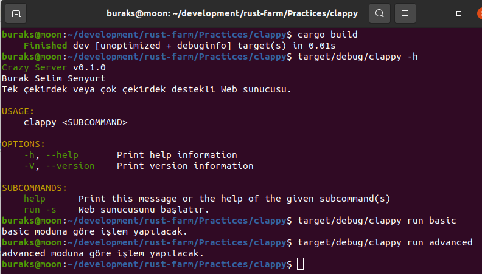
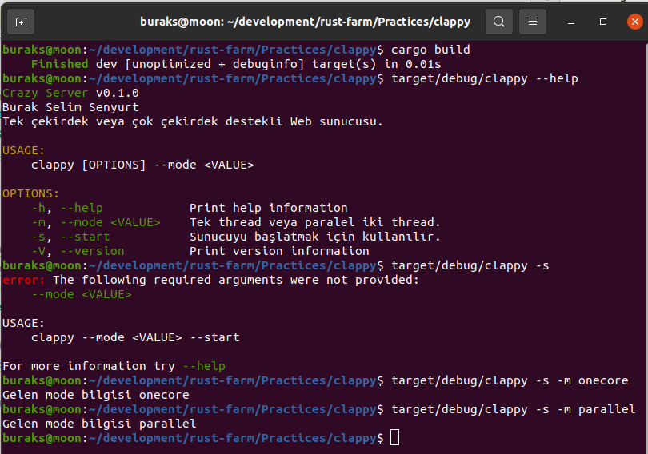

# Komut Satırı Argümanları için clap Küfesini Kullanmak

Sistem programlama söz konusu ise olmazsa olmazlardan birisi programa terminal ekranında gönderilen komutlardır. Docker'ı, redis'i vs düşünün. Terminal'den ne çok ve çeşitte parametreler alabiliyorlar. Bu programların main fonksiyonlarındaki argüman yönetimini mümkün mertebe kolaylaştırmak lazım. Rust'ın popüler küfelerinden _(crate)_ olan clap, builder pattern kabiliyetini de işin içerisine katarak bunu epeyce kolaylaştırmakta. Pratik olarak nasıl kullanıldığını deneyimlemek istedim.

```shell
cargo new clappy
```

İlk iş doğal olarak toml dosyasında gerekli bildirimi yapmak.

```toml
[dependencies]
clap="3.1.6"
```

İlk denemeleri aşağıdaki gibi yapabiliriz.

```bash
# Önce bir paket çıkalım
cargo build
# Terminal parametreleri hakkında yardım alalım.
target/debug/clappy -h

# run için bir argüman göndermeyi deneyebiliriz
target/debug/clappy run basic

# Başka bir parametre daha yollayalım.
target/debug/clappy run advanced
```



İkinci kullanım şeklini de aşağıdaki gibi deneyebiliriz.

```bash
# Önce bir paket çıkalım
cargo build
target/debug/clappy --start -m parallel
target/debug/clappy --help
```
