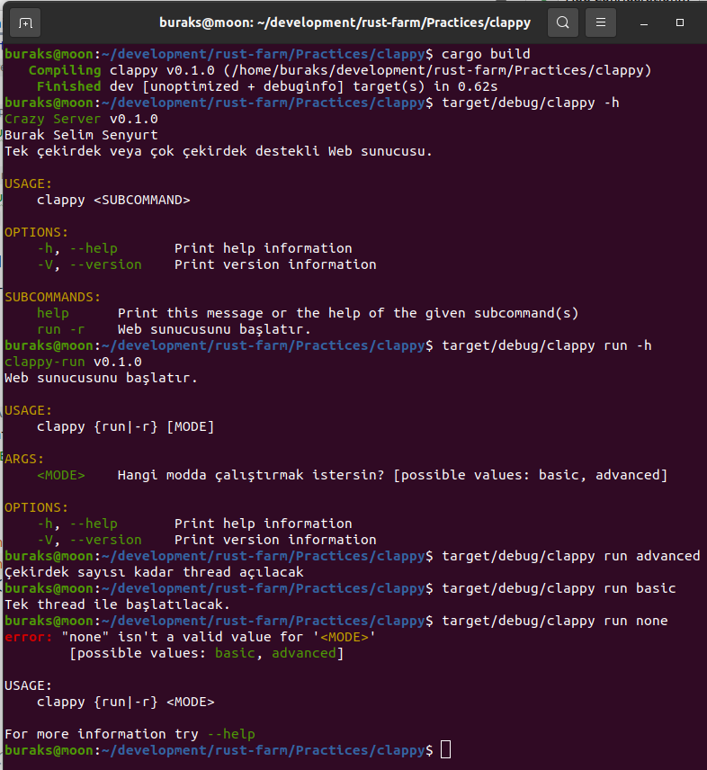
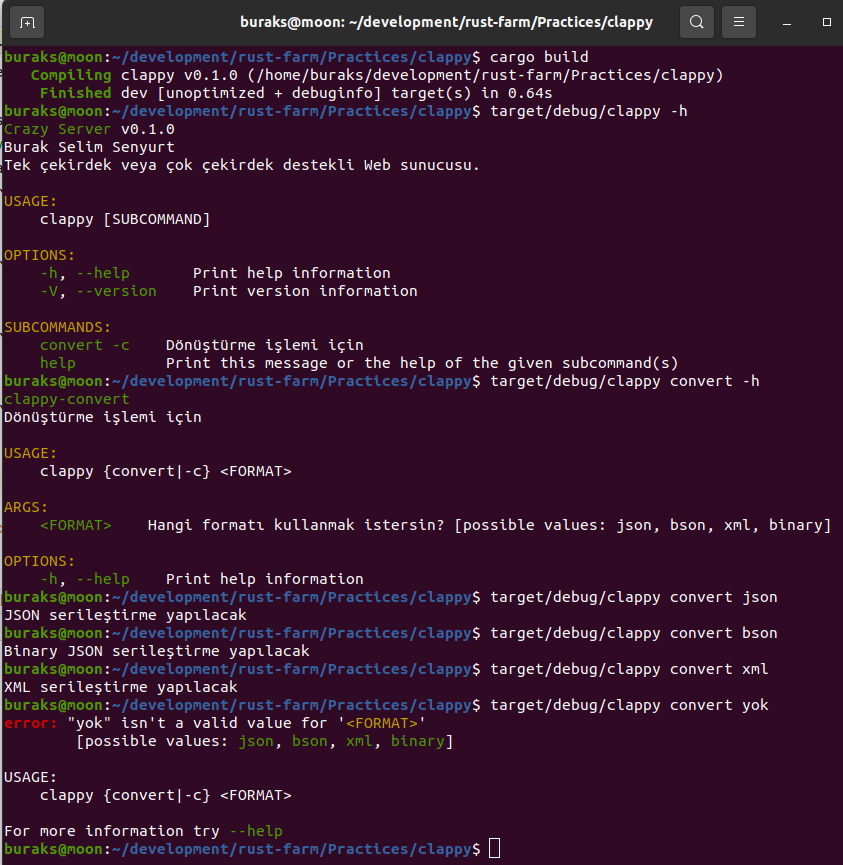

# Komut Satırı Argümanları için clap Küfesini Kullanmak

Sistem programlama söz konusu ise olmazsa olmazlardan birisi programa terminal ekranında gönderilen komutlardır. Docker'ı, redis'i vs düşünün. Terminal'den ne çok ve çeşitte parametreler alabiliyorlar. Bu programların main fonksiyonlarındaki argüman yönetimini mümkün mertebe kolaylaştırmak lazım. Rust'ın popüler küfelerinden _(crate)_ olan clap, builder pattern kabiliyetini de işin içerisine katarak bunu epeyce kolaylaştırmakta. Pratik olarak nasıl kullanıldığını deneyimlemek istedim.

```shell
cargo new clappy
```

İlk iş doğal olarak toml dosyasında gerekli bildirimi yapmak.

```toml
[dependencies]
clap="3.1.6"
```

İlk denemeleri aşağıdaki gibi yapabiliriz.

```bash
# Önce bir paket çıkalım
cargo build
# Terminal parametreleri hakkında yardım alalım.
target/debug/clappy -h

# run için bir argüman göndermeyi deneyebiliriz
target/debug/clappy run basic

# Başka bir parametre daha yollayalım.
target/debug/clappy run advanced
```


Birde mode argümanı için olası değerleri possible_values ile ekledikten sonraki duruma bakalım.

```bash
# Önce bir paket çıkalım
cargo build
# Terminal parametreleri hakkında yardım alalım.
target/debug/clappy -h

# run için nasıl argüman gönderebileceğimiz hakkında yardım alalım.
target/debug/clappy run -h

# bilinen bir argüman yollayalım
target/debug/clappy run basic

# geçersiz bir argüman yollayalım
target/debug/clappy run none
```



İkinci kullanım şeklini de aşağıdaki gibi deneyebiliriz.

```bash
# Önce bir paket çıkalım
cargo build
target/debug/clappy --start -m parallel
target/debug/clappy --help
```


Üçüncü olarak ele alacağımız kullanım şekli çok daha verimli. Argüman değerlerini bir enum yapısı ile eşleştirmemiz mümkün.

```bash
cargo build
target/debug/clappy -h
target/debug/clappy convert -h
target/debug/clappy convert json
target/debug/clappy convert bson
target/debug/clappy convert xml
target/debug/clappy convert yok
```



Tabii paketin çok fazla kullanım şekli var. Detaylar için [şu adresteki örneklere](https://github.com/clap-rs/clap/blob/v3.1.6/examples/tutorial_builder/README.md#enumerated-values) bakabiliriz.