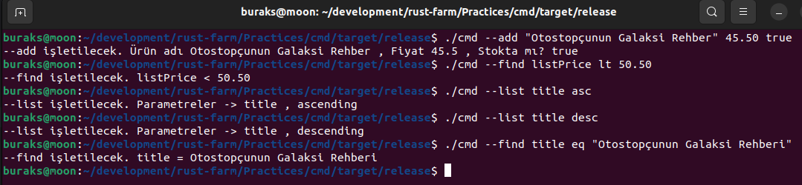

# Command Pattern ile Komut Argümanlarını Almak

Bu örnekte programa terminalden gelen komutların işlenmesi için davranışsal (Behavioral Patterns) tasarım kalıplarından olan Command tasarım kalıbının nasıl uygulandığı ele alınmaktadır.

Örnek terminal komutları şöyledir.

```shell
cmd --add "Learning Unity" 34.55 true
cmd --list all ascending
cmd --find "Learning"  
```

--add , --list, --find birer komuttur ve bazı parametreler kullanmaktadırlar. Komutların doğal olarak yapmalarını istediğimiz işlevler vardır. Bu tip işlevler bir trait olarak tanımlanabilir. C# tarafında olsa Interface olarak tanımlardık. 

Diğer yandan asıl nesneler _(Concrete Objects)_ birer struct olarak tasarlanabilir ve ilgili trait'i uygulayarak Command özelliği kazanabilir. C# tarafında interface türünün implemente eden sınıflar yazardık. 

Pek tabii bir de terminalden gelen argümanları parse etmek üzere alan ve doğru komut nesnesini geriye döndüren birde parser nesnesi gerekecektir ki bu bir fonksiyon olarak tasarslanabileceği gibi bir struct üyesi de olabilir.

## Çalışma Zamanı

Bu basit uygulamda çok fazla derine inilmedi. Sadece argüman sayısına göre doğru komut nesnelerinin örneklenmesi söz konusu. Execute metotları içerisinde birçok kontrol yapılabilir. Tür dönüşümlerinin doğru olması için tedbirler alınabilir ya da hatalı girdiler için panic üretimi düşünülebilir. Hatta komutların bazı parametreleri için enum türleri tasarlanabilir ve From gibi trait'ler uygulanarak dönüştürmeler strongly typed hale getirilebilir.

```shell
# Örneği önce release modda derleyelim
cargo build -r

# Sonrasında release klasörüne gidip aşağıdaki şekilde örnekler işletebiliriz

# Database' e komut satırında yeni bir kitap bilgisi eklediğimizi düşünelim
./cmd --add "Programming with Rust" 34.55 true

# Bir kitap aradığımızı düşünelim
./cmd --find title eq "Programming with Rust"

# ya da liste fiyatı belli bir değerin altında olanları
./cmd --find listPrice gt 90.50

# Kitapları isme göre ters sırada listelettiğimizi düşünelim
./cmd --list name desc

# Parametre sayısı hatalı olan bir komut
./cmd --list name desc bla bla

# Geçersiz bir komut
./cmd --whatisthis
```

İşte örnek bir çalışma zamanı çıktısı görüntüsü.



Bu örnekte kullanılan enstrümanlar veya kavramları şöyle özetleyebiliriz.

- Command tasarım desenini uyguladık.
- Kendi trait modelimizi yazdık.
- FromStr ve Display trait'lerini kendi enum türlerimize uyguladık.
- Birim test yazdık.
- Pattern Matching kullandık.