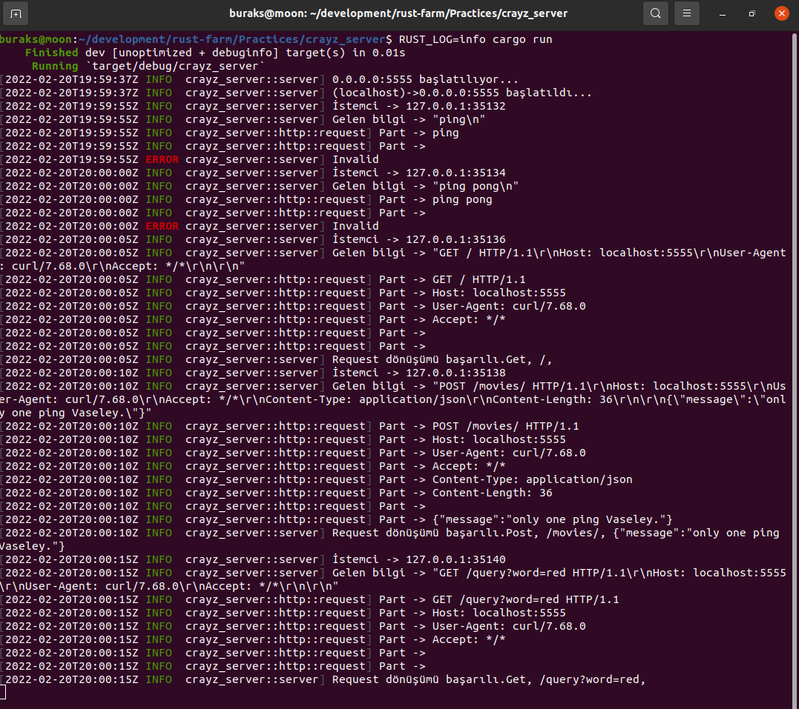

# Crayz Server _(Sıfırdan Bir HTTP Server Yazmak)_

Aslında HTTP server'lar için pek çok hazır çatı zaten var ancak HTTP taleplerini dinleyen bir sunucuyu Rust ile sıfırdan yazmak bireysel anlamda çok şey öğretir. Tabii bizim ele alacağımız basit anlamda bir makine adresi ve porta gelen istekleri dinleyip içeriğini yorumlamaya çalışmak olacak. Normal şartlarda bu tip bir başlangıç üstüne konacak çeşitli katmanlar ile _(güvenlik, yönlendirme, önbellekleme gibi)_ Backend Web Framework yazımına doğru ilerlenebilir. Bu arada Rust tarafında oldukça başarılı birçok backend web framework'te var. Actix, Gotham, Iron, Nickles ve daha niceleri. Bizim web server'ın adının Crayz olduğuna bakmayın. Sadece havalı bir isim işte :)

Ancak örneği geliştirirken hem konu tekrarı yapabileceğiz hem de kod pratiğimizi artıracağız. Hiç vakit kaybetmeden aşağıdaki terminal komutları ile işe başlayalım.

```shell
# Önce projeyi oluşturalım
cargo new crayz_server
cd crayz_server
# Genel tipleri ayrı bir modül içinde toplayalım
touch src/lib.rs
```

### Örneğin gelişimi. Emekleme dönemi.

```shell
# TcpListener ile dinelemeye başladıktan sonra test etmek istersek
# Önce uygulamayı aşağıdaki gibi başlatıp,
RUST_LOG=info cargo run
# ardından ikinci bir terminal açıp aşağıdaki komutlar ile mesaj göndermeyi deneyebiliriz.
echo "ping" | netcat localhost 5555
echo "ping pong" | netcat localhost 5555
curl localhost:5555
curl -X POST http://localhost:5555/movies/ -H 'Content-Type: application/json' -d '{"message":"only one ping Vaseley."}'
curl http://localhost:5555/query?word=red
```

