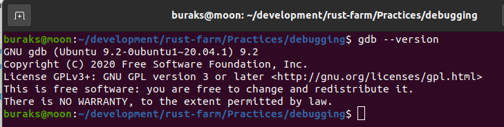
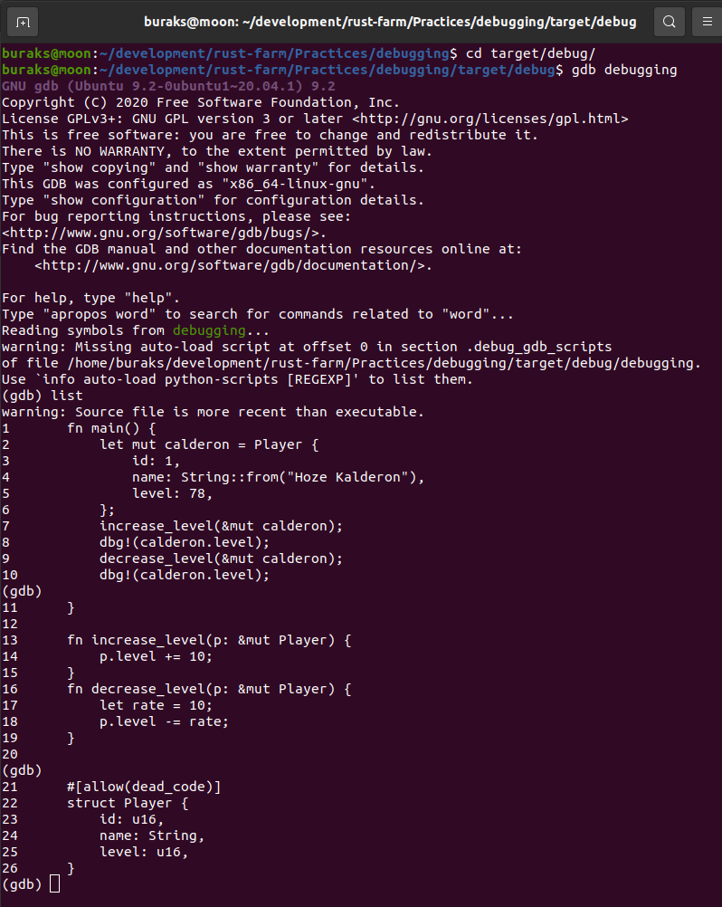
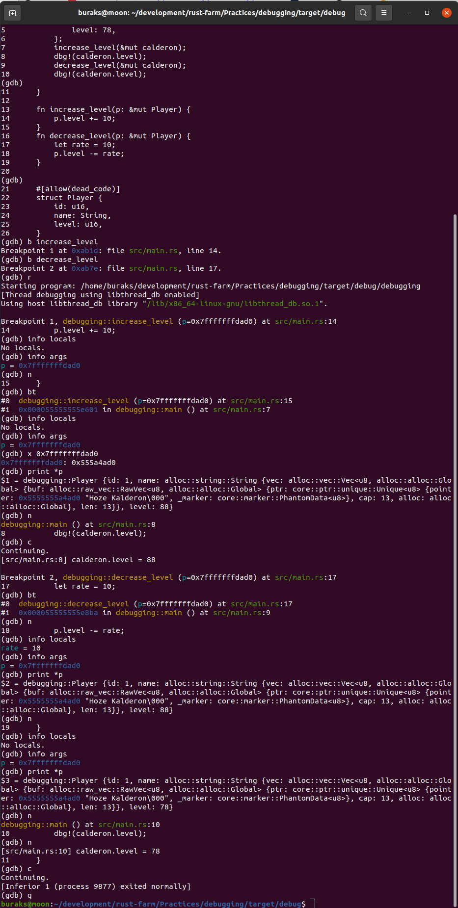

# GDB ile Debug İşlemleri

Rust ile ilgili öğretilerde bellek yönetimi konusunu incelerken fonksiyon ve değişkenlere ait kapsamların bellekte nasıl açıldığını görmek için GNU Debugger'dan yararlanıldığını gördüm. Oldukça güzel bir araç. Kodu debug etmek deyince insanın aklına Visual Studio gibi gelişmiş IDE'lerin kolaylıkları geliyor ve bu nedenle GDB ilkel bir araç olarak görünüyor. Yine de rust kodunu terminalden adım adım işletmek ve bellek üzerindeki konumlandırmaları görmek adına son derece faydalı bir araç. Rust dilinde ilerleyeceksem onu da tanımam gerekiyor. Öncelikle üzerine çalıştığım Ubuntu platformuna yüklemem lazım. Bu arada GDB ile ilgili detaylar için [şu adrese](http://www.gdbtutorial.com/) bakılabilir.

```shell
sudo apt-get update
sudo apt-get install gdb

gdb --version
```

Eğer her şey yolunda giderse aşağıdaki görüntüde olduğu gibi versiyon numarasını görebilmeliyiz.



GDB kullanımını deneyimlemek için ilk olarak basit bir örnekle ilerleyebiliriz.

```shell
cargo new debugging
cd debugging
cargo clippy
cargo run

# kodun çalıştığından emin olduktan sonra build etmeliyiz
cargo build
```

Gelelim GDB komutları ile bu kod parçasını nasıl debug edeceğimize. Öncelikle build işlemi sonrası oluşan target/debug klasörüne geçelim.

```shell
# Programa ait binary'yi debug modda açalım
gdb debugging
# Çalıştığını görelim
run
# ve ilk satırından itibaren kod içeriğine bir bakalım
list

# ardından örneğin increase_level ve decrease_level fonksiyonlarına birer breakpoint koyalım
b increase_level
b decrease_level

# kodu çalıştıralım
r

# Artık breakpoint noktalarında bir takım bilgilere bakabiliriz.
# Örneğin o andaki local değişkenlere ve argümanlara bakalım
info locals
info args

# Kodu bir adım ilerletelim
n

# Aynı bilgilere tekrar bakalım ve hatta stack bellek bölgesine bir göz atalım.
bt
info locals
info args

# Hatta pointer olarak gelen değişkenlerin içeriklerini şöyle görebiliriz
print *p

# Bir sonraki breakpoint noktasına geçmek için c komutunu kullanırız
c

# stack üzerindeki scope'ları görmek için yine bt'den yararlanabiliriz
bt

# debugger'dan çıkmak içinse aşağıdaki komutu kullanırız.
q
```

Tabii bu komutları denerken ekran görüntüsü aşağıya doğru uzayıp gitti. Neyeseki sağdaki dikey monitör biraz olsun işi kotardı. Yine de sonuçları iki parça halinde paylaşacağım.

İlk kısımda gdb'yi açıp kodun içeriğini gösteriyoruz.



Devam eden kısımda ise komutların sonuçlarını görmekteyiz.



Bu kısmı yorumlamak oldukça önemli. Kodumuzdaki fonksiyonlar Player verisini referans olarak ödünç alıp kullanmaktalar. Bu nedenle girdiğimiz fonksiyonlarda birer pointer görmekteyiz. Pointer adresi yazdığımız kod düşünüldüğünde değişmiyor elbette. Dikkat çekici bir diğer nokta fonksiyonlara parametre olarak gelen Player nesnesinin işaret ettiği veri yapısı. Dikkat edileceği üzere String olarak tasarladığımız name değişkeni String veri yapısının tasarımı gereği heap bölgesindeki içeriği işaret etmekte.

GDB aracını kullanarak özellikle Smart Pointer gibi enstrümanların işleyişini anlamak da oldukça kolay. Tabii kalabalık kod parçalarında bu pek kolay olmayabilir.