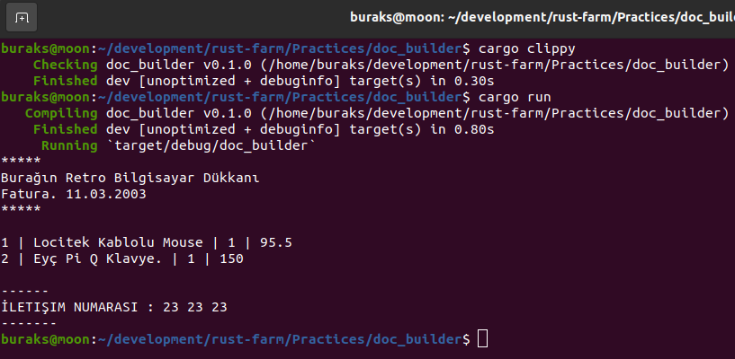

# Kendi Trait Nesnelerimizi Kullanarak Bir Doküman Tasarımını Esnekleştirmek

Bir Windows Forms uygulaması düşünelim ya da bir web sayfası. Hatta birden fazla bileşenden *(component)* oluşan bir mobil uygulama arayüzünü...Temelde ana kontrol üstüne eklenen başka tekil ve karma kontrollerden oluşan bir bütün söz konusudur. Şimdi de ana saha üzerine gelen bu kontrollerin nasıl çizilebildiğini düşünelim. Bir motor büyük ihtimalle belli ortak davranışlara sahip olan bileşenleri, ortamın istediği kıvamda *(örneğin HTML olarak)* çizme görevini üstlenir. Hatta bu sistemlerde bileşen ağacı öyle bir tasarlanır ki, geliştiriciler isterlerse kendi bileşenleri de tasarlayıp çalışma zamanı motorunun kullanımına sunabilir.

Nesne yönelimli dillerde bu tip kurgular için Interface'ler sıklıkla tercih edilir. Ana motor, belli interface şablonlarınca tanımlanan davranışları işletecek şekilde tasarlanır. Bileşenler bu interface şablonlarında belirtilen kuralları kendi dünyalarında yeniden yazar. Çalışma zamanı motoru çok biçimlilik esaslarını kullanarak bu davranışları kolayca icra eder. Rust tarafında bu amaçla trait nesneleri öne çıkmaktadır. Bu pratikte fatura gibi bir doküman üstünen eklenen parçları trait nesnelerini kullanarak nasıl genişletebileceğimizi incelemeye çalışacağız. Tabii gerçekten de bir fatura görseli çizmeyeceğiz ama temel yapı taşlarını icra etmeye uğraşacağız.

*Normalde generic tip kullanarak ilerlemeyi de düşünebiliriz lakin generic tip parametrelere t anında sadece tek bir concrete tip ile çalışabilir. Bu nedenle Trait nesneler kullanılır nitekim birden fazla asıl tipin çalışma zamanında dinamik olarak bağlanabilmesine imkan tanır. Esasında Trait nesneleri tanımlayabilmek için birkaç yol vardır. Bunlar Box<T>, &, Arc ve RC enstrümanlarıdır ve Dynamic Dispatch yöntemini kullanmamıza izin verir.

Örneğimizi doc_builder ismiyle oluşturabiliriz.

```bash
cargo new doc_builder
cd doc_builder
touch src/lib.rs
```

Lib.rs içeriğimiz;

```rust
use std::fmt::{Display, Formatter};

// Bir şeyi çizme davranışını tanımlayan yeni bir trait nesnesi eklendi.
// Tek bir fonksiyonu var uygulandığı nesne ne ise onu referans olarak alıyor
pub trait Draw {
    fn draw(&self);
}

// Bu veri yapısı fatura veya benzeri bir evrakı temsil eden modelimiz olsun.
// En önemli özelliği kendi üstündeki bileşenleri taşıdığı Sections koleksiyonu.
// Çalışma zamanında Draw trait'ini uygulayan asıl tipler belirsiz olacağından
// Dynamic Dispatch yaklaşımına geçildi.
pub struct Document {
    pub sections: Vec<Box<dyn Draw>>,
}

impl Document {
    // sections içeriğine veri ekleme işini add fonksiyonuna verdik
    pub fn add(&mut self, section: Box<dyn Draw>) {
        self.sections.push(section)
    }
    // print fonksiyonu belgenin sections kısmındaki tüm nesneleri dolaşacak
    // ve her birinin Draw fonksiyonunu çağıracak.
    pub fn print(&self) {
        self.sections.iter().for_each(|m| m.draw())
    }
}

// Şimdi Draw işlevini uygulayan birkaç veri yapısı ekleyelim.
// Örneğin dokümanın başlık kısmı için Title isimli bir veri yapısı olabilir.
pub struct Title {
    pub text: String,
    pub sub_text: String,
}

impl Title {
    pub fn new(text: String, sub_text: String) -> Self {
        Self { text, sub_text }
    }
}

// Title için Draw davranışını modelliyoruz(Sembolik olarak elbette)
impl Draw for Title {
    fn draw(&self) {
        println!("*****");
        println!("{}", self.text);
        println!("{}", self.sub_text);
        println!("*****\n");
    }
}

// Dokümanın alt kısmı için de Bottom isimli bir veri yapısı kurgulayalım
pub struct Bottom {
    pub summary: String,
}

impl Bottom {
    pub fn new(summary: String) -> Self {
        Self { summary }
    }
}

// Bottom veri yapısı içinde Draw davranışını yazıyoruz
impl Draw for Bottom {
    fn draw(&self) {
        println!("\n------\n{}\n-------", self.summary.to_uppercase());
    }
}

// Dokümana eklenebilecek ürün bilgilerini LineItems şeklinde bir veri yapısı olarak tutabiliriz.
// Faturanın orta kısımlarında alt alta kalemlerin yer aldığı, üstünde ürün adı, miktarı ve
// fiyatının olduğu bir grid düşünün.
#[derive(Default)]
pub struct LineItems {
    items: Vec<Product>,
}

impl LineItems {
    pub fn add(&mut self, p: Product) {
        self.items.push(p)
    }
}

// ve şimdi de LineItems'a Draw davranışını öğretelim
impl Draw for LineItems {
    fn draw(&self) {
        self.items.iter().for_each(|p| {
            println!("{}", p);
        })
    }
}

// Fatura dokümanında yer alabilecek ürün bilgileri Product struct'ı ile temsil edilebilir.
pub struct Product {
    pub id: u32,
    pub title: String,
    pub list_price: f32,
    pub quantity: u16,
}
impl Product {
    pub fn new(id: u32, title: String, list_price: f32, quantity: u16) -> Self {
        Self {
            id,
            title,
            list_price,
            quantity,
        }
    }
}
impl Display for Product {
    fn fmt(&self, f: &mut Formatter<'_>) -> std::fmt::Result {
        write!(
            f,
            "{} | {} | {} | {}",
            self.id, self.title, self.quantity, self.list_price
        )
    }
}
```

main.rs içeriğimiz;

```rust
use doc_builder::{Bottom, Document, LineItems, Product, Title};

fn main() {
    // Bir Document nesnesi oluşturuyoruz
    let mut invoice = Document { sections: vec![] };
    // Dokümana eklenecek bir Title nesnesi örnekliyoruz.
    let title = Title::new(
        "Burağın Retro Bilgisayar Dükkanı".to_string(),
        "Fatura. 11.03.2003".to_string(),
    );
    // Title'ı
    invoice.add(Box::new(title));

    let mouse = Product::new(1, "Locitek Kablolu Mouse".to_string(), 95.50, 1);
    let keyboard = Product::new(2, "Eyç Pi Q Klavye.".to_string(), 150.00, 1);
    let mut line_items = LineItems::default();
    line_items.add(mouse);
    line_items.add(keyboard);

    invoice.add(Box::new(line_items));

    let bottom = Bottom::new("İletişim numarası : 23 23 23".to_string());
    invoice.add(Box::new(bottom));

    invoice.print();
}
```

İşte çalışma zamanına ait bir görüntü.

