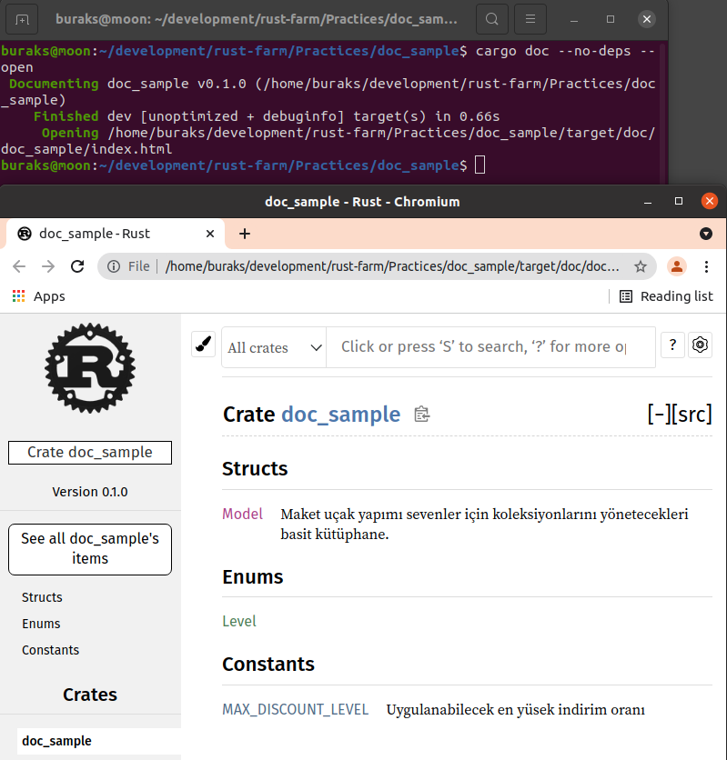
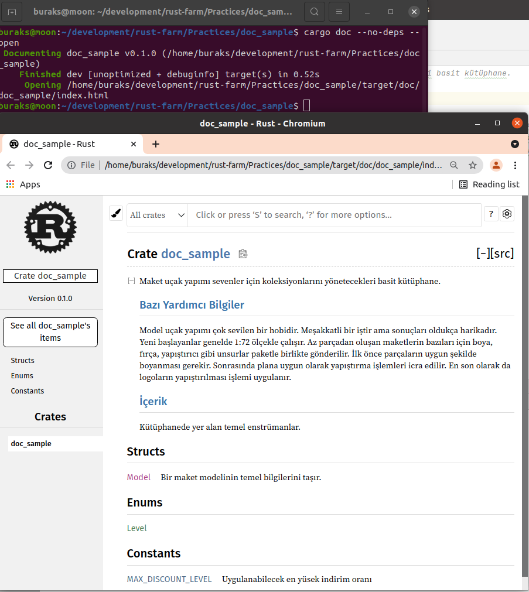
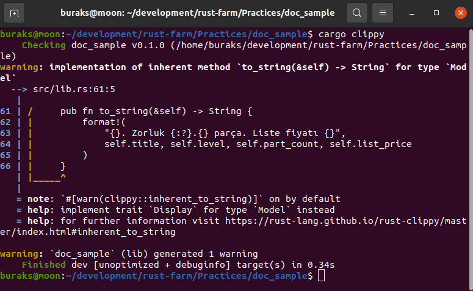
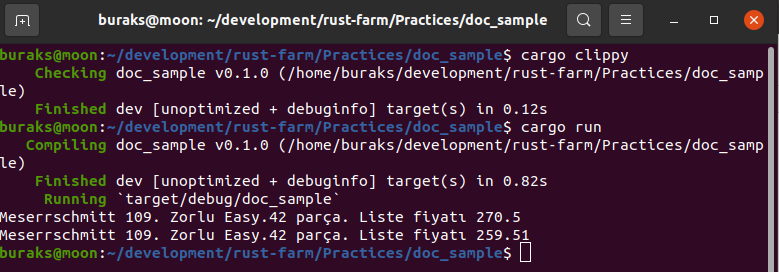

# Kod için yardım dokümanı oluşturmak.

 ```shell
cargo new doc_sample

# Normalde doküman üretimi için aşağıdaki komut kullanılır
cargo doc

# Ancak bağımlı kütüphanelerin dokümantasyonunu dahil etmek istemezsek
cargo doc --no-deps 

# Hatta geliştirme sırasında şu daha şık olur.
cargo doc --no-deps --open
```

## Notlar

Yardım dokümanları Markdown formatındadır. Yani dokümanda link verebilir, resim gösterebilir, bullet list, heading vs kullanabiliriz.
//! ile başlayan yorumlar inner doc olarak anılır. /// olarak ullandığımızda aşağıdaki sonuçları elde ederiz.



//! şeklinde değişiklik yapıldığında.



Kodun idiomatic olması için önerileri clippy verir. _cargo clippy_ Bunu alışkanlık haline getirmekte yarar var. Kodları idiomatic hale getirmek, daha temiz daha şık ve standartlara uygun çıktı üretmek için önemli bir çalışmadır. Örneğin bu kodda to_string yerine Display trait'ini implemente etmenin daha uygun olacağı söyleniyor.



Sonuç,



Dokümantasyon oluşturmada nasıl bir yol izleneceğine dair en güzel kaynak Rust'ın var olan yardım dokümanlarıdır.
