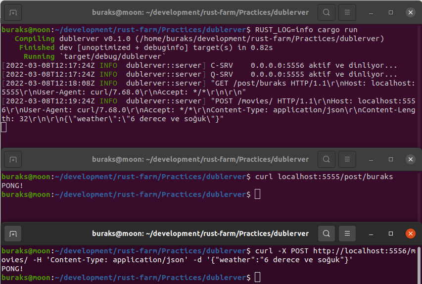

# Bir Uygulamada İki TcpListener Kullanmak

Sırf meraktan denediğim bir örnek. Uygulama çalıştığında iki TcpListener ayağa kaldırıyor. Böylece iki farklı porttan mesaj dinleyen bir programa sahip olabiliriz. Esasında çok mantıksız bir senaryo sayılmaz. Söz gelimi GET taleplerini farklı bir porttan ele alırken POST,PUT,DELETE gibi talepleri diğer porttan ele alacağımızı düşünebiliriz. CQRS'in HTTP taleplerine uygulanan bir versiyonu gibi düşünülebilir belki de. Örnek şu an için hangi istek gelirse gelsin sadece HTTP 200 Ok döndürecek şekilde geliştiriliyor. Nitekim amacım iki thread içerisinde farklı port kullanan birer TcpListener çalıştırmak.

```shell
cargo new dublerver

cd dublerver
touch src/lib.rs
# ideomatic'liği kontrol için
cargo clippy

# Logları takip etmek için ve programı çalıştırmak için
RUST_LOG=info cargo run
```

Sonuçlar fena değil.

```bash
# Örnek sorgular

#GET
curl localhost:5555/post/buraks

#JSON POST
curl -X POST http://localhost:5556/movies/ -H 'Content-Type: application/json' -d '{"weather":"6 derece ve soğuk"}'
```



Tabii ben örneği biraz yarım bıraktım gibi. Aslında Query Server'ın sadece HTTP Get taleplerini alması, Command Server'ın ise sadece POST,PUT,DELETE taleplerini işlemesi lazım. Pek tabii bunlara da uygun HTTP cevapları döndürmeliyiz.