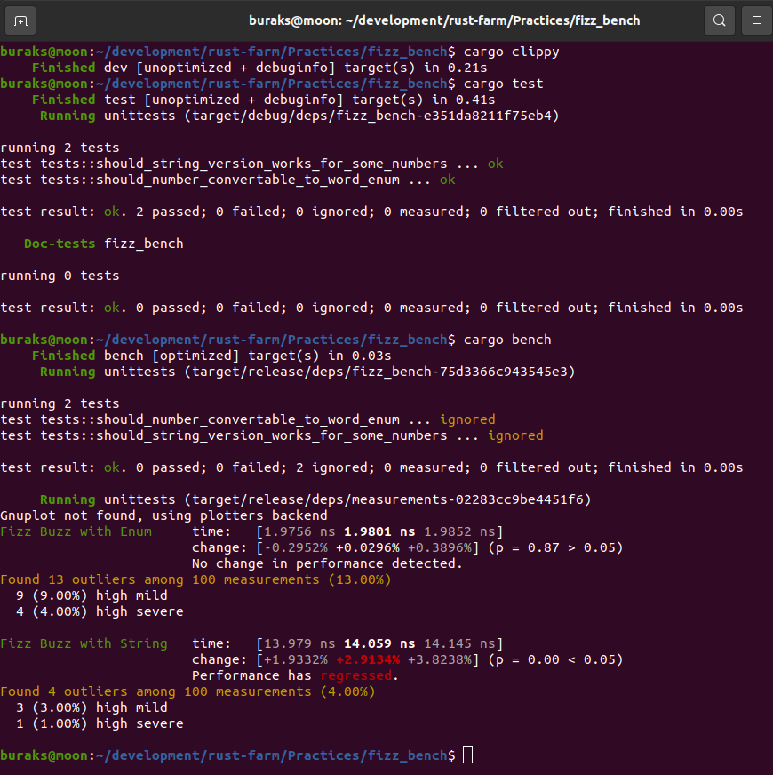

# Fizz Buzz Problemin String ve Enum Sabiti Kullanımı Arasındaki Performans Farklılıkları

Benchmark ölçümlemeleri için öncelikle cargo.toml dosyasında gerekli değişiklikleri yapalım.

```toml
[dev-dependencies]
criterion={version="0.3.5",features=["html_reports"]}

[[bench]]
name="measurements"
# built-in benchmark'ları kapatmak için false değeri atandı
harness=false
```

Çalışma zamanı çıktıları aşağıdaki gibi olacaktır.

