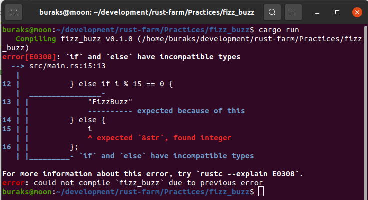
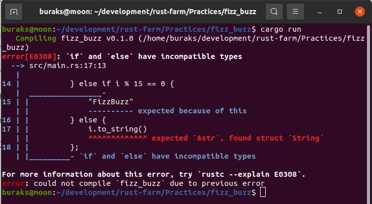
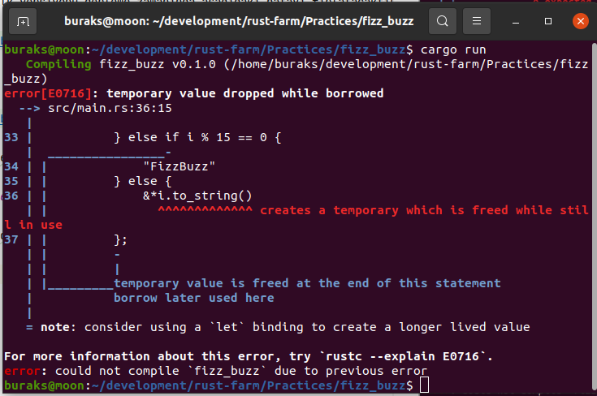
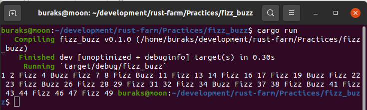

# FizzBuzz Örneği

FizzBuzz pratiğinde 1 den başlayarak ilerlenir. Sayı 3 ile tam bölünüyorsa Fizz, 5 ile tam bölünüyorsa Buzz, 15 ile tam bölünüyorsa FizzBuzz yazması istenir. Diğer durumlarda sayının kendisi yazılır. Bu işlemi Rust ile yapmayı deneyelim. Yolda başımıza açacağımız bazı işler olacak.

## `if` and `else` have incompatible types

Program kodunun ilk versiyonu derleme zamanında aşağıdaki hatayı fırlatacaktır.

Bunun üzerine pek çok diğer dilde olduğu gibi i32 türünden gelen değişkeni String türüne dönüştürerek ilerlemeyi düşünebiliriz.

Aslında temel mesele Rust'ın birçok dilin aksine tek bir string değil iki tanesine sahip olmasıdır. Birisi String veri yapısı diğeri ise &str.

## temporary value dropped while borrowed

i.to_string() ifadesinde &*i.to_string() şeklinde bir kullanıma geçilen ikinci durumda yaşam ömrü *(lifetimes)* sorunu ile karşılaşılır. else bloğunda to_string() ile yeni bir String oluşturulur ancak else bloğu bittiği anda bellek atılır. Oysa ki sahiplenilen değer let ifadesine alınabilir ki yeterince uzun yaşamamıştır.

Derleyici hata mesajında i'yi bir değişkende saklamayı önerir. Örnek buna göre düzenlendiğinde sorun kalmayacaktır.

