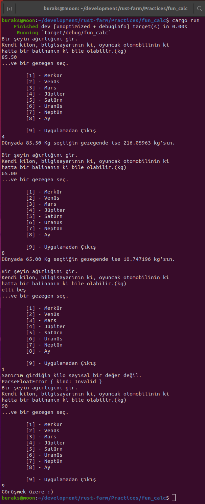

# Fun Calc _(O Gezegende Kaç Kilodur Acaba?)_

Acaba Merkür'de kaç kilo geliriz ya da Neptün'de. Peki ya Uranüs'te? Bu çerezlik terminal uygulamasında kullanıcıdan girdi alma konusuna odaklanıyor ve işi bir hesap makinesi ile eğlenceli hale getirmeye çalışıyoruz. Bol bol pattern matching kullandığımızı da söyleyelim.

```shell
cargo new fun_calc
cargo clippy
cargo run
```

İşte çalışma zamanına ait çıktılar.



Bence kurgumda bir sorun var. Kilo sorusuna cevap vermeden öncede uygulamadan çıkabilmeliyiz kontrollü bir şekilde.