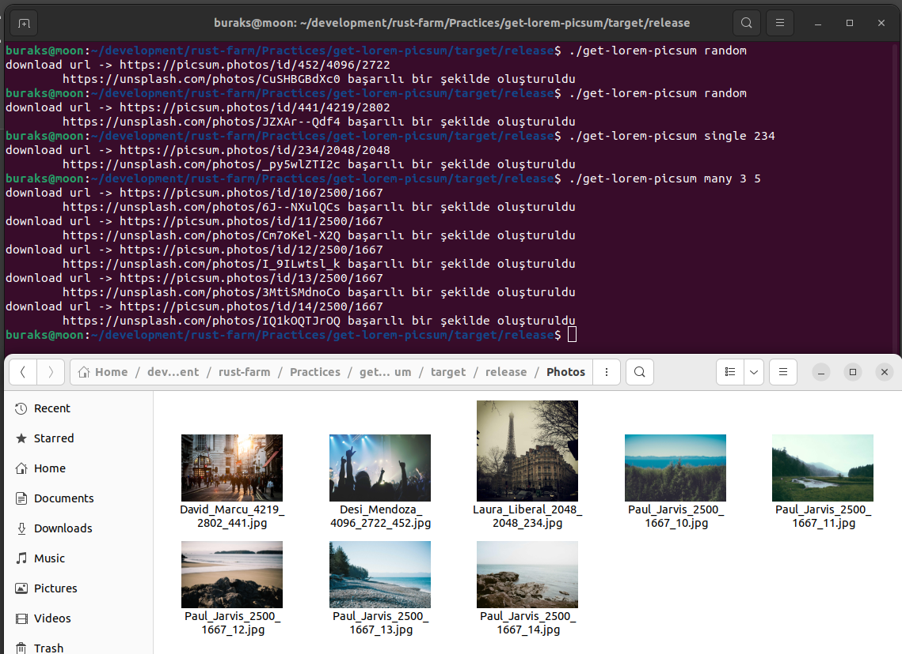

# Lorem Picsum'dan Fotoğraf İndirme

Popüler bir lorem ipsum türü olan [bu siteden](https://picsum.photos/) basit REST sorguları ile Unsplash kaynaklı fotoğraflar çekmek mümkün. Bir uygulamada rastgele fotoğraflara ihtiyacımız olduğu hallerde kullanımı ideal. Örnek uygulamada bu siteye basit REST sorguları gönderip fotoğrafların local bilgisayar ortamına JPG olarak indirilmesi. söz konusu.

Örnek Rest sorgularını şöyle ifade edebiliriz;

| URL                                            | Açıklama                                                                                                                                              |
|------------------------------------------------|-------------------------------------------------------------------------------------------------------------------------------------------------------|
| https://picsum.photos/v2/list?page=2&limit=100 | Sayfalama tekniği ile 2nci sayfadan 100 fotoğraf getirir.                                                                                             |
| https://picsum.photos/id/12/info               | Belli bir ID değerine sahip fotoğrafı getirir. Örneğin 12 nolu fotoğraf gibi.                                                                         |
| https://picsum.photos/     | Tam anlamıyla rastgele bir fotoğraf getirir. Bu örnekte 640X480 boyutlarında.                                                                         |
| https://picsum.photos/640/480?grayscale        | 640X480 boyutlarında rastgele bir fotoğraf getirir ama bunu siyah beyaz formata çevirerek yapar.|

## Çalışma Zamanı

Örnek terminalden aldığı argümanlara göre talepleri ilgili REST çağrılarına çevirecek ve buna göre birden fazla ya da tek bir fotoğrafı indirecektir. Belli bir id değerine sahip fotoğraf çekilebileceği gibi rastgele fotoğrafta indirilebilecektir. Dosya adları fotoğrafa ait info içeriğinden yararlanılarak oluşturulur. İsimlendirmede fotoğrafı çeken kişi, id ve boyut bilgileri kullanılır. Rastgele fotoğraflarda bilgileri alabilmek için id değeri gerekir. Bu id değeri Response Header'da Picsum-Id şeklinde tutulmaktadı. Bu değer yakalanarak rastgele fotoğrafın bilgilerine de ulaşılabilir.

```bash
# öncelikle örneği release etmek lazım
cargo build -r

# release klaösrü altındayken aşağıdaki gibi çalıştırılabilir

# belli bir id'ye ait fotoğrafı indirmek için
./get-lorem-picsum single 123

# 5nci sayfadan itibaren 10 kayıt getirmek için
./get-lorem-picsum many 5 10

# rastgele bir fotoğraf indirmek için
./get-lorem-ipsum random
```

