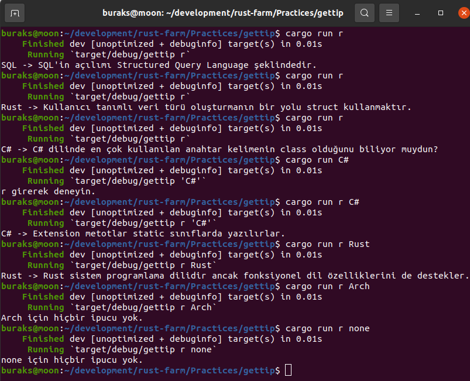
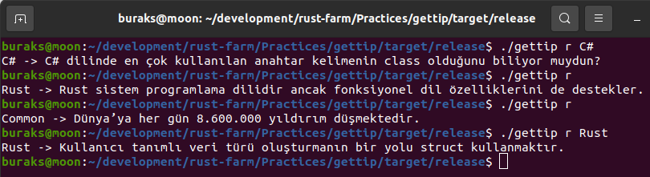

# GetTip

Bir json dosyasında farklı kategorilerde ipuçları, bilgiler yer alıyor. Komut satırından gettip programını çalıştırınca rastgele bir tanesini çekip ekrana getiriyor. Hatta ikinci versiyonunda komut satırından yeni ipucu girilmesi de sağlanabilir.

```shell
# rastgele bir ipucu döndürür
cargo run r

# Örnek olarak rust kategorisinden rastgele bir ipucu döndürür
cargo run r Rust
```



Tabii bir release çıkıp cargo aracını kullanmadan da binary'imizi işletebiliriz.

```shell
cargo build --release
cd target/release
./gettip r rust
./gettip r
```

Ancak şöyle bir hatırlatma yapalım. Program tips.json dosyası ile çalıştığından onu da binary'nin olduğu klasörle birlikte dağıtmalıyız.



