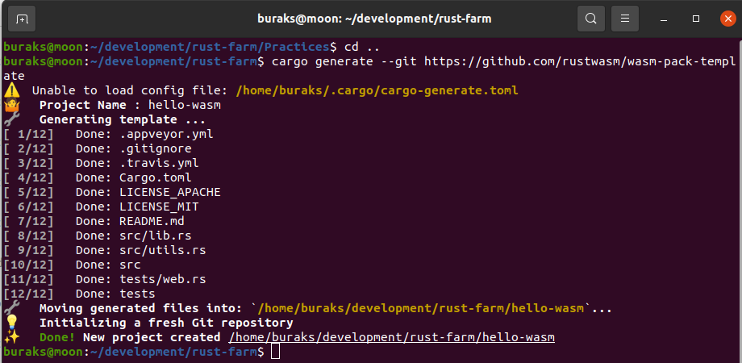
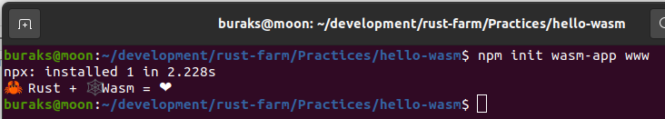
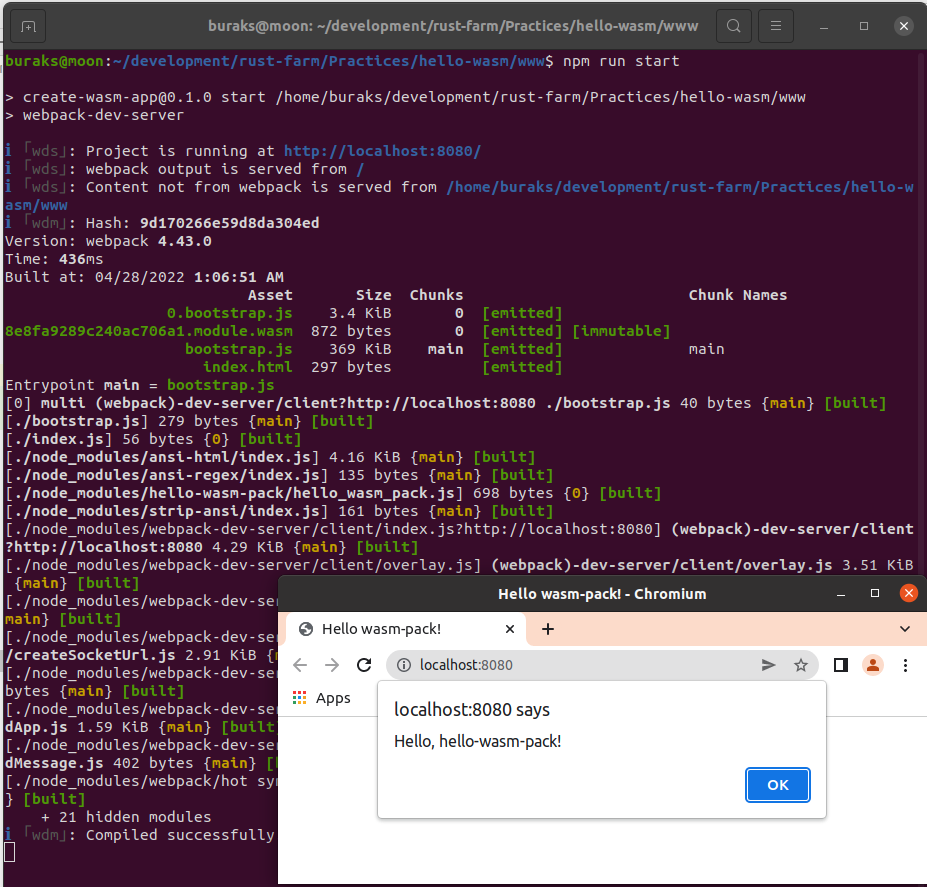

# Bir Web Assembly Denemesi

Web tarafını ayağa kaldırmak için node ve npm'e ihtiyaç olacaktır. Moon *(Benim ubuntu sistemi)* üstünde bunlar yoktu.

```shell
sudo apt update
sudo apt install nodejs

# Kurulum başarılı olduysa bir versiyona bakılır
node -v

# npm yüklemek için
sudo apt install npm

# tabii birde webpack'e ihtiyaç var
sudo npm install --save-dev webpack

# işleri kolaylaştırmak için hazır bir proje şablonu var
# aşağıdaki komut ile bunu indirmek lazım.
cargo install cargo-generate

# sonrasında git üstündeki proje şablonu ile yeni bir proje oluşturulur.
cargo generate --git https://github.com/rustwasm/wasm-pack-template
```



```shell
# Web tarafında kullanılacak WASM paketini üretmek için
wasm-pack build

# web assmebly'ı bir web sayfasında kullanmak için öncelikle wasm-app yüklenmelidir
npm init wasm-app www
```



Bu işlemler sonrasında www klasöründeki node projesinin pkg içerisindeki wasm çıktısını kullanması için  www içerisindeki package.json dosyasında dependencies kısmı eklenmelidir.

```json
{
  "dependencies": {
    "hello-wasm": "file:../pkg"
  }
}
```

```shell
# Bu işlemle birlikte npm bağımlılıkları yüklenir
cd www
npm install

# ve deneme amaçlı olarak proje aşağıdaki komutla çalıştırılır
npm run start
```



Rust kütüphanesinde değişiklik olduğunda www klasöründeki projede kullanılabilmesi için yeni bir build işlemi yapmak gerekir.

```shell
wasm-pack build
```

