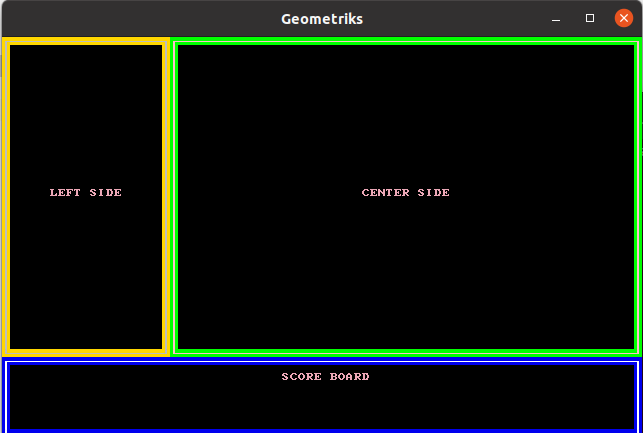

# Oyun Sahasındaki Çerçeveler

Bir retro otomobil yarışı ekranını düşündüm. Alt tarafta skorbord ve belki bazı takım konuşma metinleri, sol tarafta arabanın göstergeleri, sağ ana ekranda da yol ve pistin kendisi. Burada çerçeveleri bracket-lib ile nasıl oluşturabilirim görmek istedim.

