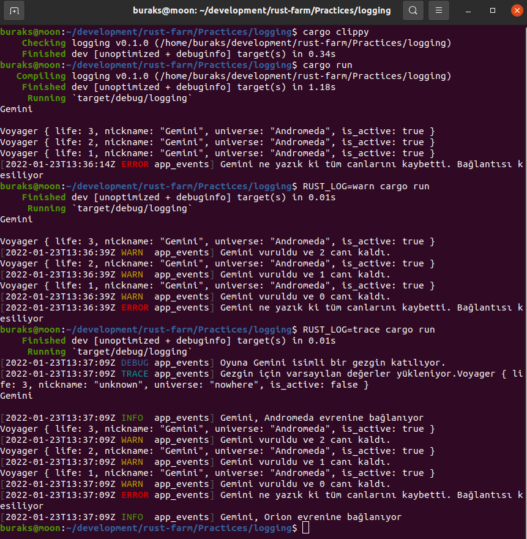

# Loglama

Sistem programcıları için de log okumak, logdan bilgi alıp karar vermek veya sorunları tespit etmek oldukça önemli. Çok doğal olarak Rust ile yazılan uygulamalar içinden de bir takım logları yayınlamak isteyebiliriz. Bu örnekte [log](https://crates.io/crates/log) ve [env_logger](https://docs.rs/env_logger/0.9.0/env_logger/) paketlerini kullanarak basit anlamda loglamanın nasıl yapıldığını öğreniyoruz. 

Normalde bir kütüphane geliştiriyorsak sadece log paketini kullanmak yeterlidir. Ancak çalıştırılabilir bir uygulamadan log basacaksak onu implemente eden crate'leri kullanmamız gerekir. Façade görevi üstlenen bu tetikleyiciler farklı ortamlara log basma kabiliyetlerine de sahiptir. 

Bizim örnekte minimal olanlardan env_logger kullanılıyor. Ancak daha karmaşık sistemler için log4rs _(log4net gibi düşünün)_, web assembly'lar için console_log, android, windows, unix gibi ortamlara logları adapte edebilen android_log, win_dbg_logger, syslog vb türler de bulunmakta.

Senaryoda kobay bir Voyager veri yapısı ve üzerinde uygulanan birkaç fonksiyon var. Fonksiyonların bazı noktalarına log mekanizması serpiştirilmiş durumda. Amaç termimal ekranına çeşitli türde log basılmasını sağlamak.

```shell
cargo new logging
touch src/lib.rs

# önerileri alıp kodu toparlamak için
cargo clippy
# library'nin başarılı şekilde build olup olmadığını görmek için
cargo build --lib

# varsayılan çalıştırmada sadece ERROR Logları görünür
cargo run

# log çıktılarını okumak için farklı yollar kullanabiliriz.
# warn ve error mesajlarını gösterir
RUST_LOG=warn cargo run

# trace ile birlikte debug,warn,info,error mesajlarını alırız
RUST_LOG=trace cargo run
```

