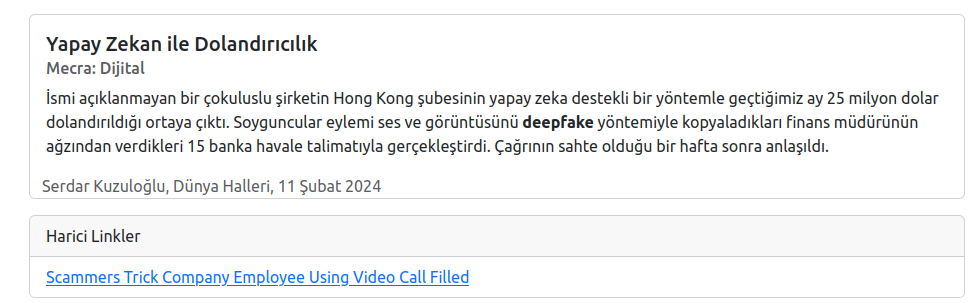

# Notes Server

Bu uygulama sadece index.html sayfasını host eden basit bir web sunucu uygulamasıdır. Sayfa her talep edildiğinde benim kitaplardan, bültenlerden, dergilerden derlediğim notlardan rastgele birisini göstermektedir. 

Örnek projede warp, tokio, serde, handlebars küfeleri kullanılmakta. warp web sunucusu, tokio asenkron operasyonlar, serde json serileştirme operasyonları ve handlebars' da HTML şablonundaki dinamik içerikleri yönetmek için kullanılmaktadır.

İşte çalışma zamanına ait birkaç görüntü.





## Dockerize İşlemleri

Projeyi dockerize etmek için bir Dockerfile eklenmiştir. Sonrasında aşağıdaki adımlar ile ilerlenebilir.

```bash
# Docker Image oluşturma
sudo docker build -t notes-server .

# Image başarılı bir şekilde oluştuysa çalıştırabiliriz.
sudo docker run -d -p 5556:5555 notes-server

# Eğer makine her başlatıldığında bu servis aktif olarak çalışsın istiyorsak
# aşağıdaki komutu da kullanabiliriz
sudo docker run -d --restart always -p 5556:5555 notes-server
```


Bu örnek uygulamada dikkat edilmesi gereken bazı noktalar var. Örneğin docker dosyası içerisinde bir Environment değişkeni kullanılıyor. Main koduna dikkat edilecek olursa ENV değişkenine göre json ve handlebar dosyalarının adresleri ayarlanmakta. Böylece local ortamda cargo run ile uygulama çalışabilirken docker image ile build edildikten sonra da json ve hbs dosyalarına erişilebiliyor.


Docker image 5556 nolu portu kullandığından sorunsuz şekilde hem docker imajı hem de local ortamı birlikte kullanabiliriz. Elbette yapılacak kod değişiklikleri sonrası docker imajının yeniden build edilmesi gerekecektir.


## Güncelleme

Yeni notlar eklenmesini kolaylaştırmak için basit bir form eklendi.


## Bazı Notlar

Bu örnekle çalışırken sistemde dangling olarak adlandırılan none isimli bazı docker imajlarına rastladım. Bunları yönetmek için aşağıdaki komutlardan yararlandım.

```bash
# Dangling statüsündeki imajları listelemek için
sudo docker images -f "dangling=true"

# Dangling statüsündeki imajları silmek için
sudo docker image prune

# Kullanılmayan imajlarla birlikte, kullanılmayan ağ tanımlamalarını, hacimleri(volumes)
# topluca temizlemek için. Dikkatli olunması gereken bir komuttur.
sudo docker system prune

# Tabii container ile çalışırken bazı kayıtları oraya atmış bulundum
# Hal böyle olunca oradaki güncel json içeriği de gerekti.
# Aşağıdaki komut ile container içerisindeki json dosyasını bulunduğum klasöre kopyalayabildim.

sudo docker cp notes-server:/usr/local/bin/notes.json .

# notes-server yerine çalışan container'ın id'si de yazılabilir. Örneğin aşağıdaki gibi.
sudo docker cp 236ff7:/usr/local/bin/notes.json .
```

## Güncelleme

Uygulamaya loglama eklendi. Local'de çalıştırırken aşağıdaki gibi ilerlenebilir.

```bash
RUST_LOG=info cargo run

# Docker container ile çalıştığında oluşan logları yakalamak içinse
# aşağıdaki gibi ilerlenebilir
sudo docker logs <container_adı_veya_id_değeri> 
```