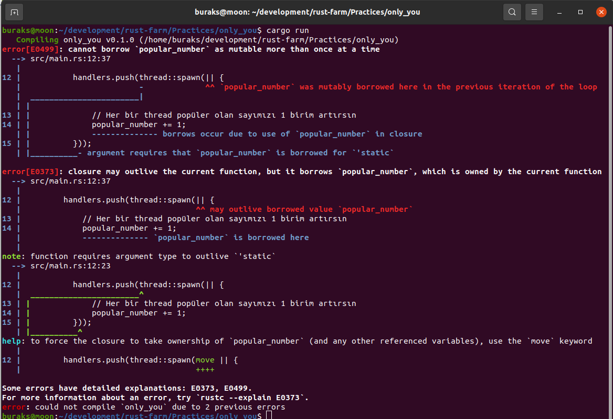
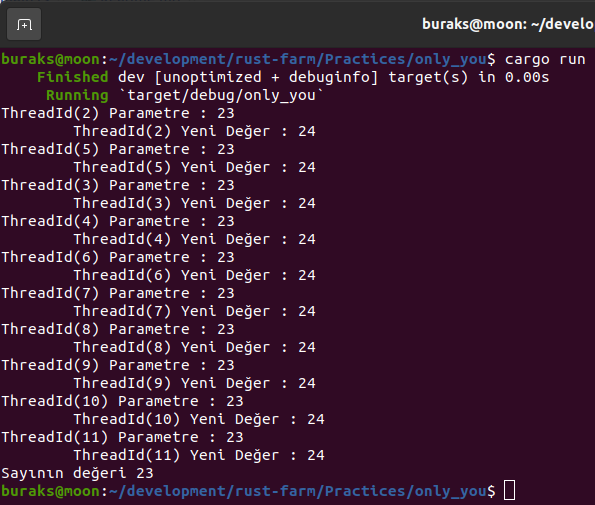
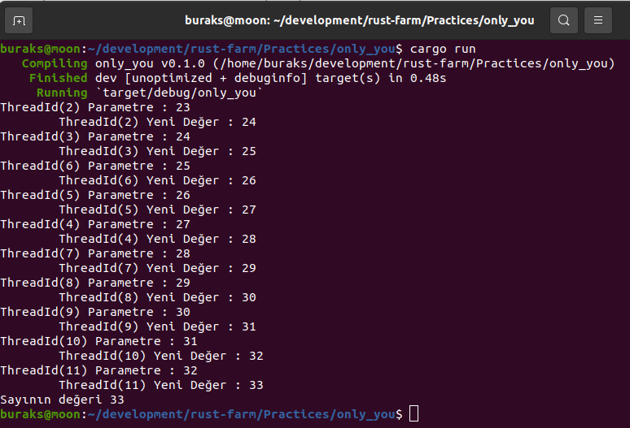
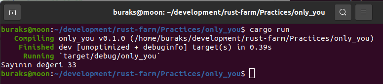

# Aynı Anda Sadece Tek Bir Değiştirilebilir Referans Olabilir

Thread'ler ve eş zamanlı iş parçacıkları işin içerisine girdiğinde karşımıza çıkan önemli konulardan biriside mutable türden referansları nasıl kullanacağımızdır. Malum bu thread'ler aynı veri üzerinde değişiklik yapmak isteyebilirler. Data Races oluşmaması Rust'ın temel ilkelerinden birisidir ve bunun en büyük sebebi bellek ortamını güvenli halde koruyabilmektir. Dolayısıyla belleğin referans edilen bölgelerinin bu thread'ler içerisinde yazma amaçlı ele alınması durumlarında kod biraz karmaşıklaşabilir. Öncesinde kuralın ne olduğunu dile getirelim; ___Rust bir t anında birden fazla mutable referans oluşturulmasına izin vermez, buna müsaade edecek şekilde kodlama yapmamızı engeller.___ Elbette konuyu anlamanın en güzel yolu basit bir örnek üzerinden ilerlemekle mümkün. Öyleyse başlayalım.

```shell
# Projemizi aşağıdaki gibi oluşturabiliriz.
cargo new only_you
cd only_you

# Kodun kalitesine bakmak için
cargo clippy

# ve çalıştırmak için 
cargo run
```

İlk başta kodlarımız aşağıdaki gibi.

```rust
use std::thread;

fn main() {
    // Birkaç thread'in ortaklaşa kullanmak istediği bir sayı belirleyelim.
    let mut popular_number = 23_u32;

    // JoinHandle nesneleri için bir vector. Main'i bekletmek için kullanırız.
    let mut handlers = Vec::new();

    // 10 tane thread açalım
    for _ in 0..10 {
        handlers.push(thread::spawn(|| {
            // Her bir thread popüler olan sayımızı 1 birim artırsın
            popular_number += 1;
        }));
    }

    for h in handlers {
        let _ = h.join();
    }
}
```

Birden fazla thread'in ortaklaşa artıracağı bir sayımız var. 10 thread açıp değerini 1 birim artırmak istiyoruz. Ne yazık ki uygulamamızı bu haliyle çalıştırmak istediğimizde aşağıdaki hatalar ile karşılaşacağız.



Hata mesajı açık bir şekilde popular_number'ın birden çok kez mutate edilmeye çalışıldığını belirtmekte. Esasında bunu çözmenin basit bir yolu var. Spawn fonksiyonunda move özelliğini kullanarak her bir thread'in popular_number'ın birer kopyasını almasını sağlayabiliriz. Kopyasını almak istediğimiz sonucu vermeyebilir ki bunu şimdi göreceğiz. main içeriğini aşağıdaki gibi değiştirerek devam edelim.

```rust
use std::thread;

fn main() {
    // Birkaç thread'in ortaklaşa kullanmak istediği bir sayı belirleyelim.
    let mut popular_number = 23_u32;

    // JoinHandle nesneleri için bir vector. Main'i bekletmek için kullanırız.
    let mut handlers = Vec::new();

    // 10 tane thread açalım
    for _ in 0..10 {
        handlers.push(thread::spawn(move || {

            println!(
                "{:?} Parametre : {}",
                thread::current().id(),
                popular_number
            );

            // Her bir thread popüler olan sayımızı 1 birim artırsın
            popular_number += 1;

            println!(
                "\t{:?} Yeni Değer : {}",
                thread::current().id(),
                popular_number
            );
        }));
    }

    for h in handlers {
        let _ = h.join();
    }

    println!("Sayının değeri {}", popular_number);
}
```

Hata mesajından kurtulduğumuzu söyleyebiliriz ancak program pekte istediğimiz gibi çalışmayacaktır. Normalde her thread'in bu ortak sayı değerini birer artırmasını bekliyoruz. Lakin thread'lere ilgili değişkeni move sebebiyle kopyalayarak verdiğimizden her thread kendi 23 değerini kullanıyor. Sonuçta aşağıdaki gibi bir çıktı elde edeceğiz.



Şimdi ne yapacağız? Ortak veriyi bir Mutex nesnesi olarak ele almak esasında işimizi çözecektir. Lakin Mutex kullandığımızda değeri okuyabilir ve eğer onun için bir kilit açmışsak üzerine yazma işlemi gerçekleştirebiliriz. Gelin kodumuzu aşağıdaki halde yeniden tasarlayalım.

```rust
use std::sync::{Arc, Mutex};
use std::thread;

fn main() {
    // Birkaç thread'in ortaklaşa kullanmak istediği bir sayı var.
    // Thread Safe Reference Counter ile birlikte Mutex nesnesi olarak oluşturuyoruz
    let popular_number = Arc::new(Mutex::new(23_u32));

    // JoinHandle nesneleri için bir vector. Main'i bekletmek için kullanırız.
    let mut handlers = Vec::new();

    // 10 tane thread açalım
    for _ in 0..10 {
        // Atomically Reference Counted nesnesinin bir klonunu oluşturuyoruz
        // Thread'ler bunu kullanacak
        let number_clone = Arc::clone(&popular_number);

        handlers.push(thread::spawn(move || {
            // klonlanan referans bilgisine bağlı Mutex içeriğini kitliyoruz
            let mut p = number_clone.lock().unwrap();

            println!("{:?} Parametre : {:?}", thread::current().id(), p);

            // p değerini dereference ettikten sonra 1 artırıyoruz
            *p += 1;

            println!("\t{:?} Yeni Değer : {:?}", thread::current().id(), p);
        }));
    }

    for h in handlers {
        let _ = h.join();
    }

    // Thread'lerin ortaklaşa kullandığı sayısal değer aslında Atomically Reference Counted tarafından
    // tutulan bir Mutext değişkeni. Bir şekilde sonucu almak gerekiyor.
    // Şimdilik aşağıdaki gibi bir yol bulabildim.
    println!(
        "Sayının değeri {}",
        Arc::try_unwrap(popular_number)
            .unwrap()
            .into_inner()
            .unwrap()
    );
}
```
Yeni kurguda işin içerisine Mutext nesnesini tutan bir de Atomically Reference Counted tipi girdi. Yapılan şeyi anlamaya çalışalım. Öncelikle ortak sayı değerinin thread'ler tarafından aynı anda değiştirilmeyeceğini garanti etmemiz gerekiyor. Bunun için Mutex nesnesini kullanıyoruz. Lakin n sayıda thread'in bu değişkene erişip değiştirmesini istiyoruz. Bir thread bu değişkeni kilit altına aldıysa başka bir thread'in onu değiştirmesini engelliyoruz ve değişken boşa düştüğü zaman başka bir thread tarafından değiştirilebiliyor. Lakin n thread'in içerisine değişkenin birer kopayasını aldığımızda hepsinin kendi başına takılması da söz konusu ve sonuçta sayı ortaklaşa artmıyor. İşte Atomically Reference Counter dediğimiz tür burada devreye girmekte. Arc ile heap'te yer alan ve bir Mutex tarafından tutulan bellek bölgesi için n adet referans oluşturulması mümkün. Thread'ler Arc değerlerini klonladıkça aslında Mutex ile sahiplenilmiş aynı bellek bölgesini referans eden pointer'lar oluşuyor. number_clone değişkeni bu amaçla oluşturuldu. Derken açılan herbir thread kendisine klon olarak gelen ama aynı bellek bölgesini işaret eden bu referansları ele almaya başlıyor. Bu referansın bellekte işaret ettiği alanı değiştirmek içinse öncelikle bir kilit koyuyor. p değişkenini oluşturduğumuz yer. Dolayısıya thread içinde tamamen güvenli bir şekilde ilgili referansın işaret ettiği bölgedeki veriyi değiştirme şansımız doğuyor. Tabii bunun için dereference işlemini uygulamamız lazım ki bu da * operatörü ile sağlanmakta. Thread scope'u sonlandığında hem kilit kalkıyor hem de referans eden pointer'lardan birisi eksiliyor. En nihayetinde tüm thread'ler ilgili sayıyı ortaklaşa değiştirmiş oluyorlar. İşte çalışma zamanı görüntüsü.



Rust'ın standart Arc, Mutex ve thread yapılarını kullanınca kodlamak biraz zorlaşabiliyor. Esasında concurrent işlemler için çok güzel iki paket mevcut. Benim de bazı örneklerde tercih ettiğim [Crossbeam](https://crates.io/crates/crossbeam) ve [parking_lot](https://crates.io/crates/parking_lot) paketlerinden yararlanarak kodu daha okunur ve anlaşılır hale getirebiliriz. Şimdi bunları kullanarak aynı örneği tekrar yazmayı deneyelim. İlk olarak toml dosyasında gerekli bildirimleri eklemeliyiz.

```toml
[dependencies]
crossbeam="0.8.1"
parking_lot = "0.12.0"
```

Sonrasında main içeriğini aşağıdaki şekilde değiştirebiliriz.

```rust
//use std::sync::{Arc, Mutex};
//use std::thread;

use parking_lot::Mutex;

fn main() {
    // Yine bir Mutex oluşturduk ancak Arc gibi bir referans counter kullanmadık
    let popular_number = Mutex::new(23_u32);

    // Bir scope oluşturuyoruz ve bu scope 10 adet thread yumurtluyor.
    crossbeam::scope(|s| {
        for _ in 0..10 {
            s.spawn(|_| {
                // Dereference ve lock işlemini mütaakip sayı değerini bir artırıyoruz
                *popular_number.lock() += 1;
            });
        }
    })
    .unwrap();

    let popular_number = popular_number.into_inner();
    println!("Sayının değeri {}", popular_number);
}
```

Program kodumuzu tekrar çalıştırdığımızda istediğimiz sonuca ulaşırız.

