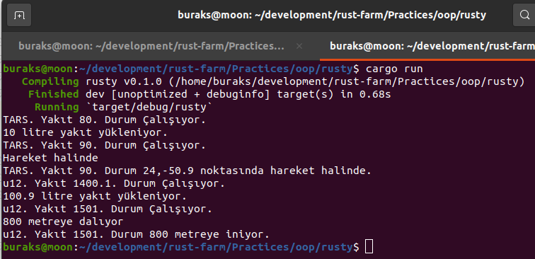

# C# Tarafında Class, Peki Ya Rust Tarafında ???

Rust'ın fonksiyonel paradigma'yı desteklemesi bir yana imperative özellikleri de benimsediğini söyleyebiliriz. Bu açıdan bakıldığında nesne yönelimli dillerde uygulanan bazı kavramların Rust tarafında da uygulanabiliyor olması beklenebilir. Bu klasörde iki örnek yer alıyor. Birisi Dotnet platformuna ait basit bir Console uygulaması. Adı sharpy. Diğeri ise rusty isimli ve Rust ile geliştirilen bir console uygulaması.

```shell
dotnet new console -n sharpy

cargo new rusty
```

Çalışmadaki amaç **OOP-Object Oriented Programming*** prensiplerinin Rust tarafında uygulanıp uygulanamayacağını görmek.

## Basit Nesne Tasarımı ve Override

İlk olarak dotnet tarafındaki console uygulamasını ele alalım. Bir oyundaki robotu temsile edecek veri yapısını kuvvetle muhtemel bir sınıf olarak tasarlarız.

```csharp
var tars = new Robot("TARS", 80);
Console.WriteLine(tars.ToString());
tars.LoadFuel(10);
Console.WriteLine(tars.ToString());
tars.Walk();
Console.WriteLine(tars.ToString());

public enum State
{
    Online,
    OutOfService,
    OnTheMove,
    Destroyed
}
class Robot
{
    public string Name { get; set; }
    public float FuelLevel { get; set; }
    private State State { get; set; }

    public Robot(string name, float fuel)
    {
        Name = name;
        FuelLevel = fuel;
        State = State.Online;
    }

    public void LoadFuel(float amount)
    {
        Console.WriteLine($"{amount} litre yakıt yükleniyor...");
        this.FuelLevel += amount;
    }

    public void Walk()
    {
        Console.WriteLine("Hareket halinde");
        this.State = State.OnTheMove;
    }

    public override string ToString()
    {
        return $"{this.Name}. Yakıt {this.FuelLevel}. Durum {this.State}";
    }
}
```

Yukarıdaki örnek şu an için aşağıdaki gibi çalışacaktır.


Robot sınıfının iki public ve bir de private özelliği var. Auto-Property olduklarından get ve set blokları dotnet tarafından tamamlanıyor. Parametreler ile overload edilmiş bir yapıcı metodu var. Ayrıca Walk ve LoadFuel isimli deneysel fonksiyonlara sahip. Object sınıfından gelen ToString metotu bu sınıf için yeniden yazıldı *(override)* Robotun o anki durumunu tutmak için State isimli bir Enum sabiti kullanıyoruz. Benzer bir modeli Rust tarafında inşa etmek istersek aşağıdaki gibi ilerleyebiliriz.

```rust
use std::fmt::{Display, Formatter};

fn main() {
    // Robot nesnesi üstünde değişikliker yapacağımız için mutable olması gerekir
    // Sonrası C# tarafı ile oldukça benzerdir.
    let mut tars = Robot::new(String::from("TARS"), 80.0);
    println!("{}", tars);
    tars.load_fuel(10.0);
    println!("{}", tars);
    tars.walk(24.0, -50.9);
    println!("{}", tars);
}

// C# Örneğindeki gibi robotun anlık durumu için burada da bir enum kullanıyoruz.
// Tabii rust için enum bir veri yapısıdır. Zenginleştirilebilir. OnTheMove alanında olduğu gibi.
#[allow(dead_code)]
enum State {
    Online,
    OutOfService,
    OnTheMove(Location), // Bonus :) Rust enum veri yapısının zenginliğini kullandık. OnTheMove state'indeyken örneğin lokasyonunu da tutalım dedik.
    Destroyed,
}

struct Location {
    pub x: f32,
    pub y: f32,
}

// C# tarafındaki Robot sınıfı burada bir struct olarak tanımlanır.
// Malum Rust tarafında class diye bir kavram yok.
struct Robot {
    pub name: String,
    pub fuel_level: f32,
    state: State,
}

// C# tarafında Robot nesnesinin metotları(yapıcı metot dahil) sınıf tanım blokları içerisindedir.
// Rust fonksiyonel paradigmayı benimser ve aşağıdaki usülde ilerlenir.
impl Robot {
    // yapıcı metot karşılğı. Self ile çalışma zamanındaki Robot nesnesini ifade ederiz.
    pub fn new(name: String, fuel_level: f32) -> Self {
        Self {
            name,
            fuel_level,
            state: State::Online,
        }
    }
    // yakıt seviyesini artıran fonksiyon.
    // Tabii rust tarafında her değişken aksi belirtilmediği sürece immutable olduğundan,
    // self için &mut kullanılır.
    pub fn load_fuel(&mut self, amount: f32) {
        println!("{} litre yakıt yükleniyor.", amount);
        self.fuel_level += amount
    }

    // Rust örneğinde bonus olarak enum veri yapısını zenginleştirebileceğimizi göstermek istedim.
    pub fn walk(&mut self, x: f32, y: f32) {
        println!("Hareket halinde");
        self.state = State::OnTheMove(Location { x, y });
    }
}

// C# örneğinde ToString metodunu override edip Robot nesneleri için bu davranışı değiştirmiştik.
// Rust tarafında bunun için Display trait'ini Robot nesnesi için implemente edebiliriz.
impl Display for Robot {
    fn fmt(&self, f: &mut Formatter<'_>) -> std::fmt::Result {
        write!(
            f,
            "{}. Yakıt {}. Durum {}",
            self.name, self.fuel_level, self.state
        )
    }
}

// Tabii Rust tarafında şöyle bir sorun olacaktır. Robot veri yapısının kullandığı
// State enum türü için de Display trait'ini uygulamamız gerekir.
impl Display for State {
    fn fmt(&self, f: &mut Formatter<'_>) -> std::fmt::Result {
        let state = match self {
            State::Online => "Çalışıyor.".to_string(),
            State::Destroyed => "Yok edildi".to_string(),
            State::OutOfService => "Servis dışı".to_string(),
            State::OnTheMove(l) => format!("{},{} noktasında hareket halinde.", l.x, l.y),
        };
        write!(f, "{}", state)
    }
}
```

Rust örneğinin çalışma zamanı çıktısı da aşağıdaki gibi olacaktır.


## Kalıtım(Inheritance) Durumu

Gelelim nesne yönelimli programlamanın önemli kavramlarından birisi olan türetmeye. Bunu için dotnet tarafındaki uygulamamızı değiştirerek ilereyelim. Örneğin Robot haricinde Submarine şeklinde bir sınıfımız da olsun. Her ikisinin ortak özellik ve fonksiyonlarını bir üst sınıfta toplayalım. Vehicle tipik bir abstract sınıf rolünde. Robot ve Submarine sınıfları ortak özellikleri ve örneğin yapıcı metot için bu sınıfa geliyorlar.

```csharp
Robot tars = new Robot("TARS", 80);
Console.WriteLine(tars.ToString());
tars.LoadFuel(10);
Console.WriteLine(tars.ToString());
tars.Walk(23, -51);
Console.WriteLine(tars.ToString());

Submarine u12 = new Submarine("u12", 1200);
Console.WriteLine(u12.ToString());
u12.LoadFuel(10);
Console.WriteLine(u12.ToString());
u12.Dive(800);
Console.WriteLine(u12.ToString());

enum State
{
    Online,
    OutOfService,
    OnTheMove,
    Dive,
    Destroyed
}
class Vehicle
{
    public string Name { get; set; }
    public float FuelLevel { get; set; }
    protected State State { get; set; }

    public Vehicle(string name, float fuelLevel)
    {
        Name = name;
        FuelLevel = fuelLevel;
        State = State.Online;
    }
    public override string ToString()
    {
        return $"{this.Name}. Yakıt {this.FuelLevel}. Durum {this.State}";
    }
    public void LoadFuel(float amount)
    {
        Console.WriteLine($"{amount} litre yakıt yükleniyor...");
        this.FuelLevel += amount;
    }
}

class Robot
    : Vehicle
{
    public Robot(string name, float fuel)
        : base(name, fuel)
    {
    }

    public void Walk(float x, float y)
    {
        Console.WriteLine($"{x},{y} noktasında hareket halinde");
        this.State = State.OnTheMove;
    }
}

class Submarine
    : Vehicle
{
    public Submarine(string name, float fuel)
        : base(name, fuel)
    {
    }
    public void Dive(int depth)
    {
        Console.WriteLine($"{depth} metreye dalıyor");
        this.State = State.Dive;
    }
}
```

Bu örneği çalıştırdığımızda aşağıdaki gibi sonuçlar alırız.


Kalıtımı kullanmanın sebepleri arasında tekrarlı kod bloklarını engellemeyi, türler için ortak olan özellik ve fonksiyonellikleri bir noktada toplamayı vs sayabiliriz. Gerçi ben sınıf bazlı kalıtım yerine Interface kullanmaktan ve ille de gerekiyorsa ortak özellik ve fonksiyonları tutan sınıfların alt sınıflarda birer özellik gibi kullanılmasından yanayım *(Bir nevi Composition diyebilir miyiz?)* . Ancak bu tartışmaya açık bir konu. Biz şimdi rust cephesinden duruma bir bakalım.

Rust tarafında bu tip bir kalıtım formasyonu mevcut değil ama ortak fonksiyonellikleri birer davranış gibi düşünürsek trait'ler kullanılabilir. Dolayısıyla Submarine ve Robot veri yapılarının ortak özellikleri için farklı bir yaklaşıma gitmeliyiz ki burada composition göz önüne alınabilir.

```rust
use std::fmt::{Display, Formatter};

fn main() {
    let mut tars = Robot::new(String::from("TARS"), 80.0);
    // Tabii ortak özellikleri vehicle alanında tutuyoruz ve onun Display özelliğini kullanmalıyız.
    // Bu nedenle tars.vehicle şeklinde bir kullanım söz konusu.
    println!("{}", tars.vehicle);
    tars.vehicle.load_fuel(10.0);
    println!("{}", tars.vehicle);
    tars.walk(24.0, -50.9);
    println!("{}", tars.vehicle);

    let mut u12 = Submarine::new(String::from("u12"), 1400.10);
    println!("{}", u12.vehicle);
    u12.vehicle.load_fuel(100.90);
    println!("{}", u12.vehicle);
    u12.dive(800);
    println!("{}", u12.vehicle);
}

// C# Örneğindeki gibi robotun anlık durumu için burada da bir enum kullanıyoruz.
// Tabii rust için enum bir veri yapısıdır. Zenginleştirilebilir. OnTheMove ve Dive alanlarında olduğu gibi.
#[allow(dead_code)]
enum State {
    Online,
    OutOfService,
    OnTheMove(Location), // Bonus :) Rust enum veri yapısının zenginliğini kullandık. OnTheMove state'indeyken örneğin lokasyonunu da tutalım dedik.
    Dive(i32),           // Bonus
    Destroyed,
}

struct Location {
    pub x: f32,
    pub y: f32,
}
struct Vehicle {
    pub name: String,
    pub fuel_level: f32,
    state: State,
}
impl Vehicle {
    pub fn new(name: String, fuel_level: f32) -> Self {
        Self {
            name,
            fuel_level,
            state: State::Online,
        }
    }
}

// Hem Robot hem de Submarine için ortak olan load_fuel fonksiyonelliğini bir trait olarak tanımladık
trait Fuel {
    fn load_fuel(&mut self, amount: f32);
}

// Tanımladığımız trait'i Vehicle tipi için uyguladık.
impl Fuel for Vehicle {
    fn load_fuel(&mut self, amount: f32) {
        println!("{} litre yakıt yükleniyor.", amount);
        self.fuel_level += amount
    }
}

impl Display for Vehicle {
    fn fmt(&self, f: &mut Formatter<'_>) -> std::fmt::Result {
        write!(
            f,
            "{}. Yakıt {}. Durum {}",
            self.name, self.fuel_level, self.state
        )
    }
}

// Robot veri yapısı Vehicle türünden bir özellik barındırıyor.
// Bu Submarine için de uygulanıyor. Composition yaptığımızı düşünebiliriz.
struct Robot {
    pub vehicle: Vehicle,
}

impl Robot {
    // C# tarafındaki base constructor'ı çağırma işlevselliğini uygulamaya çalıştık diyebiliriz.
    // Aslında Robot'un içerdiği Vehicle nesnesini örnekleyip onu taşıyan bir Robot değişkeni dönüyoruz.
    pub fn new(name: String, fuel_level: f32) -> Self {
        Self {
            vehicle: Vehicle::new(name, fuel_level),
        }
    }

    // Bu robota has bir fonksiyon.
    pub fn walk(&mut self, x: f32, y: f32) {
        println!("Hareket halinde");
        self.vehicle.state = State::OnTheMove(Location { x, y });
    }
}

struct Submarine {
    pub vehicle: Vehicle,
}

impl Submarine {
    pub fn new(name: String, fuel_level: f32) -> Self {
        Self {
            vehicle: Vehicle::new(name, fuel_level),
        }
    }

    // Submarine'e özgün fonksiyon
    pub fn dive(&mut self, depth: i32) {
        println!("{} metreye dalıyor", depth);
        self.vehicle.state = State::Dive(depth);
    }
}

impl Display for State {
    fn fmt(&self, f: &mut Formatter<'_>) -> std::fmt::Result {
        let state = match self {
            State::Online => "Çalışıyor.".to_string(),
            State::Destroyed => "Yok edildi".to_string(),
            State::OutOfService => "Servis dışı".to_string(),
            State::OnTheMove(l) => format!("{},{} noktasında hareket halinde.", l.x, l.y),
            State::Dive(m) => format!("{} metreye iniyor.", m),
        };
        write!(f, "{}", state)
    }
}
```

Submarine ve Robot veri yapılarının ortak özellikleri Vehicle veri yapısına alındı. Bu nedenle hem Robot hem Submarine, vehicle isimli birer alana sahip. Bir nevi Composition gibi düşünebiliriz. Tabii C# örneğinde ortak fonksiyonellik olan load_fule metodunu üst sınıfta konuşlandırmıştık. Burada da bu iş için bir trait tanımlayıp kullanmaktayız. İlgili trait'i Vehicle için yazdığımızda Submarine ve Robot için de kullanabilir hale getirdik. Nitekim her ikisi de Vehicle'a sahip ve dolayısıyla Fuel trait'i istenen yakıt yükleme davranışını uygulayabilir. Ancak şunu hatırlatmak yarar var, Rust OOP hedefli bir dil değil. Yine de basit bir has-a ilişkisi ve trait'leri kullanarak benzer işlevsellikleri sağladık diyebiliriz. İşte çalışma zamanı çıktısı.

