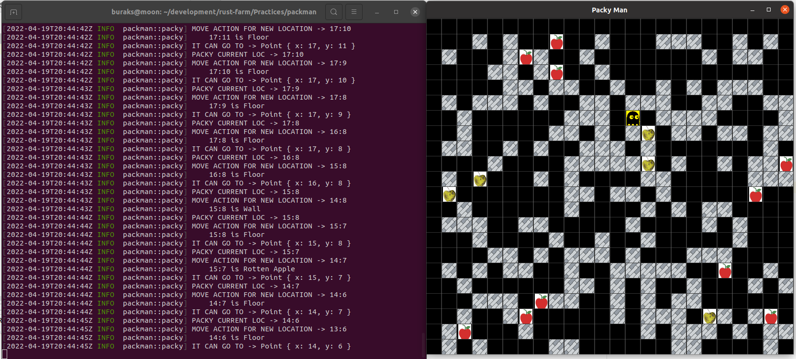
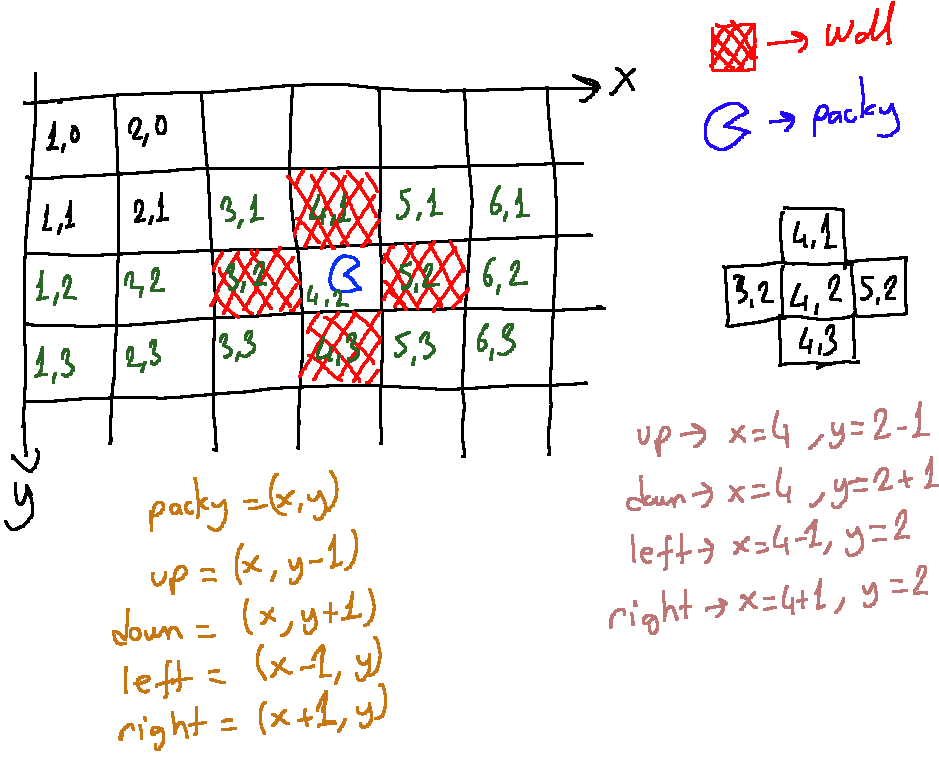

# Bracket-Lib ile Bir Packman Oyunu Denemesi

Herbert Wolverson'un yazdığı [Hands-on Rust: Effective Learning through 2D Game Development and Play](https://www.amazon.com/Hands-Rust-Effective-Learning-Development-dp-1680508164/dp/1680508164/) kitabından öğrendiklerimle popüler Packman oyununun bir benzerini yazmaya çalışmaktayım. Yol boyunca rust dilini öğrenmek adına bana kattığı pek çok şey oluyor.

#### Sürüm 0.1.1

- Sahneye yer, duvar, elma ve çürük elma ile packy karakteri başarılı bir şekilde yerleştirildi.
- Tam 10 yenebilir elma ve 5 çürük elma eklendi.
- Açılışta Duvar, Elma, Çürük Elma ve Packy sadece boş olan elverişli alanlara yerleşebiliyor.
- Her açılışta Packy müsait olan rastgele bir konumda oyuna başlıyor.
- Packy duvarlardan geçemez *(Şimdilik. Sonrasında hak sayısına göre duvar patlatabilir)*
- Pack elma ve çürük elmalar üstünden şimdilik geçebiliyor ama sonraki sürümde sağlıklı elmalardan artı puan, çürük elmalardan eksi puan alacak ve geçtiği karelerdeki elmalar sahneden çıkarılacak.

#### Sürüm 0.1.2

- Packy, sağlam elamları yediğinde 10 puan, çürük elma yediğinde -5 puan alıyor.
- Skor tabelası eklendi.
- 3 bomba hakkı verildi. Packy, space tuşu ile bomba patlatabiliyor. Bu durumda üst, sol, sağ ve alt kısımlarda duvar varsa patlıyor.
- Apple ve Rotten_Apple veri yapıları tek veri yapısında toplandı.

Bomba ile duvarları patlatma özelliği için aşağıdaki çizelgeden yararlanıldı.

