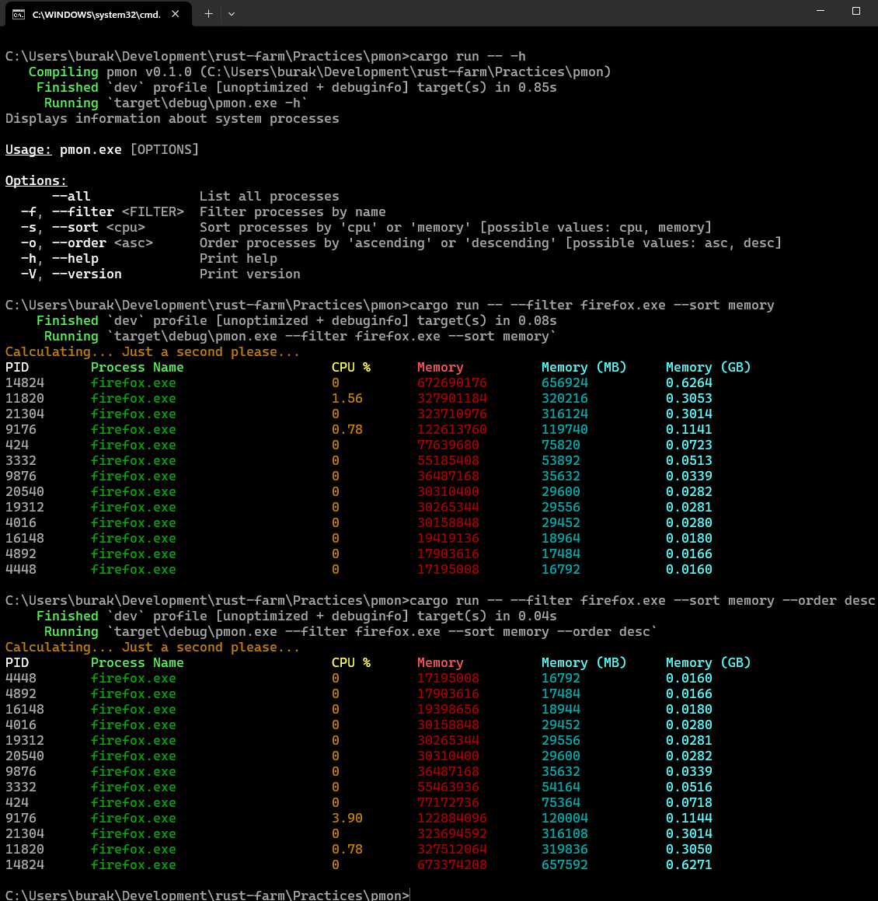
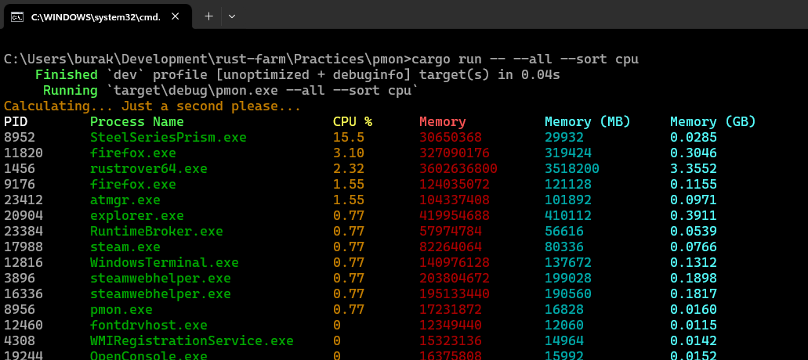

# Basit Bir Process Monitor Aracı

Rust dilinin kütüphane tarafı _(crates)_ tabii oldukça zengin. Bu basit örnekte sistemden process bilgilerini çekmek için
sysinfo, terminal ekranını renklendirmek için colored, komut satırından parametre alırken bir CLI _(Command Line Interface)_ 
durumu oluşturmak adına clap küfelerinden yararlanmaktayız.

```bash
# İlgili crate'leri eklemek için
cargo add sysinfo colored
cargo add clap -F derive

# Programı aşağıdaki gibi farklı şekillerde çalıştırabiliriz

# Help dokümanını göstermek
cargo run -- -h
cargo run -- --help

# firefox process'lerini en çok bellek tüketenden en az tüketene kadar göstermek
cargo run -- --filter firefox.exe --sort memory

# aynısını ters sırada çekmek. Az bellek tüketenden çok tüketene doğru
cargo run -- --filter firefox.exe --sort memory --order desc

# tüm process'leri cpu kullanımlarına göre varsayılan sırada(çok kullanandan az kullanana doğru)
cargo run -- --all --sort cpu
```

İşte çalışma zamanına ait birkaç örnek.



Tüm process'lerin CPU kullanımına göre sıralanması

