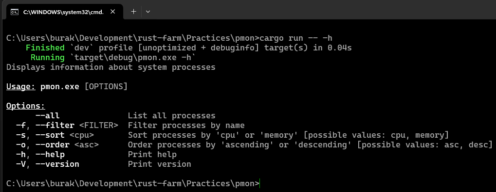
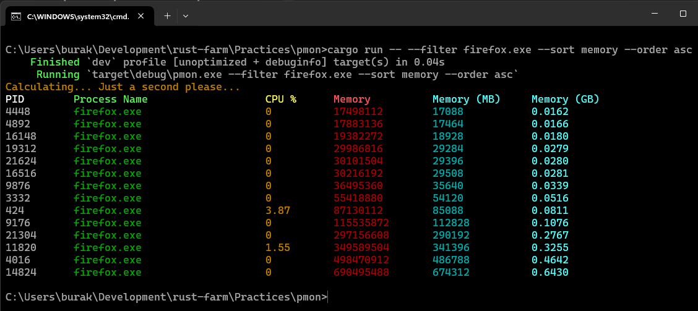
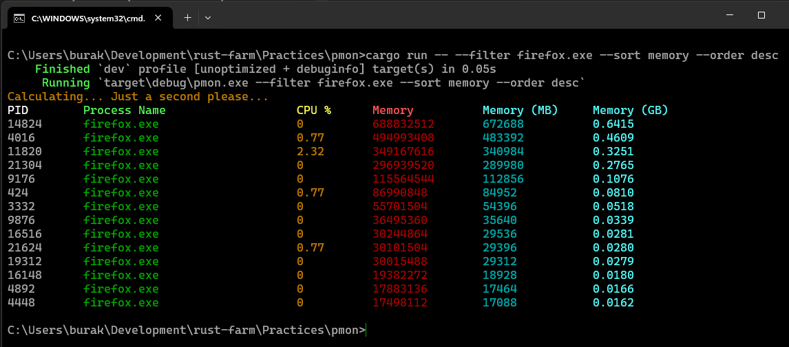
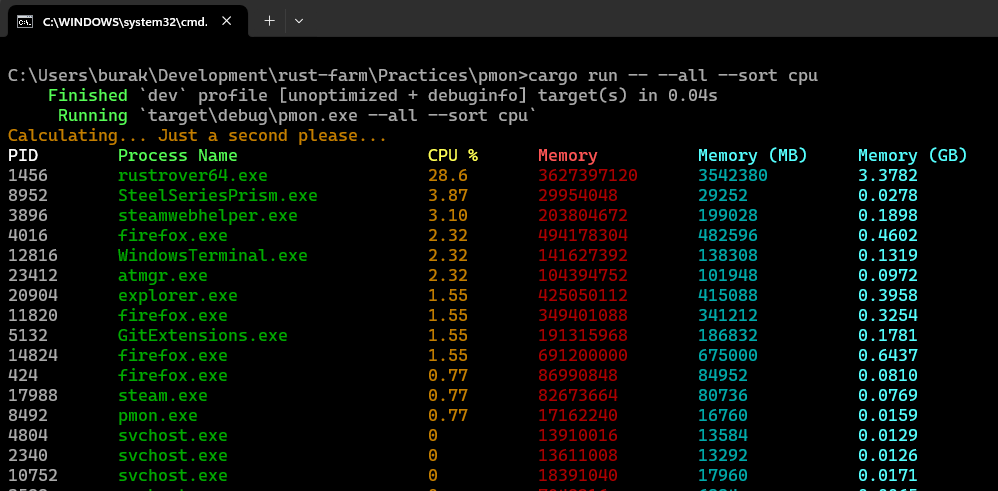

# Basit Bir Process Monitor Aracı

Rust dilinin kütüphane tarafı _(crates)_ tabii oldukça zengin. Bu basit örnekte sistemden process bilgilerini çekmek için
sysinfo, terminal ekranını renklendirmek için colored, komut satırından parametre alırken bir CLI _(Command Line Interface)_ 
durumu oluşturmak adına clap küfelerinden yararlanmaktayız.

```bash
# İlgili crate'leri eklemek için
cargo add sysinfo colored
cargo add clap -F derive

# Programı aşağıdaki gibi farklı şekillerde çalıştırabiliriz

# Help dokümanını göstermek
cargo run -- -h
cargo run -- --help

# firefox process'lerini bellek kullanımına göre artan sırada listelemek
cargo run -- --filter firefox.exe --sort memory --order asc

# Bellek kullanımına göre azalan sıralamada listelemek
cargo run -- --filter firefox.exe --sort memory --order desc

# tüm process'leri cpu kullanımlarına göre azalan sırada listelemek
cargo run -- --all --sort cpu

# tüm işlemlerin listelenmesi
cargo run -- --all
```

İşte çalışma zamanına ait birkaç örnek.

Kullanım kılavuzunun gösterilmesi.



Firefox processlerini bellek kullanımına göre artan sırada listelemek.



Yukarıdakinin tam tersi sıralama.



Tüm processleri cpu kullanımına göre azalan sırada listelemek.


