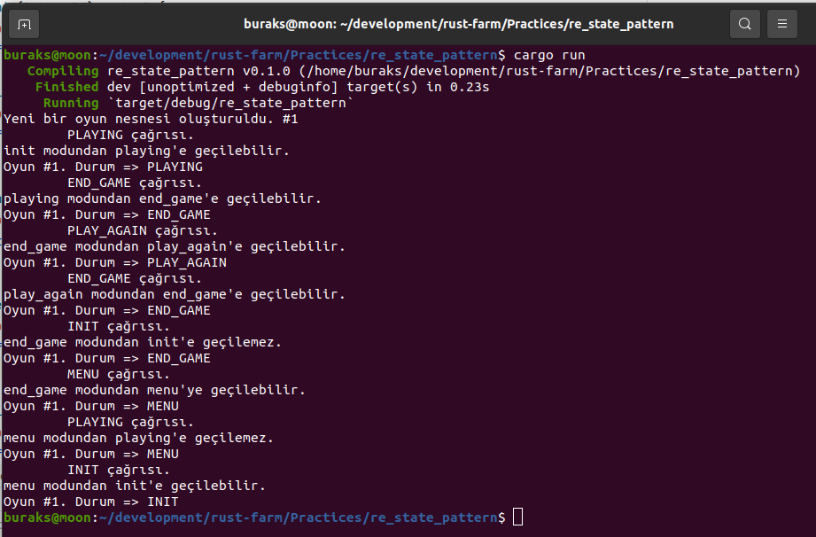

# State Design Patter Örneği 2

Bu sefer kahramanımız bir oyun nesnesi. Oyun nesnesinin içinde bulunabileceği halleri yönetmek adına State Design Pattern'i kullanıyoruz. Game olarak isimlendirdiğimiz veri yapısının olası durumları şöyle.

- MENU
- INIT
- PLAYING
- END_GAME
- PLAY_AGAIN

Çok karmaşık olmayan kuralları ise şöyle özetleyebiliriz.

- Oyun nesnesi Init konumundan, Playing konumuna geçebilir ama EndGame konumuna geçemez.
- Playing konumundan EndGame konumuna geçebilir ama Init konumuna geçemez.
- EndGame konumundan PlayAgain ve Menu konumuna geçebilir ama Init konumuna geçemez.

Kurallar çoğaltılabilir veya farklı şekillerde esnetilebilir.

```shell
# Testleri koşturmak için
cargo test

# Örneği çalıştırmak için
cargo run
```

İşte örnek bir çalışma zamanı görüntüsü.


