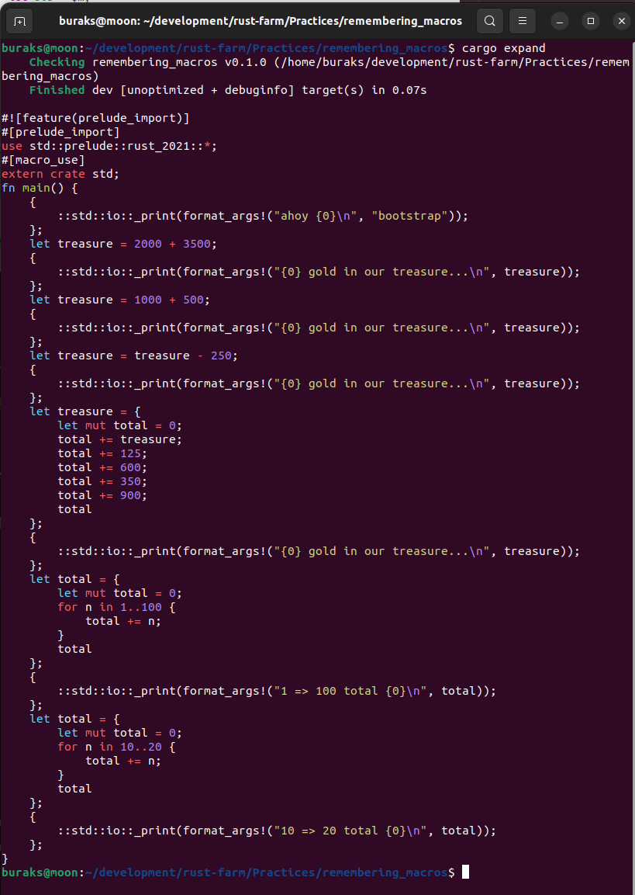

# Bazı Notlar

Örnekte yer alan makroların koda nasıl yansıdığını görmek için cargo-expand aracını kullanabiliriz.

```bash
# Aracın install edilmesi için.
cargo install cargo-expand

# Nightly moda geçmek için (Öncesinde install etmek gerekebilir)
rustup install nightly
rustup default nightly

# Örneği çalıştırırken
cargo expand

# Çalışma zamanını stable moduna çevirmek için
rustup default stable
```

Bu örnek kod için çıktı aşağıdaki gibidir.

