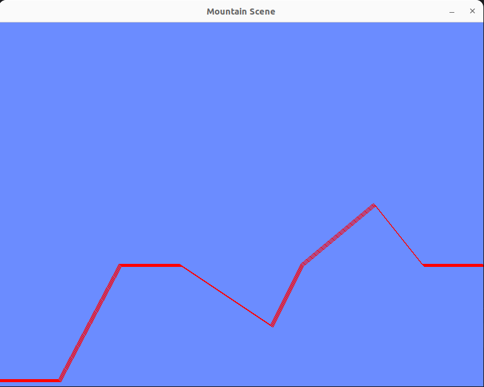

# SDL2 Maceraları

SDL yani **[Simple DirectMedia Layer](https://github.com/libsdl-org)** 2, cross-platform olarak kullanılabilen ve sistemdeki bazı enstrümanlara _(audio, keyboard, mouse, joystick, graphics)_ alt seviyede erişmeye olanak sağlayan bir kütüphanedir. Oyun geliştirme ve medya araçlarında sıklıkla kullanılır. Grafik çizdirme, ses çalma, klavye girdilerini ele alma, mouse hareketlerini algılama gibi işlerde sıklıkla başvurulur. Windows, MacOS, Linux gibi sistemlerde kolaylıkla kullanılabilir. Donanım kaynakları üzerinde doğrudan kontrol sağlanmak istenen senaryolar için idealdir.

SDL2 ile bir talep giriş formu hazırlamak sanıldığı kadar kolay değil hatta epeyce de zordur. Bu workspace içerisindeki amacım biraz da SDL2'nin yeteneklerini keşfetmek. ggez ve piston SDL2 kütüphanesini kullanan örnek oyun motorlarıdır.

## Zorluklar

- Form türünden tasarımlar için doğrudan TextBox, Button gibi kontroller vs içermez.
- Varsayılan olarak daire çizimi desteklenmez. line ve rectangle desteklenir. Dolayısıyla daire çizdirmek için ekstra fonksiyon yazılması gerekir.
- Örneğin kalın çizgiler çizmek epey zahmetli. Mountain örneğinde aşağıdaki gibi bir sonuç ortaya çıktı.

Dikkat edileceği üzere çizgiler için kalınlaştırma pek de beklenildiği gibi çalışmıyor. Bunun için anti-alliased line drawing algorithm gibi bir algoritmadan yararlanmak gerekiyor (ki bu beni aşar :D ) İnsanlar o yüzden 3rd Party crate'ler kullanıyorlar oyun sahasındaki çizimler için :D

- Ekrana metin yazdırmakta sanıldığı kadar kolay değil hatta bunun için SDL_ttf paketinin kullanılması öneriliyor.