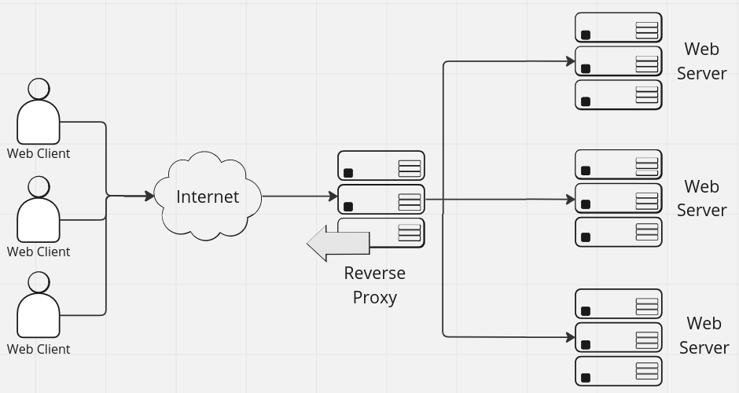
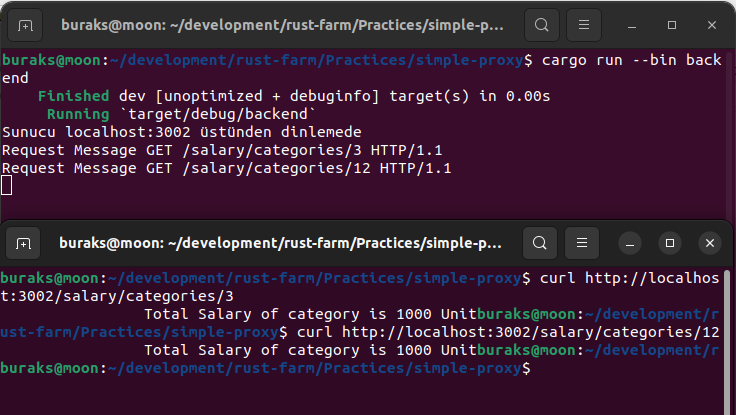
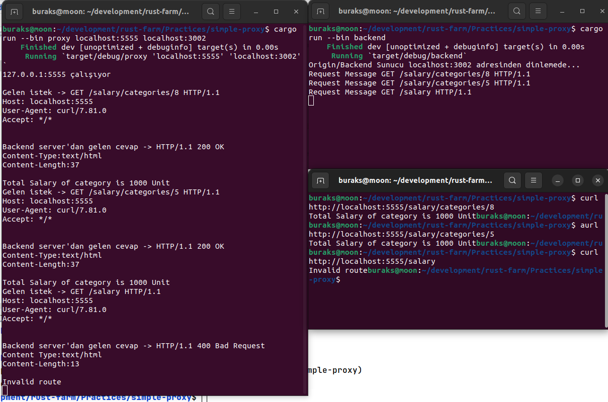

# Basit Bir Reverse Proxy Senaryosu

Bu örnekte amaç çok basit seviyede bir Reverse Proxy Server geliştirmek. Proxy server'lar aracı yazılım servisleri olarak internet üzerindeki çoklu ağlar arası geçişlerde yön bulma sağlarlar. İki çeşit proxy server vardır. Forward Proxy ve Reverse Proxy.

Forward proxy, istemcilerin internete doğru yaptığı talepler için gateway rolü üstlenirler. İstemci makinelerin IP adresleri internette gezinirken gizli kalır nitekim internete çıkışı Forward Proxy Server sağlar. Böylece internete çıkan istemciler için organizasyonel politikaların uygulanması mümkün hale gelir. Mesela bazı adreslere çıkışlar kısıtlanabilir.

Bizim örneğimizde ele alacağımız konu ise Reverse Proxy. Bu sefer backend server'ların kimliği istemciden gizlenir. İstemci talepleri backend server'lara geçirilirken load balancing, caching, compression gibi çeşitli fonksiyonellikler kullanılabilir. Backend server'larda işlenen taleplere ait cevaplarda yine Proxy Server üstünden istemcilere iletilir.



Senaryo da iki adet program söz konusu olacak. Birisi backend server görevini üstlenirken diğeri reverse proxy server olacak.

Origin Server'ın görevleri arasında HTTP taleplerini almak, talebin ilk satırını ayrıştırıp GET metodunu ve belli bir route bilgisini yakalamak, sonrasında da bir cevap dönmek yer alıyor.

## Çalışma Zamanı

Backend tarafını doğrudan çalıştırıp test etmek için aşağıdaki gibi ilerleyebiliriz. Örnek epeyce dummy bir çözüm olduğundan backend taraf, doğru formatta gelen tüm talepler için aynı HTML mesajını dönmektedir. Gerçek anlamda bir backend server yazmaktan ziyade Reverse Proxy Server'ın basit çalışma mekaniğine odaklandığımızı unutmayalım.

```bash
# Önce backend server çalıştırılır
cargo run --bin backend

# Ardından basit bir tarayıcıdan ya da curl ile terminalde aşağıdaki gibi talep gönderilir.
curl http://localhost:3002/salary/categories/3
```



Proxy sunucusunun kodlarını tamamladıktan sonra ise aşağıdaki şekilde testler yapılabilir.

```bash
# Önce backend server ayağa kaldırılır
cargo run --bin backend

# Ardından proxy server
cargo run --bin proxy localhost:5555 localhost:3002

# sonrasında yine curl veya bir tarayıcı ile aşağıdaki örnek talepler yapılır
curl http://localhost:5555/salary/categories/5
curl http://localhost:5555/salary/categories/8
```

Dikkat edileceği üzere talepler localhost:5555 adresine yapılmaktadır. Burası proxy sunucusudur. Proxy sunucusu gelen talepleri backend tarafta yer alan localhost:3002 adresine yönlendirir. Gelen cevapları da istemci tarafına taşır. Aşağıdaki şekilde görüldüğü gibi.

