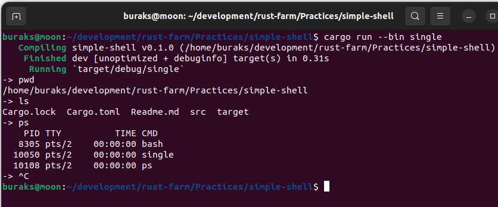
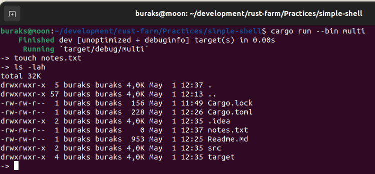

# Terminalden Alt Process'ler Başlatmak

Uygulamada main fonksiyonuna sahip üç program bulunmaktadır. main_proc, child_proc1 ve child_proc2. toml dosyasında [[bin]] altında yapılan tanımlamalara göre **cargo run** komutu ile herhangi biri işletilebilir.

- **single**, basit komutlar için process'ler açar. **ls, ll, ps** gibi. _(Örnek Linux platformuna aittir)_
- **multi** örneğinde ise argümanlı komutlar işletilebilir. **ps -ef, touch notes.txt** gibi. Bu komutlarda -ef ve notes.txt argümanlardır.
- **readable** isimli örnekte ise ls, ps gibi komutlar yerine konuşma diline yakın komutlar kullanılarak alt process'lerin başlatılması örneklenir. **ls yerine list files** yazınca ls komutunun işletilmesi gibi.


## Çalışma Zamanları

İlk örnek için;

```bash
cargo run --bin single
```



2nci örnek için;

```bash
cargo run --bin multi
```



3ncü örnek için;

```bash

```