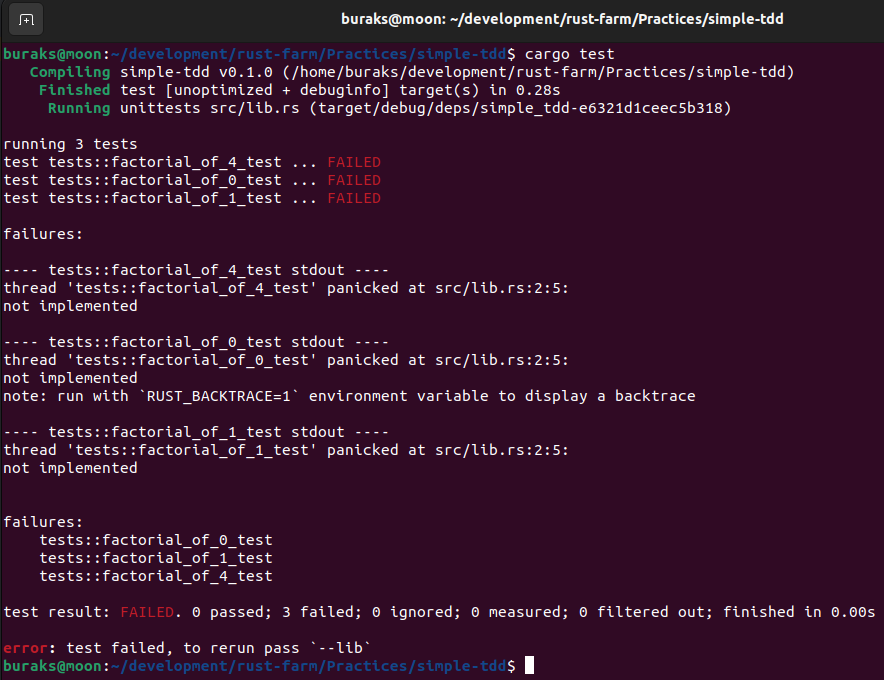
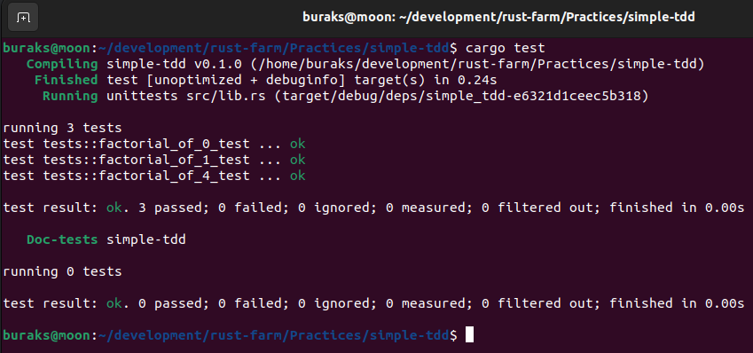
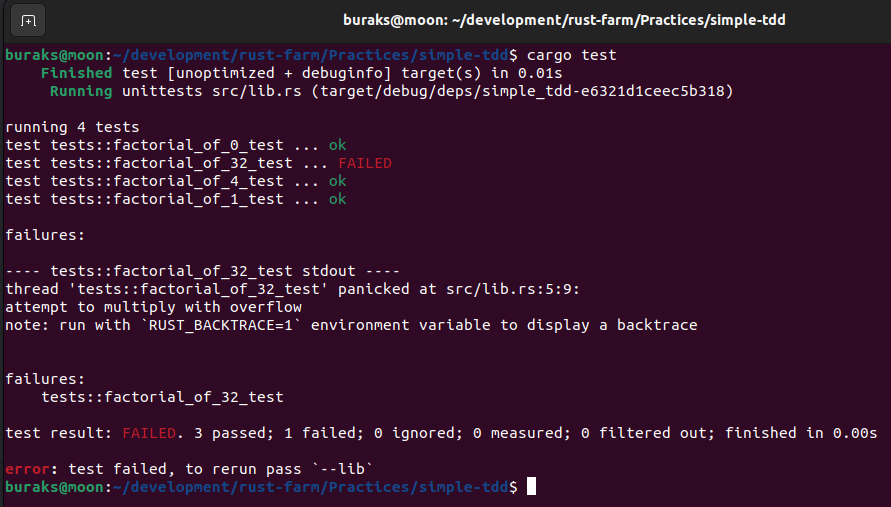
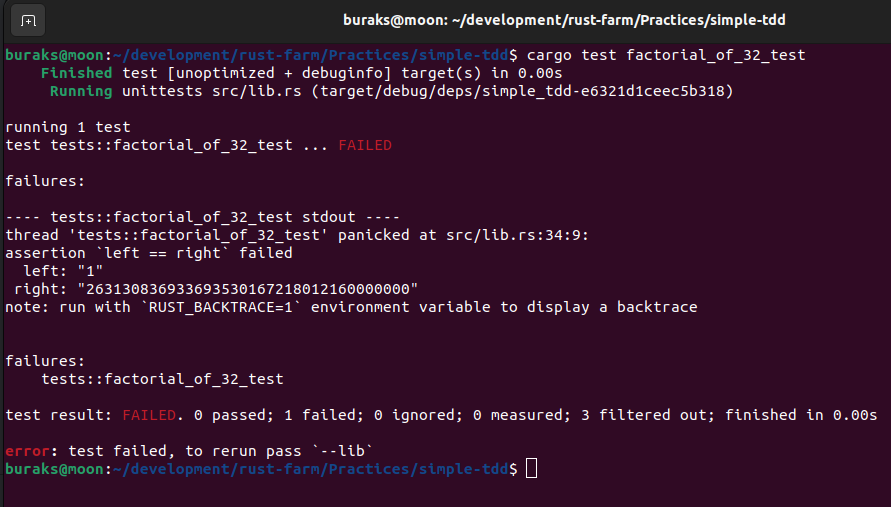
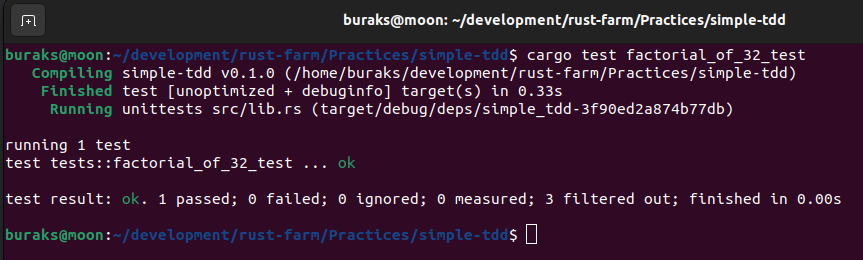

# Rust ile TDD Pratiği

TDD _(Test Driven Development)_ yüksek kalite standartlarında, test edilmiş, güvenilirliği yüksek kodlar üretmek için önemli metodolojilerden birisidir. Programlama dillerinin tamamında bu metodolojiyi uygulamak mümkündür. Bu metodolojiye Red Green Blue ya da Red Green Refactor dendiği de olur. Teorisi basittir. Önce sisteme eklenecen fonksiyonellik için fail duruma düşüren birim test yazılır. Ardından Green safhasına geçilir ve fonksiyon testi başarılı çalışacak biçimde tamamlanır. Mavi renkle ifade edilen Refactor safhasında ise fonksiyonun temiz ve etkili olması için gerekli iyileştirmeler yapılır. Bu konuyu uygulamalı olarak gösterirken kullanılabilecek en basit örneklerden birisi de faktöryel fonksiyonunun TDD ile yazılmasıdır.

## Red (Fail State)

Aşağıdaki kodlama ile işe başlanır.

```rust
pub fn factorial(_number: u64) -> u64 {
    unimplemented!()
}
#[cfg(test)]
mod tests {
    use super::*;
    #[test]
    fn factorial_of_0_test() {
        assert_eq!(factorial(0), 1);
    }

    #[test]
    fn factorial_of_1_test() {
        assert_eq!(factorial(1), 1);
    }
    #[test]
    fn factorial_of_4_test() {
        assert_eq!(factorial(4), 24);
    }
}
```

Burada faktöryel hesabı yapan fonksiyon için 3 test yazılmıştır. 0 ve 1 için faktöryel değer 1 dönerken, 4 için 24 dönmesi beklenir. Bu aşam esasında fonksiyonun parametre yapısının, dönüş değerinin belirlendiği ve kabul kriterlerinin inşa edildiği safhadır diye düşünebiliriz. Çok doğal olarak cargo test çalıştırıldığında unimplemented makrosunun kullanılması sebebiyle birim testlerini üçü de fail olacaktır.



## Green (Pass State)

Bu aşamada fonksiyon için yazılan birim testin (testlerin) başarılı olması için gerekli kodlamalar yapılır.

```rust
pub fn factorial(number: u64) -> u64 {
    if number == 0 || number == 1 {
        1
    } else {
        number * factorial(number - 1)
    }
}
#[cfg(test)]
mod tests {
    use super::*;
    #[test]
    fn factorial_of_0_test() {
        assert_eq!(factorial(0), 1);
    }

    #[test]
    fn factorial_of_1_test() {
        assert_eq!(factorial(1), 1);
    }
    #[test]
    fn factorial_of_4_test() {
        assert_eq!(factorial(4), 24);
    }
}
```



## Blue (Refactor State)

Refactor aşaması kodun iyileştirilmesi için çalışmalar yapılır. Örneğin faktöryel hesabı yapan fonksiyon da 0 ve 1 olma halleri daha farklı bir şekilde ele alınabilir.

```rust
pub fn factorial(number: u64) -> u64 {
    if number <= 1 {
        1
    } else {
        number * factorial(number - 1)
    }
}
#[cfg(test)]
mod tests {
    use super::*;
    #[test]
    fn factorial_of_0_test() {
        assert_eq!(factorial(0), 1);
    }

    #[test]
    fn factorial_of_1_test() {
        assert_eq!(factorial(1), 1);
    }
    #[test]
    fn factorial_of_4_test() {
        assert_eq!(factorial(4), 24);
    }
    #[test]
    fn factorial_of32_test(){
        assert_eq!(factorial(32), 0);
    }
}
```

Elbette bu aşamada da tüm birim testlerin başarılı şekilde çalışması beklenir.

## Sürekli Test

TDD metodolojisinde geliştirilen fonksiyonellikler için Blue Green Refactor döngüsü yinelenebilir. Söz gelimi değeri çok büyük olan bir faktöryel sayı hesabını göz önüne alalım. Örneğin 32 sayısı için faktöryel değeri [Zep To Math' e göre](https://zeptomath.com/calculators/factorial.php?number=32&hl=en) 2631308369 3369353016 7218012160 000000 dir. 36 haneli bir sayı. Bunun için bir test metodu yazdığımızda ilk takılacağımız yerlerden birisi üretilen 36 hanelik sayının u64 tipi ile taşınamayacak olmasıdır. Dolayısıyla çıktıyı string olarak ele almayı düşünebilir ve test fonksiyonunu aşağıdaki hale çevirebiliriz.

```rust
#[test]
fn factorial_of_32_test() {
    assert_eq!(
        factorial(32).to_string(),
        "263130836933693530167218012160000000"
    );
}
```



Görüldüğü gibi çarpma operasyonu bir yerden sonra overflow vermiştir. Burada Divide and Conquer algoritmasını kullanarak fonksiyonu değiştirip testin pass hale gelmesine uğraşabiliriz.

```rust
pub fn factorial_for_big(number: u64) -> u64 {
    if number == 0 || number == 1 {
        return 1;
    }
    let mid = number / 2;
    factorial_for_big(mid) * factorial_for_big(number - mid)
}
```

Ancak sonuç değişmeyecek ve test overflow hatası vermese de fail olacaktır. Burası çözüm için ek bir crate kullanmak zorunda kaldığımız yerdir. BigInt kütüphanesi bu amaçla kullanılabilir.



```shell
cargo add num-bigint num-traits
```

Elbette buna göre yeni faktöryel fonksiyonu da değiştirilmelidir.

```rust
use num_bigint::BigInt;
use num_traits::One;
use std::ops::MulAssign;

pub fn factorial(number: u64) -> u64 {
    if number <= 1 {
        1
    } else {
        number * factorial(number - 1)
    }
}

pub fn factorial_for_big(number: u64) -> BigInt {
    let mut result = BigInt::one();
    for i in 1..=number {
        result.mul_assign(&BigInt::from(i));
    }
    result
}

#[cfg(test)]
mod tests {
    use super::*;
    use std::str::FromStr;
    #[test]
    fn factorial_of_0_test() {
        assert_eq!(factorial(0), 1);
    }
    #[test]
    fn factorial_of_1_test() {
        assert_eq!(factorial(1), 1);
    }
    #[test]
    fn factorial_of_4_test() {
        assert_eq!(factorial(4), 24);
    }
    #[test]
    fn factorial_of_32_test() {
        let expected = BigInt::from_str("263130836933693530167218012160000000").unwrap();
        assert_eq!(factorial_for_big(32), expected);
    }
}
```




