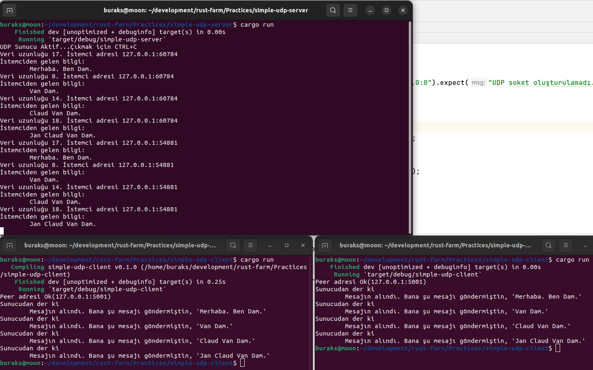

# Basit Bir UDP Server Yazımı

Ağ programlamada bilinmesi gereken iki temel protokol var. TCP _(Transmission Control Protocol)_ ve UDP _(User Datagram Protocol)_. Özellikle güvenilir bir iletişim hattı, kayıp mesaj yönetimi, veri bütünlüğü gibi kritik süreçler gerkektiği durumlarda TCP protokolü tercih edilmekte. Diğer yandan hızlı ve hata kaybınının ikinci planda kaldığı durumlar için User Datagram Protocol tercih edilir. Bu örnekte Rust ile bir UDP server nasıl yazılır onu öğreniyoruz.

**Not: Örneğin istemcisi simple-udp-client isimli Rust uygulamasıdır.**

Dolayısıyla önce sunucu ardından istemci çalıştırılarak örnek test edilebilir.

