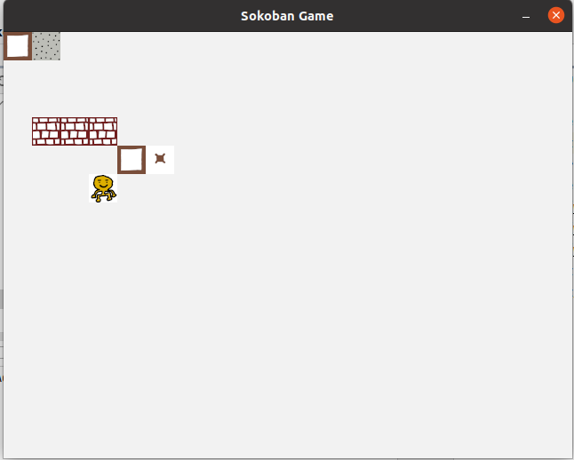
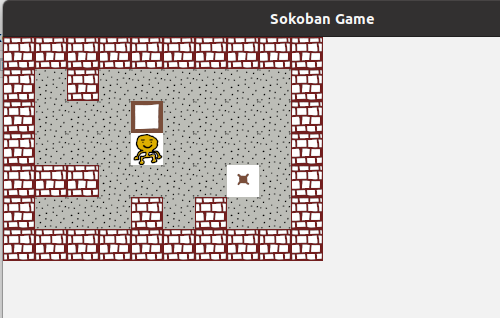

# Entity Component System

Oyun programlama ile ilgili öğrenmekte olduğum yeni kavramlardan birisi de Entity Component System. Oyun içerisinde geçen birçok enstrüman bulunuyor. Karakterler, araçlar, nesneler vs Bunların birde türlü davranışları ve bu davranışlarıyla dahil oldukları sistemler söz konusu. Bracket-lib motorunu kullanarak geliştirdiğim Packyman oyunu için düşünürsek, packy, ghost, apple birer entity olarak ifade edilebilirler. Bunların saha üstündeki konumları, çiziliş işlemleri, packy'nin hareket etmesi, ışınlaması, ghost'un rastgele hareketleri de birer bileşen olarak düşünülebilir. Harita ve üstündeki varlıkların çizilmesi ile packy ile ghost'un savaşı da birer sistem olarak göz önüne alınabilir. Esasında oyuna ait varlıklar, varlıkların sahip olduğu bileşenler, bileşenleri ile birlikte varlıkların dahil olduğu sistemler ile tüm bunlar için ortak sayılabilen kaynakların *(resources)* yönetimi bir noktadan sonra zorlaşabildiği için ECS gibi çatılar tasarlanmıştır. Tabii ilk önce ECS'i bir örnekle deneyimlemem lazım. Bu amaçla sokoban isimli popüler oyun için bu çatının nasıl kullanıldığını anlatan [şu adresteki öğretiyi](https://sokoban.iolivia.me/c01-01-setup.html) takip etmeye karar verdim.

ECS kısaca oyunlarda Composition over Inheritance prensibini temel alan bir mimari tasarım yaklaşımıdır. Üç ana kavramı vardır.

- Component: Sadece saf veri taşıyan yapılardır. Davranış barındırmazlar. Konum, render, hareket birer bileşen olarak düşünülebilir.
- Entity: Birden fazla bileşen içeren veri yapılarıdır. Mesela ghost karakteri için konum, render ve hareket bileşenleri varken, yer zemini için sadece konum ve render bileşenleri söz konusudur. Bunları birden fazla bileşeni ihtiva eden benzersiz *(unique)* aptal taşıyıcılar *(container)* olarak düşünebiliriz.
- System: Örneğin oyunda render bileşeni içeren tüm varlıkların harita üstünde çizilmesi bir render sistemi olarak düşünülebilir. Davranışlar sistemler tarafından ele alınır.

[Sokoban](https://en.wikipedia.org/wiki/Sokoban) oyununu düşündüğümüzde oyun sahasındaki kutuların oyuncu tarafında hareket ettirilip doğru yerlere yerleştirilmesi söz konusudur. Bu senaryodaki varlıkları ve bileşenler şöyle düşünülmüşler.

- Entities : player, wall, floor, box, box spot
- Components : Position, Renderable, Movable

Buna göre örneğin player, üç bileşeni de içerirken wall ve floor sadece position ve renderable bileşenlerini içerebilir. Nitekim oyuncu hareket edebilirken duvar ve yer zeminlerinin pozisyonları setup sırasında sabitlenir. Kısaca her entity sadece kendisi ile alakalı bileşenleri içerir.

```shell
cargo run sokoban
```

Örnekte 2 boyutlu oyunlar için kullanılabilen hafifsiklet [ggez](https://ggez.rs/) isimli bir oyun motoru kullanılmakta. Ayrıca ECS çatısı için [specs](https://crates.io/crates/specs) isimli küfeden yararlanılıyor. İlerleyen kısımlarda [glam](https://crates.io/crates/glam) isimli 3D matematiksel işlemleri kolaylaştıran bir oyun ve grafik küfesi de işin içerisine giriyor.

Örneğin ubuntu sistemde denediğim için ek bazı bağımlılıkları yüklemem gerekti.

```shell
sudo apt-get install libudev-dev libasound2-dev
```

Aksi takdirde alsa kütüphanesi için bir derleme hatası alınıyor.

Buraya Render sistemini oluşturduktan sonra deneysel olarak ekrana birkaç bileşen eklenmesine ait bir ekran görüntüsü de bırakalım.



Harfler kullanılarak oluşturulan ilk haritanın işletilmesi sonrası oluşan ekran görüntüsü.


