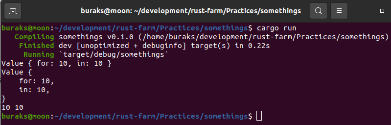

# Kıyıda Köşede Birikmiş Konular

- Mesela Raw Identifier kullanımı. Buna göre rezerve edilmiş birçok keyword'ü değişken adı olarak kullanmak mümkün. İşin espirisi r# ifadesi. r# ile takip eden token'ın bir keyword değil identifier olduğu belirtiliyor.

