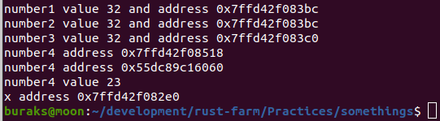
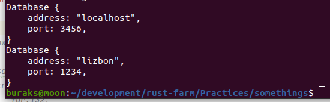

# Kıyıda Köşede Birikmiş Konular

- #1: Mesela Raw Identifier kullanımı. Buna göre rezerve edilmiş birçok keyword'ü değişken adı olarak kullanmak mümkün. İşin espirisi r# ifadesi. r# ile takip eden token'ın bir keyword değil identifier olduğu belirtiliyor.

- #2: {:p} ile değişkenlerin bellek adreslerini öğrenebiliriz.

- #3: Her şeye fonksiyon veya metot diyemiyoruz esasında. Söz gelimi associated function ve method diye iki ayrı kavram var.

