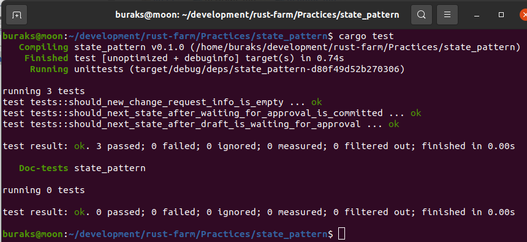

# State Tasarım Kalıbının Uygulanması

Belli bir akış içerisinde ele alınan nesneler belli durumlara sahiptirler. Bu durumlar arasındaki geçişler için fonksiyonlardan yararlanılırken bazı kuralların işletilmesi de istenebilir. Örneğin belli bir duruma sahipken diğer bir duruma geçilmesini engelleyen karak mekanizmaları ve koşullar söz konusudur. Nesne yönelimli dillerde bu gibi ihtiyaçlar için State tasarım kalıbı sıklıkla kullanılır. Hatta oyun programlamanın da önemli yapı taşlarından birisi olan State Machine kullanımında da nesne durumlarının yönetimi söz konusudur. Pek tabii nesne yönelimli diller denince işin içerisine interface, class ve object gibi kavramlar da dahil olur. Rust açısından olaya bakınca elimizde struct ve ortak davranış modellemesi için kullanabileceğimi trait'ler vardır. Bu örnekte State tasarım kalıbının Rust tarafında nasıl uygulayabiliriz, örneklerle anlamaya çalışacağız.

Ancak öncesinden bir senaryo düşünelim. Örneğin iş biriminin bir ürünle ilgili yazılım değişiklik taleplerinin belli bir akışı olduğunu düşünelim. Talebin kendisini ChangeRequest gibi bir veri modeli olarak tasarlayabiliriz. Bu nesnenin kullanıldığı akışın da belli kuralları olduğunu düşünelim. Şöyle ki,

- Talepler başlangıçta Draft durumundadır ve boş bir şekilde oluşur.
- Draft tamamlandıktan sonra söz konusu değişiklik talebi gözden geçirilmek üzere bir onaya gönderilir ki bu noktada nesnenin durumu örneğin WaitingForApproval gibi bir konumdadır.
- Talep onaylandığı takdirde yazılım ekibinin backlog'una önceliklendirilmek üzere girebilir. Bu noktada talep örneğin Committed gibi bir konumda olabilir.
- Sadece onaylanan yazılım değişiklik talepleri backlog'a akar. Bir başka deyişle onaylanmayan yazılım değişiklik talepleri hiçbir şekilde Committed durumuna geçememelidir. 
- Benzer şekilde henüz Draft olarak dünyaya gelen bir yazılım değişiklik talebi, gözden geçirilme ve onay mekanizmasını atlayarak Committed durumuna geçemez. Bir başka deyişle gözden geçirme durumu için bir geçiş işlemi uygulanmamışsa Draft konumunda kalması gerekir.

Benzer şekilde farklı senaryoları da düşünebiliriz. Örneğin bir şirketin veritabanında personelin açtığı ve birtakım onay mekanizmaları sonrası işletilen SQL betiklerine ait akışta da State tasarım kalıbı pekala kullanılabilir. Ya da bir terminal oyununun menüsünden oyunun oynandığı duruma geçmek, oyuncu yandığında oyunu tekrardan başlatmak üzere başlangıç konumuna döndürmek gibi durumların ele alınmasında da bu kalıbı pekala kullanabiliriz.

İlk senaryomuza geri dönelim ve adım adım kodlamasını yapmaya çalışalım. Yazılım değişiklik talebinin kendisini ChangeRequest isimli bir struct olarak tanımlayabiliriz. State olarak ifade edilen hallerini ise Draft, WaitingForApproval ve Committed şeklinde üç struct'la ifade edebiliriz. Durumlar arasındaki geçişleri sağlamak içinse ortak davranışlar tanımlamamızı sağlayacak bir trait'ten faydalanabiliriz.

Örneğimizi bir kütüphane olarak açarak devam edelim.

```shell
cargo new --lib state_pattern
```

Program kodumuzu aşağıdaki gibi tek seferde yazarak ilerleyebiliriz. Yorum satırları ile konuyu mümkün mertebe aktarmaya çalıştım. 

```rust
#[cfg(test)]
mod tests {
    use super::*;

    #[test]
    fn should_new_change_request_info_is_empty() {
        // Yeni bir RCF oluşturulduğunda get_info'nun boş bir String dönmesi beklenir.
        // Nitekim nesne Draft durumundadır.
        let mut rfc_1 = ChangeRequest::new();
        rfc_1.add_info(
            "Menü arka plan rengi".to_string(),
            "Menü arka planının kullanıcı isteğine göre değişebilmesini istiyorum".to_string(),
        );
        assert_eq!(rfc_1.get_info(), "");
    }

    #[test]
    fn should_next_state_after_draft_is_waiting_for_approval() {
        // Bu vakada ise yeni bir RFC oluşturulduktan sonra durumu onay bekliyora çekilir.
        // Buna göre title, description gibi bilgiler girildiği gibi alınabilmeli ve hatta
        // nesenin kendisi WaitingForApproval modunda olmalıdır.
        let mut rfc_1 = ChangeRequest::new();
        rfc_1.add_info(
            "Menü arka plan rengi".to_string(),
            "Menü arka planının kullanıcı isteğine göre değişebilmesini istiyorum".to_string(),
        );
        let current_info = rfc_1.get_info();
        assert_eq!(current_info, "".to_string());
        rfc_1.request_approve();
        let current_info = rfc_1.get_info();
        assert_eq!(current_info, "Onay Bekliyor|Menü arka plan rengi|Menü arka planının kullanıcı isteğine göre değişebilmesini istiyorum".to_string());
    }

    #[test]
    fn should_next_state_after_waiting_for_approval_is_committed() {
        // Bu vakada ise yeni bir RFC oluşturulduktan sonra durumu onay bekliyora çekilir.
        // Sonrasında da submit çağrısı ile durumu Committed'a çekilir.
        let mut rfc_1 = ChangeRequest::new();
        rfc_1.add_info(
            "Menü arka plan rengi".to_string(),
            "Menü arka planının kullanıcı isteğine göre değişebilmesini istiyorum".to_string(),
        );
        let current_info = rfc_1.get_info();
        assert_eq!(current_info, "".to_string());
        rfc_1.request_approve();
        let current_info = rfc_1.get_info();
        assert_eq!(current_info, "Onay Bekliyor|Menü arka plan rengi|Menü arka planının kullanıcı isteğine göre değişebilmesini istiyorum".to_string());
        rfc_1.submit();
        let current_info = rfc_1.get_info();
        assert_eq!(current_info, "Onaylandı, Backlog'a eklendi|Menü arka plan rengi|Menü arka planının kullanıcı isteğine göre değişebilmesini istiyorum".to_string());
    }
}

// Durumlar arasındaki geçişlere ait davranışları tanımladığımız trait
trait State {
    // ChangeRequest nesne içeriğini çekmek için bildirilen davranış.
    // Varsayılan olarak boş bir string referansı döner.
    // Bu davranışı State trait'ini implemente eden WaitingForApproval ile Committed
    // veri yapıları yeniden uygulayabilirler.
    // Böylece nesnenin bulunduğu duruma ait değerleri elde edebiliriz.
    // information fonksiyonu bir gövdeye sahip olduğu için State'i implemente eden her struct
    // için yeniden yazılmak zorunda değildir. Mesela Draft veri yapısı için uyarlanmamıştır,
    // nitekim zaten Draft durumundayken title ve description bilgilerinin boş olması istenmektedir.
    fn information(&self, _cr: &ChangeRequest) -> String {
        "".to_string()
    }
    // Draft halinden WaitingForApproval'a geçişi tanımladığımız davranış
    fn request_approve(self: Box<Self>) -> Box<dyn State>;
    // WaitingForApproval durumundan Committed durumuna geçişi tanımlayan davranış
    fn commit(self: Box<Self>) -> Box<dyn State>;
}

// ChangeRequest nesnesinin ilk halini ifade eden veri yapısı
struct Draft {}
// Sonraki duruma geçiş de dahil olmak üzere State üstünden gelen davranışlar uyarlanıyor
impl State for Draft {
    fn request_approve(self: Box<Self>) -> Box<dyn State> {
        // Draft için bu davranışın uygulanması bir sonraki durum olan WaitingForApproval'a geçiştir.
        Box::new(WaitingForApproval {})
    }

    // Nesne, Draft halindeyken doğrudan Committed durumuna geçemez. Bu nedenle self dönülür.
    fn commit(self: Box<Self>) -> Box<dyn State> {
        self
    }
}

// Draft modundan sonra geçilebilecek olan durumu ifade eden veri yapısı
struct WaitingForApproval {}
// Bu veri yapısı içinde State trait'inde tanıumlı davranışları uyarlamalıyız.
impl State for WaitingForApproval {
    // ChangeRequest nesnesi bu konumdayken zaten request_approve gibi bir davranışı uygulamamalıdır.
    fn request_approve(self: Box<Self>) -> Box<dyn State> {
        // bu nedenle kendisini döndürür
        self
    }
    // Talep onaylandıktan sonra WaitingForApproval'dan  Committed'a geçebilir
    // Bu nedenle smart pointer üstünden Committed nesne örneği dönülür.
    fn commit(self: Box<Self>) -> Box<dyn State> {
        Box::new(Committed {})
    }
    // Nesnemiz WaitingForApproval durumuna geçtiğinde artık title ve description gibi bilgilerin
    // görülebilmesi gerekir. Bu nedenle State trait'i içindeki information davranışını yeniden
    // yazmaktayız.
    fn information(&self, cr: &ChangeRequest) -> String {
        format!("Onay Bekliyor|{}|{}", cr.title, cr.description)
    }
}

// WaitingForApproval durumundaki sonraki durumu ifade eden veri yapısı
struct Committed {}

// Örnek akışımızda Committed nesnenin içinde olabileceği son haldir.
// Bu nedenle request_approve veya commit gibi davranışlar self ile kendi durumunu döner.
// Nitekim Committed durumunda diğer durumlar geçilmemektedir. En azından bu senaryo gereği.
impl State for Committed {
    fn information(&self, cr: &ChangeRequest) -> String {
        format!(
            "Onaylandı, Backlog'a eklendi|{}|{}",
            cr.title, cr.description
        )
    }

    fn request_approve(self: Box<Self>) -> Box<dyn State> {
        self
    }

    fn commit(self: Box<Self>) -> Box<dyn State> {
        self
    }
}

// İş akışındaki ana nesnemiz. Bir yazılım değişiklik talebini ifade ediyor.
// Basit olması açısında title ve description gibi alanlar içermekte.
// Dikkat edileceği üzere state, title ve description alanları private.
// Nitekim nesnenin o anki durumuna ait değerlerin dışarıdan doğrudan müdahele ile değiştirilmemesi gerekiyor.
pub struct ChangeRequest {
    // Nesne durumunu bir Option enum sabiti ile smart pointer kullanarak tanımladık.
    // nesnenin kullanacağı trait çalışma zamanında belli olacağından Dynamic Dispatch yaklaşımı bizim için ideal.
    state: Option<Box<dyn State>>,
    title: String,
    description: String,
}

impl ChangeRequest {
    // ChangeRequest new fonksiyonu ile ilk kez oluşturulurken title ve description alanları boş olmalı.
    // Daha da önemlisi ilk kez oluşturulduğundan nesne Draft durumunda başlamalı.
    pub fn new() -> Self {
        Self {
            state: Some(Box::new(Draft {})),
            title: String::new(),
            description: String::new(),
        }
    }
    // Taleple ilgili bilgileri eklemek için bir fonksiyondan yararlanabiliriz.
    pub fn add_info(&mut self, title: String, description: String) {
        self.title = title;
        self.description = description;
    }

    // Nesnenin bilgilerini çekmek için çağırılan fonksiyon.
    // Dikkat edilmesi gereken nokta nesnenin o an sahip olduğu durum bilgisine göre
    // information fonksiyonunun çağırılmakta oluşudur.
    // Örneğin nesne o anda WaitingForApproval veya Committed durumunda ise bu veri yapılarında
    // State trait'inden gelip yeniden yazılan information fonksiyonu çağırılır.
    // Dolayısıyla nesnenin içinde bulunduğum durumdaki verisini saklayarak da akışı ilerletme şansımız olur.
    pub fn get_info(&self) -> String {
        self.state.as_ref().unwrap().information(self)
    }

    // Nesnenin Draft durumundan WaitingForApproval durumuna geçişi sırasında kullanılan fonksiyon
    pub fn request_approve(&mut self) {
        // Eğer nesne durumunu alabiliyorsak
        if let Some(s) = self.state.take() {
            // O anki trait kimse onun üstünden asıl durum nesnesinin uyguladığı request_approve fonksiyonu çağırılır.
            self.state = Some(s.request_approve())
        }
    }

    // Nesnenin WaitingForApproval durumundan Committed durumuna geçişi sırasında kullanılan fonksiyon
    pub fn submit(&mut self) {
        if let Some(s) = self.state.take() {
            // O anki trait kimse onun üstünden asıl durum nesnesinin uyguladığı commit fonksiyonu çağırılır.
            self.state = Some(s.commit())
        }
    }
}
```

Kod epey uzun ve kalabalık görünüyor ancak bir kere benzerini yazmayı deneyip, ona sorular sorduktan sonra daha anlaşılır olacaktır. Dikkat edilmesi gereken noktalar ChangeRequest nesnesi için durumlar arası geçişlerin nasıl yapıldığı ve burada State trait'inin nasıl etkin kullanıldığıdır. State trait'i içinde tanımlanan information, request_approve ve commit davranışlarının nesne durumlarını ifade eden veri yapılarında nasıl kullanıldığına dikkat etmeliyiz. Her state nesnesi sadece kendisi ile ilgili olan davranışı uygulayıp diğerleri için kendi örneğini döndürmektedir. Öyle ya, nesne durumu WaitingForApproval'dayken yeniden bir onay talebinin gönderilmesi mantıklı değildir. Lakin bir sonraki durum olan Committed'a geçmek için commit davranışının uyarlanması anlamlıdır. Bir diğer dikkat çekici noktada birçok enstrümanda smart pointer kullanılmasıdır. State trait'ini uygulayan veri yapılarına ait nesnelerin durumlar arası geçişlerde neyi kullanacağının çalışma zamanında çözümlenmesi tercih edildiğinden dolayı böyle bir kullanım söz konusudur. Bu dynamic dispatch kullanımı için de güzel bir örnektir.  

Uygulamanın işe yarayıp yaramadığını anlamak için basit testler koşturabiliriz. İşte kendi sistemimdeki çalışma zamanı sonuçları.



Bence uygulamayı daha da geliştirmek ve başka pratikler yapmak da mümkün. Mesela yazının başlarında belirttiğimiz onay mekanizmasına göre SQL betik çalıştıran bir akış için geliştirme yapmayı deneyebilirsiniz ;)