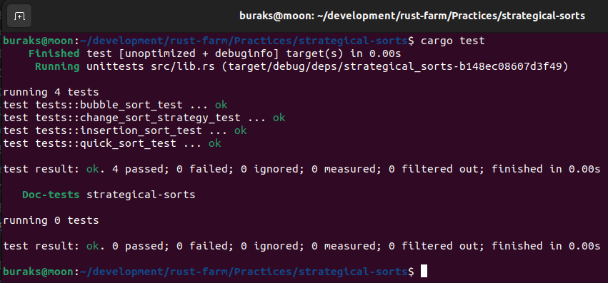

# Sıralama Seçimleri için Strategy Tasarım Kalıbını Kullanmak

Tasarım kalıplarının Rust tarafındaki uygulanmasında trait' ler büyük öneme sahip. Bu örnekte de onlardan faydalanıp örnek bir vakada strategy design pattern' in nasıl uygulanabileceğini incelemeye çalışıyorum. Kobay olarak farklı sıralama algoritmalarının asıl uygulayıcı tarafa strategy deseni üzerinden verilmesi vakasını ele alacağım.

Örnekte yer alan SortStrategy trait'i sıralama fonksiyonunu bildirir. Asıl sıralayıcılar bu trait'i implemente ederler. Context nesnesi SortingMaster isimli structure'dır. new ile oluşturulurken hangi sıralama strateji ile çalışacağı bilgisini alır. change fonksiyonu ile istenirse belirlenen strateji değiştirilebilir. sort operasyonu ise oluşturulurken seçilen sıralama algoritmasını uygulayan nesne üzerinden sıralama işini icra eder. 

Örnekte amaç sıralama algoritmalarının nasıl yazıldığını öğrenmekten ziyade _(ki internette her yerde bulunabilirler ve bende öyle yaptım hatta :D )_ nesne davranış biçimleri ile ilgili olan strategy tasarım kalıbınının rust tarafında nasıl uygulanacağını anlamaktır.

## Çalışma Zamanı Çıktısı



## Çalışmada Kullanılan Enstrümanlar / Kavramlar

- Starteji tasarım kalıbının kullanılması
- Kendi trait modelimizin geliştirilmesi
- Birim testler
- ~~Box pointer ile dynamic dispatch uygulanması~~
- Generic tür ile çalışma ve PhantomData kullanımı.

Örneğin yeni versiyonunda SortStrategy isimli trait aşağıdaki şekilde değiştirilmiştir.

```rust
trait SortStrategy<T> {
    fn sort(&self, data: &mut Vec<T>);
}
```

Ancak bu şekilde ilerlendiğinde SortingMaster uyarlamasında aşağıdaki gibi bir hata alırız.

```text
error[E0392]: parameter `T` is never used
  --> src/lib.rs:71:22
   |
71 | struct SortingMaster<T, S: SortStrategy<T>> {
   |                      ^ unused parameter
   |
   = help: consider removing `T`, referring to it in a field, or using a marker such as `std::marker::PhantomData`
   = help: if you intended `T` to be a const parameter, use `const T: usize` instead

For more information about this error, try `rustc --explain E0392`.
error: could not compile `strategical-sorts` (lib) due to previous error
```

Bu hata T türünün SortingMaster' da doğrudan kullanılmamasından kaynaklıdır. Aşmanın yollarından birisi de PhantomData türünü kullanmaktır. PhantomData<T>, T türünde bir değer saklamadan, T'nin struct'ın bir parçası olduğunu belirtmekte kullanılır. O yüzden adı Phantom'dur zaten :D Dolayısıyla implementasyon aşağıdaki hale getirilebilir.

```rust
#[allow(dead_code)]
struct SortingMaster<T, S>
where
    S: SortStrategy<T>,
{
    strategy: S,
    _phantom_data: PhantomData<T>,
}

#[allow(dead_code)]
impl<T, S> SortingMaster<T, S>
where
    S: SortStrategy<T>,
{
    fn new(strategy: S) -> Self {
        Self {
            strategy,
            _phantom_data: PhantomData,
        }
    }
    fn sort(&self, data: &mut Vec<T>) {
        self.strategy.sort(data);
    }
}
```

