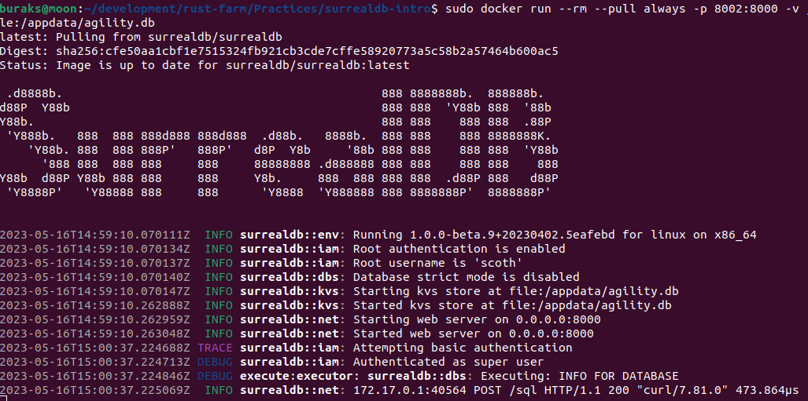
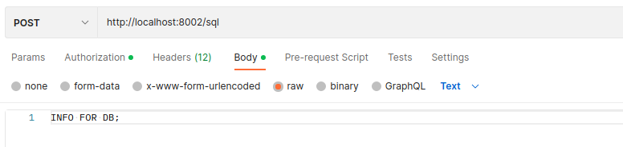
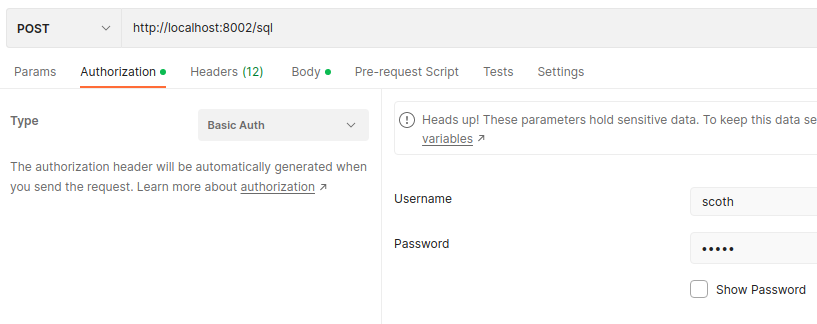
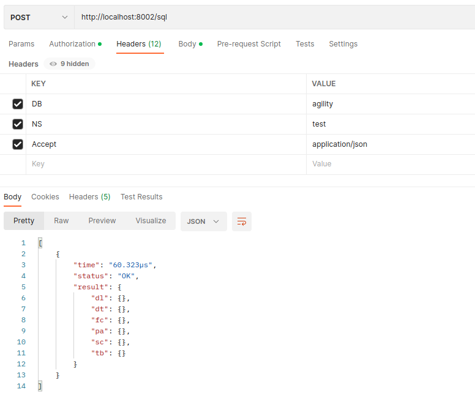
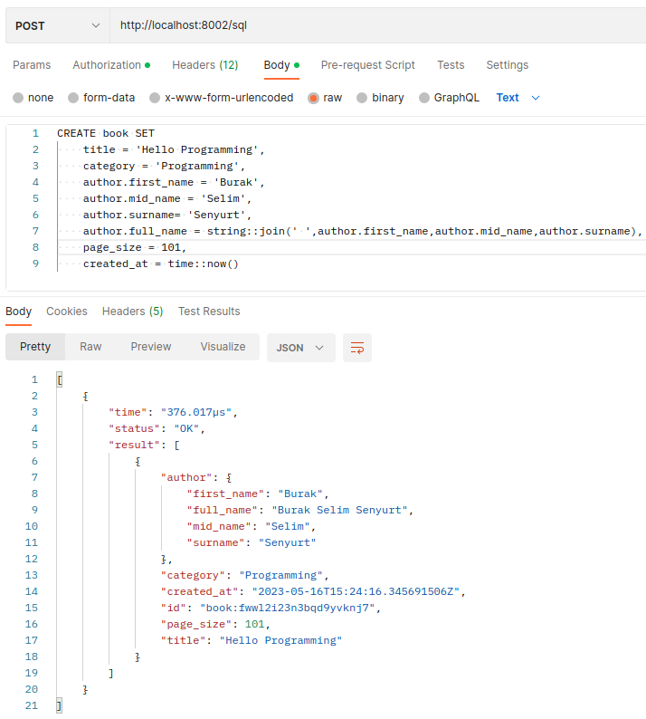
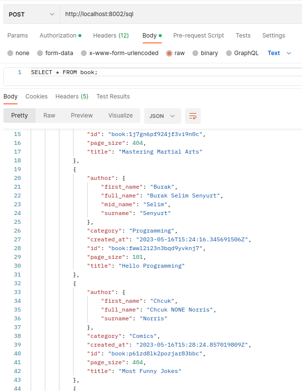
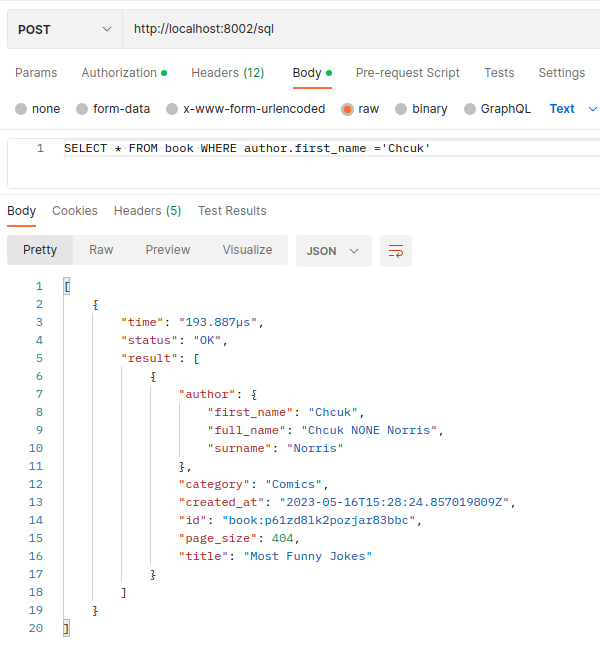

# SurrealDB ile Çalışmak

Örnekteki amacım Rust ile yazılmış özellikle bulut tabanlı ortamda yüksek ölçeklenebilirlik sunan document-graph tipteki [SurrealDb](https://surrealdb.com/) veritabanını kullanmayı öğrenmek. Ubuntu tabanlı sistemimde onu docker üstünde ayağa kaldırıp kullanacağım. Dile entegre edilebilen paketleri ile kullanılabileceği gibi, kendi CLI'ı üzerinden ya da Postman veya curl gibi araçlarla REST çağrıları vasıtasıyla yönetilebilen bir veritabanı sistemi söz konusu.

## Kurulum Aşaması

```bash
# docker kullanımı için (Giriş portunu bilerek 8002 olarak değiştirdim)
docker run --rm --pull always -p 8002:8000 -v /appdata:/appdata surrealdb/surrealdb:latest start --log trace --user scoth --pass tiger file:/appdata/agility.db
```



## Basit Sorgular

Birkaç basit sorgu denemek için Postman kullanılabilir ama doğru çalıştırma şeklini bulmakta zorlandım. Normalde curl ile aşağıdaki gibi ilerlenebilir.

```bash
DATA="INFO FOR DB;"
sudo curl --request POST \
        --header "Accept: application/json" \
        --header "NS: test" \
        --header "DB: agility" \
        --user "scoth:tiger" \
        --data "${DATA}" \
        http://localhost:8002/sql
```

Bu, docker'ı ayağa kaldırırken belirttiğimiz agility veritabanı hakkında bilgi almak için kullanılan bir curl komutu. Postman'de şöyle ilerlemek gerekiyor.

Body kısmını aşağıdaki gibi yazıyoruz. Basit metin formatında bir içerik esasında.



Login olabilmek için basic authenticaion ile ilerliyoruz.



Header'ları da aşağıdaki gibi ayarlayıp talep gönderebiliyoruz.



Veri eklemek için aşağıdaki gibi sorgu denenebilir.

```SurrealQL
CREATE book SET
    title = 'Hello Programming',
    category = 'Programming',
    author.first_name = 'Burak',
    author.mid_name = 'Selim',
    author.surname= 'Senyurt',
    author.full_name = string::join(' ',author.first_name,author.mid_name,author.surname),
    page_size = 101,
    created_at = time::now()
```

Burada book isimli bir kayıt _(record)_ oluşturulmakta. İşlem sonucu oldukça etkileyici :)



Yazar kısmının nasıl oluşturulduğuna dikkat edelim.

Sorgulama işlemleri de oldukça pratik görünüyor. Hatta SQL bilenler için oldukça tanıdık. İşte birkaç örnek,

```SurrealQL
SELECT * FROM book;
```



```SurrealQL
SELECT * FROM book WHERE author.first_name ='Chcuk';
```



Serüvenin devamı kodlarda... Onu Rust tarafında bir crate ile nasıl kullanacağımızı inceleyeceğiz. Anahtar paketimizi surrealdb...

```bash
cargo add surrealdb
```

_**Not:** Henüz beta sürümünde test ettiğim için yukarıdaki komutla eklenen versiyon zaman zaman "failed to verify checksum of surrealdb-....." gibi bir hata verebiliyor. Bu durumda toml dosyasındaki gibi kullanarak ilerlenebilir._

```toml
[dependencies]
surrealdb = { git = "https://github.com/surrealdb/surrealdb.git", tag = "v1.0.0-beta.9" }
```

