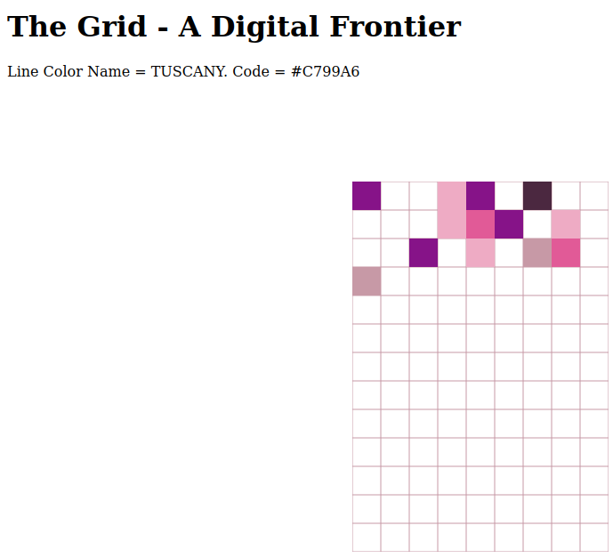

# The Grid - A Digital Frontier

Aslında WASM, Rust ikilisini öğrenmeye çalıştığım bir örnek. Basit bir HTML sayfasında rastgele renklerden oluşan bir grid çizimi söz konusu. Bazı bloklar yine rastgele renklerden oluşacak şekilde doldurulmakta. Kabaca aşağıdaki gibi bir görüntü oluşuyor.

Gerçi kodda bir bug var. Blokları istediğim gibi dağıtamıyorum.

