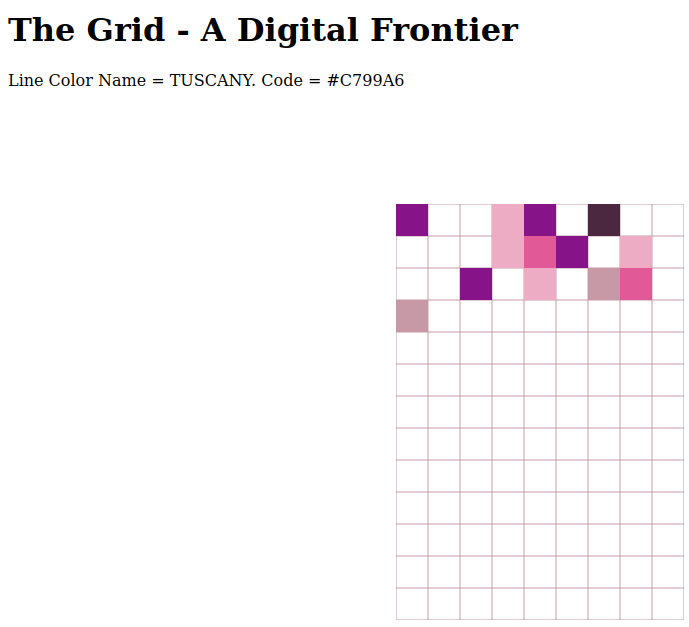

# The Grid - A Digital Frontier

Aslında WASM, Rust ikilisini öğrenmeye çalıştığım bir örnek. Basit bir HTML sayfasında rastgele renklerden oluşan bir grid çizimi söz konusu. Bazı bloklar yine rastgele renklerden oluşacak şekilde doldurulmakta. Kabaca aşağıdaki gibi bir görüntü oluşuyor.

Gerçi kodda bir bug var. Blokları istediğim gibi dağıtamıyorum.



## Nasıl Çalıştıracağız?

**1. Proje kök dizininde wasm paketi derlenir.**

```bash
wasm-pack build --target bundler
```

Bu komut `pkg/` klasörünü oluşturur. `www/package.json` bu klasörü `the_grid` bağımlılığı olarak kullanır.

**2. npm bağımlılıkları yüklenir:**

```bash
cd www
npm install
```

**3. Geliştirme sunucusu başlatılır:**

```bash
npm run dev
```

Uygulama varsayılan olarak `http://localhost:8080` adresinde açılır.
