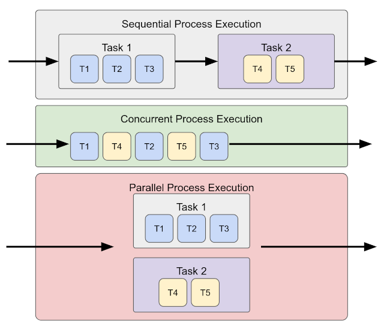
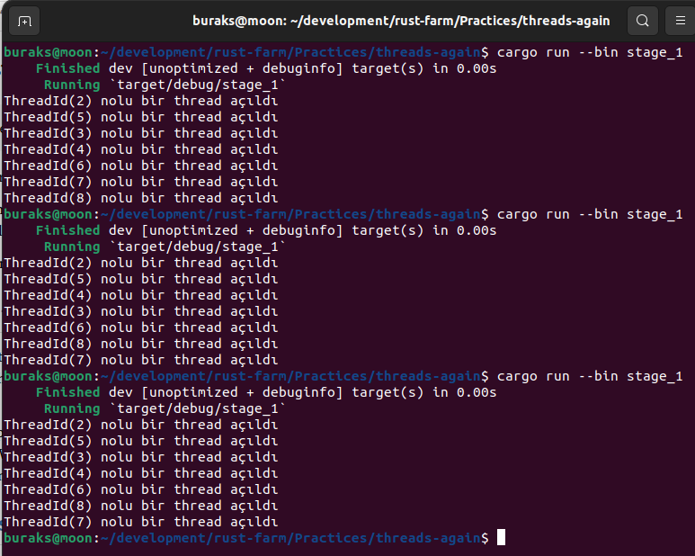
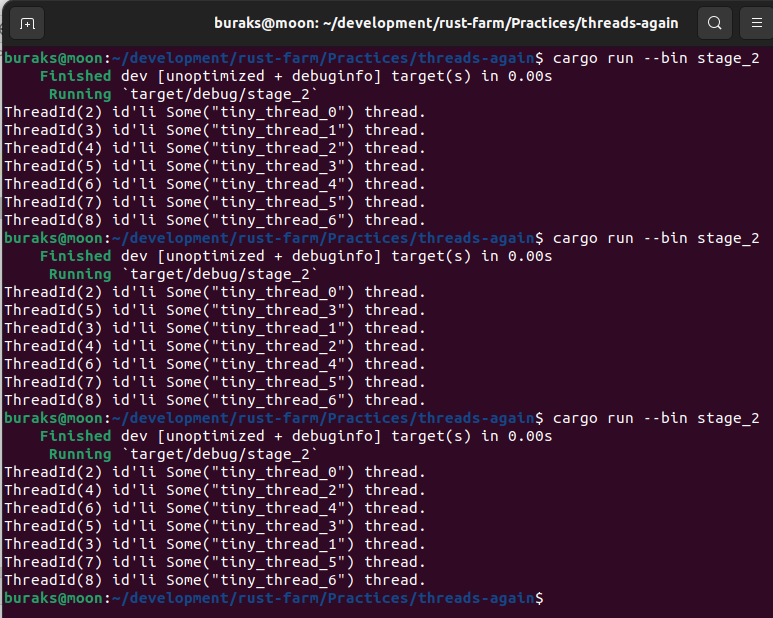
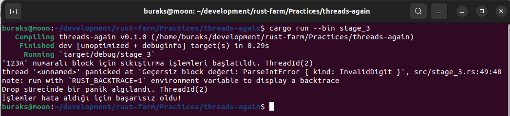

# Concurrency Dünyası

Örnek antrenmandaki amacım rust tarafında thread yönetimi ile ilgili konuları hatırlamak. 

Başlamada önce hatırlatıcı not. Concurrency ve Parallelism farklarını aşağıdaki şekille özetleyebiliriz.



- **stage_1:** İlk örnekte rust'ın standart kütüphanesinin kullandığı 1:1 thread modeli ele alınır.
- **stage_2:** İkinci örnekte bir thread factory olarak görev yapan builder struct'ından yararlanılıyor. Bu sayede oluşturulan thread'lere isim verebilir, bellekte stack bölgesinde ayrılan yer için boyut belirtebiliriz. İlk yöntemde bunlar standart değerler olarak atanır.
- **stage_3:** Bu örnekte ise thread'ler için söz konusu olabilecek hataların yönetimi ele alınmaktadır.
- **stage_4:** Dördüncü örnekte thread'ler arasında mesaj taşınması konu alınıyor.  

## Çalışma Zamanları

```bash
cargo run --bin stage_1
```



```bash
cargo run --bin stage_2
```



```bash
cargo run --bin stage_3
```



