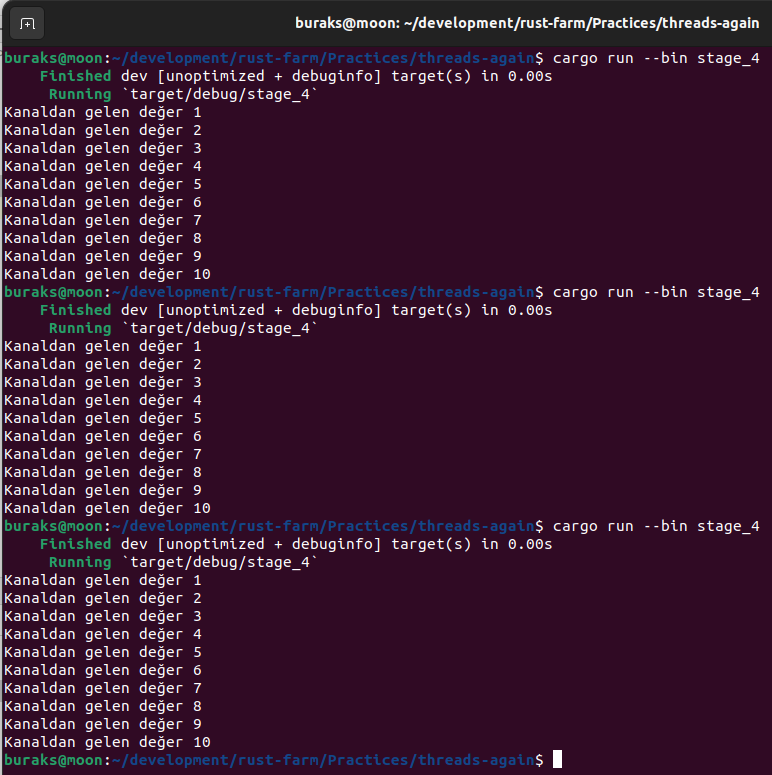
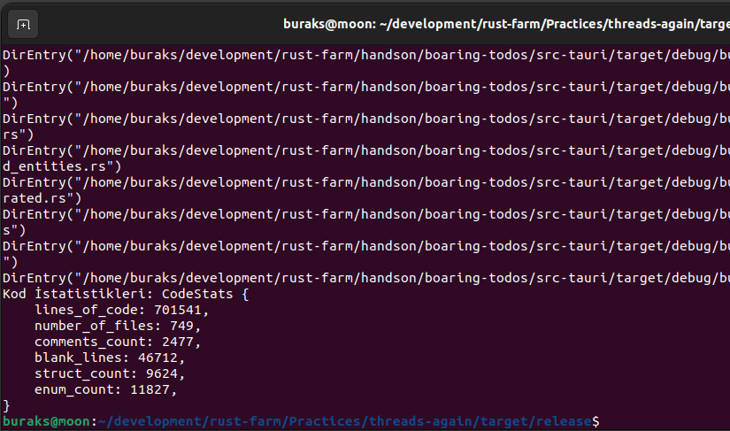

# Concurrency Dünyası

Örnek antrenmandaki amacım rust tarafında thread yönetimi ile ilgili konuları hatırlamak. _**Kaynak: Practical System Programming for Rust Developers, Prabhu Eshwarla, Packt**_

Başlamada önce hatırlatıcı not. Concurrency ve Parallelism farklarını aşağıdaki şekille özetleyebiliriz.


- **stage_1:** İlk örnekte rust'ın standart kütüphanesinin kullandığı 1:1 thread modeli ele alınır.
- **stage_2:** İkinci örnekte bir thread factory olarak görev yapan builder struct'ından yararlanılıyor. Bu sayede oluşturulan thread'lere isim verebilir, bellekte stack bölgesinde ayrılan yer için boyut belirtebiliriz. İlk yöntemde bunlar standart değerler olarak atanır.
- **stage_3:** Bu örnekte ise thread'ler için söz konusu olabilecek hataların yönetimi ele alınmaktadır.
- **stage_4:** Dördüncü örnekte thread'ler arasında mesaj taşınması konu alınıyor. Thread'ler arasında mesaj taşıması için Rust **channels** olarak da adlandırılan **Message-Passing Concurrency** yaklaşımını benimsiyor. Rust bu yaklaşımı özel olarak uygulamakta. İsmi **Multiple Producer Single Consumer(mpsc)**. Buna göre kanala(channel) mesaj gönderen birden fazla thread olabilir ancak bunları alıp işleyecek tek bir thread var olabilir. Bu da bir nevi concurrency'de senkronizasyonun sağlanması demektir.  

## Çalışma Zamanları

```bash
cargo run --bin stage_1
```


```bash
cargo run --bin stage_2
```


```bash
cargo run --bin stage_3
```


```bash
cargo run --bin stage_4
```



```bash
cargo build -r
#sonrasında target/release altında iken
#folder permission gerekirse sudo ile çalıştırılabilir.
sudo ./stage_5
```


