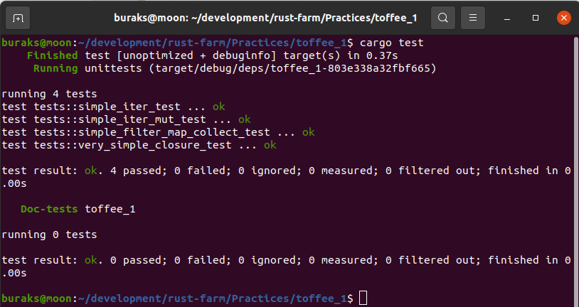

# toffee_1: Closure ve Iterator Kullanımı için İdman

Örnekte basit anlamda bir closure nasıl yazılır ve daha çok iterator fonksiyonlarda ne şekilde kullanılır gibi konular ele alınmakta. Oldukça basit kodlar ancak başlangıç seviye Rust eğitimlerinde ödev olarak verilebilir.

```shell
cargo test
```

