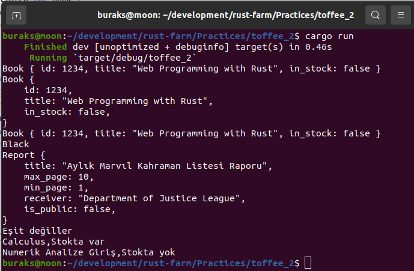

# toffee_2 Sık Kullanılan Bazı Derivable Trait Örnekleri

Trait'leri struct, enum, closure ve function yapılarına uygulayabiliriz.

Derivable Trait...En bilinen yaygın örneği #[derive(Debug)] şeklinde karşımıza çıkar. Bir struct veya enum türüne Debug davranışının uygulanmasında kullanılır. Diğer popüler derivable trait'ler arasında Clone,Copy, Default, PartialEq, Eq, From ve Into vardır.

- __Copy ve Clone :__ Stack'te duran primitive tipler doğal __Copy__ davranışı sergilerler.
  Heap'te duranlar içinse __Clone__ uygulanması gerekir.
- __Default :__ Bazen nesnelerin varsayılan değerleri ile oluşturulmasını isteriz. Hatta __..Default::default()__ ile kendi atadıklarımız dışındaki alanlara  varsayılan olarak belirlediğimiz değerlerin gelmesini de sağlayabiliriz.
- __PartialEq :__ Özellikle kendi Struct türlerimizde eşitlik kontrolü için sıklıkla kullanılır.
- __From/Into :__ Örneğin bir struct'a __String::from__ ya da __.into__ uygulayarak içinden belli bir bilgiyi istenen türde almak için kullanılabilir.

```shell
cargo run
```

