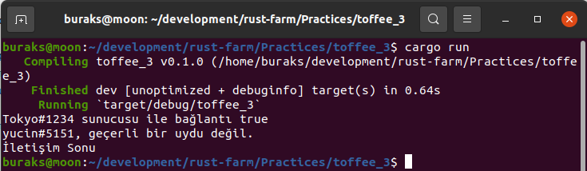

Kendi error türlerimizi yazabiliriz. En ideali bunların Enum veri tipinde olmasıdır. Kendi hata türlerimizde Debug + Display + Error trait'lerini uygulamamız gerekir. Aynen bu sırada uygulamak gerekir. Nitekim Error trait'i Debug ve Display trait'lerinin alt trait'idir. Debug,Display ve Error trait'leri ile hiç uğraşmayabiliriz de. Bunun için thiserror isimli crate kullanılabilir. Sonrasında error annotation'larını kullanabiliriz.

```rust
use thiserror::Error;

#[derive(Debug, Error)]
pub enum CommError {
    #[error("{0} sürede bağlantı sağlanamadı")]
    NotConnect(u8),
    #[error("{0} uydusu mevcut değil")]
    MissingSatellite(String),
    #[error("Güneş fırtınası sebebiyle iletişim hatası")]
    SunStorm,
}
```

```shell
cargo clippy
cargo run
```

Örneğin çalışma zamanı çıktısı aşağıdaki gibidir.

