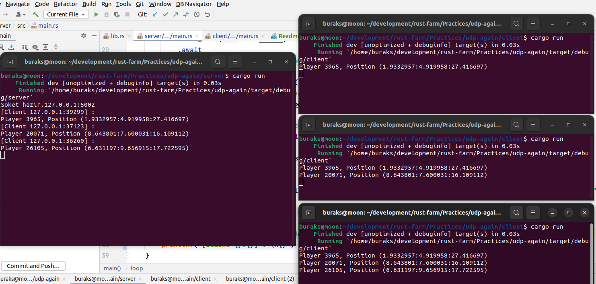
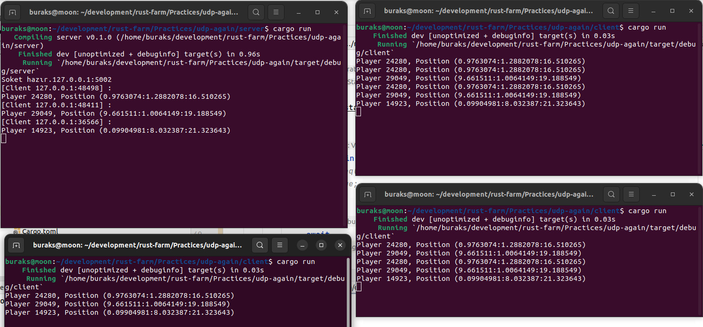

# Oyuncu Durumları için UDP Tabanlı Çözüm

Bu örnekte UDP _(User Datagram Protocol)_ kullanan bir oyun sunucusu simülasyonu çalışılmaktadır. İstemci taraftaki oyuncuların 3D düzlemdeki koordinatları oyun sunucusuna gönderilmekte, oyun sunucusunda toplanan güncel hareket bilgileri de son bağlanan istemci tarafına döndürülmektedir.

## Çözmem Gerekenler

- [x] İstemci ve sunucu arasında hareket edecek nesnelerin serileşerek taşınması gerekiyor. _(bincode crate ile çözümlendi)_
- [x] Sunucu ve istemci uygulamaların asenkron olarak çalıştırılması gerekmekte. _(tokio crate ile çözümlendi)_
- [x] Tüm istemcilerin sunucu tarafında thread-safe bir vektor nesnesine eklenebilmesi gerekiyor. _(Mutex kullanılarak çözüldü)_
- [x] Güncel oyuncu durumlarının bağlı olan tüm istemcilere gönderilmesi lazım. Şu an bilgi gönderen son kullanıcıya gidiyor.

## Denemeler

İlk gün denemesinin sonuçları aşağıdaki gibidir.

İkinci gün istemcilere de güncel oyuncu hareketleri gönderiliyor. Ancak tekrar eden bildirimler var. Buradaki senkronizasyonu daha iyi planlamam lazım.

