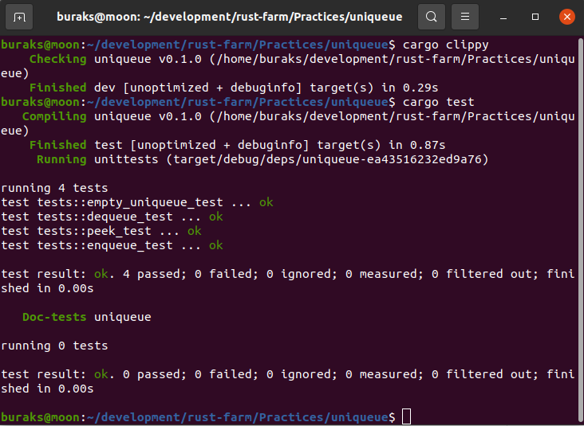

# UniQueue

Vector ve generic kavramlarını bilmek liste benzeri yeni veri yapılarını tasarlamak için oldukça yeterli. Sık kullanılan antrenman pratiklerinden birisi de Queue, Heap, LinkedList tasarlamak. UniQueue'da bir çeşit Queue ancak elemanlarında benzersizlik kuralını işletiyor. Yani kuyrukta örneğin 23 değeri varsa tekrarda 23 ekleyemiyorsunuz.

```shell
cargo new uniqueue --lib
cargo clippy
cargo test
```

