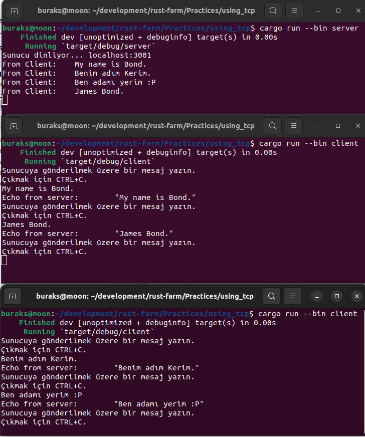

# Basit Bir TCP Server / Client Örneği

Bu çalışmada basit seviyede bir TCP server ve client uygulaması geliştirilmektedir. Örneği çalıştırmak için aşağıdaki gibi ilerlenebilir.

```bash
# Sunucu uygulamayı çalıştırmak için
cargo run --bin server

# İstemci tarafı çalıştırmak için
cargo run --bin client
```

İşte örnek bir çalışma zamanı.

