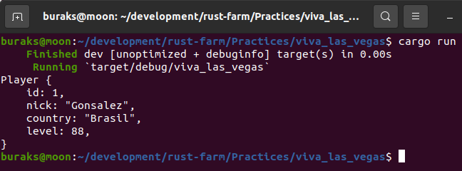
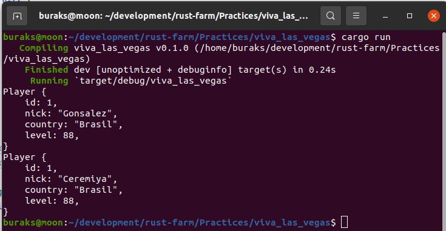
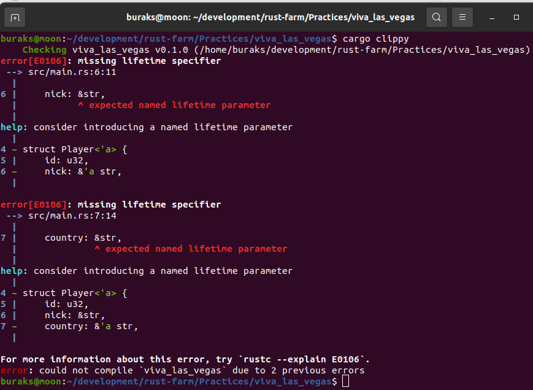

# Lifetimes Mevzusu

Rust'ın özellikle Garbage Collector kullanılan dillerden çok farklı olduğunu bellek yönetimi için getirdiği kurallardan dolayı biliyoruz. Ownership, borowwing gibi hususlar sayesinde güvenli bir bellek ortamını garanti etmek üzerine ihtisas yapmış bir dil. Bunlar pek çok dilde otomatik yönetildiği için Rust'ı öğrenmek zaman alabiliyor. Zor konulardan birisi de Lifetimes mevzusu. Bu konuyu esasında 45 Byte sohbetlerinde dile getirmek istiyorum. Lakin çok basit bir örnek gerekiyor. viva_las_vegas bu amaçla yazıldı.

```shell
# Önce projemizi bir oluşturalım
cargo new viva_las_vegas
cd viva_las_vegas
cargo clippy
cargo run
```

Senaryomuz bir oyuncuyu temsil eden veri modelinin tasarlanması ile başlıyor. Bu haliyle gayet güzel çalışmakta.



Sonrasında senaryoya oyuncunun nickname bilgisini değiştirecek bir fonksiyon _(change_nickname)_ dahil eidliyor. Bu durumda da kod beklediğimiz şekilde çalışıyor.



Aslında Player değişkenindeki String içerikler literal türden de tanımlanabilirler. String veri türü heap alanını kullanan ve genişleyebilen bir yapıdadır. Stack'te Heap'teki metinsel alanı işaret eden, pointer ve referans adresi gibi bilgileri tutar. str literal'de bir String'in işaret ettiği bellek bölgesinin bir parçasını _(metnin bir kısmını mesela)_ referans eder ve sabit uzunluktadır. Yani String'ten çekildikten sonra değiştirielemez. Metinsel bilginin değişmeyeceği durumlarda literal kullanmak da oldukça mantıklıdır. O halde gelin Player veri yapısında nick ve country alanlarını literal string'e çevirelim. 

Upss!!! Bir sürü hata alacağız.



nick ve country alanları literal string türünden. Player'ın kullanıldığı scope'lar düşünüldüğünde deallocate edilmesi sonrasında olmayan bellek alanlarını referans eden pointer'lar kalabilir. Bu durumun oluşmaması için Rust söz konusu alanların ne kadar süre yaşayacağını bilmek istiyor. Böylece _Dangling Pointer_ durumunun oluşmasının önüne geçmiş oluyoruz.

